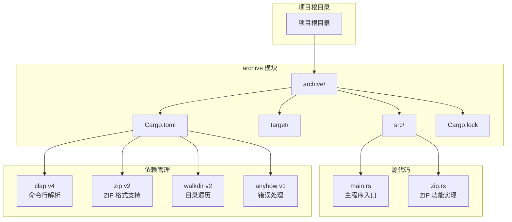
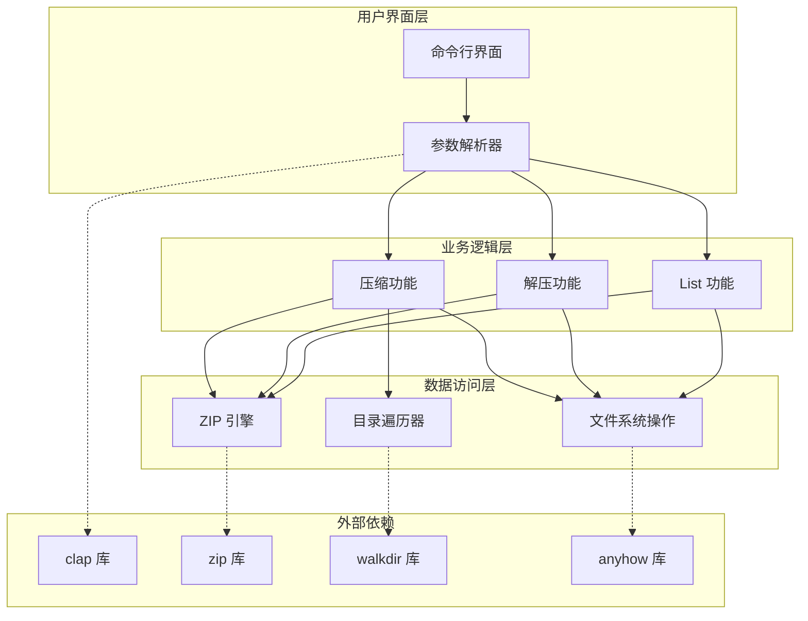
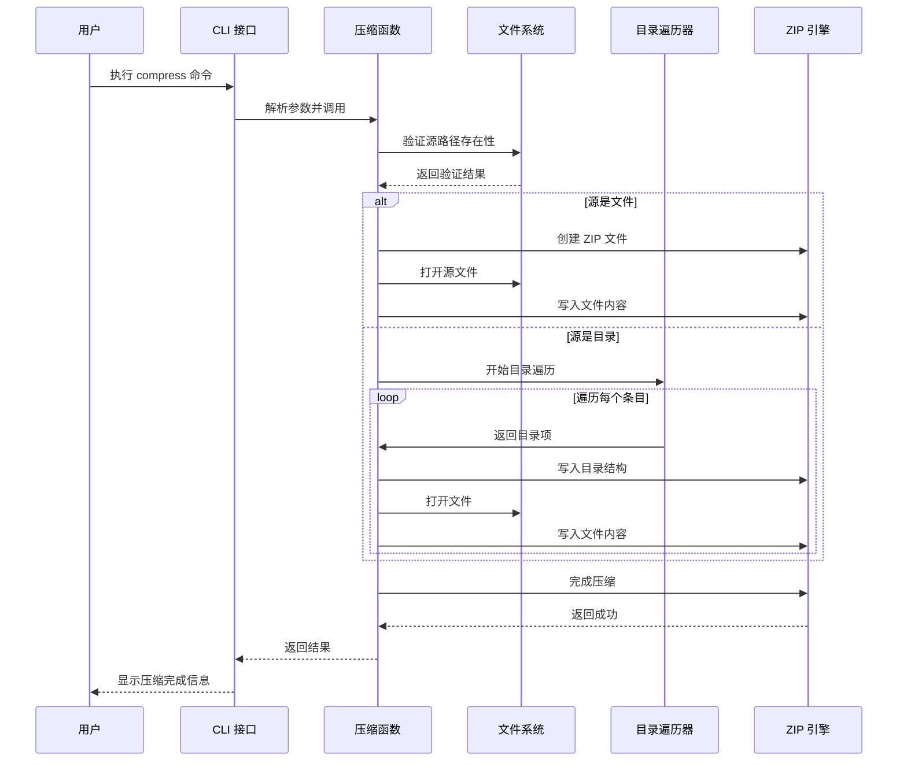
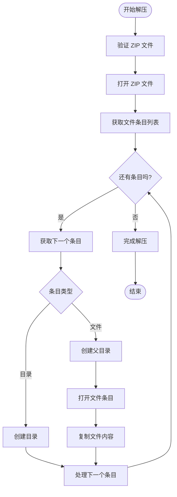
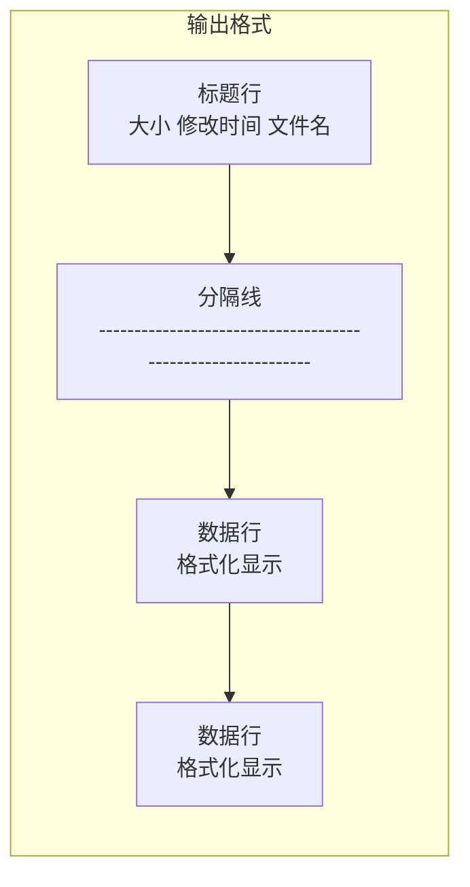
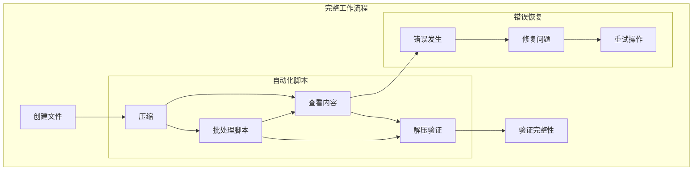
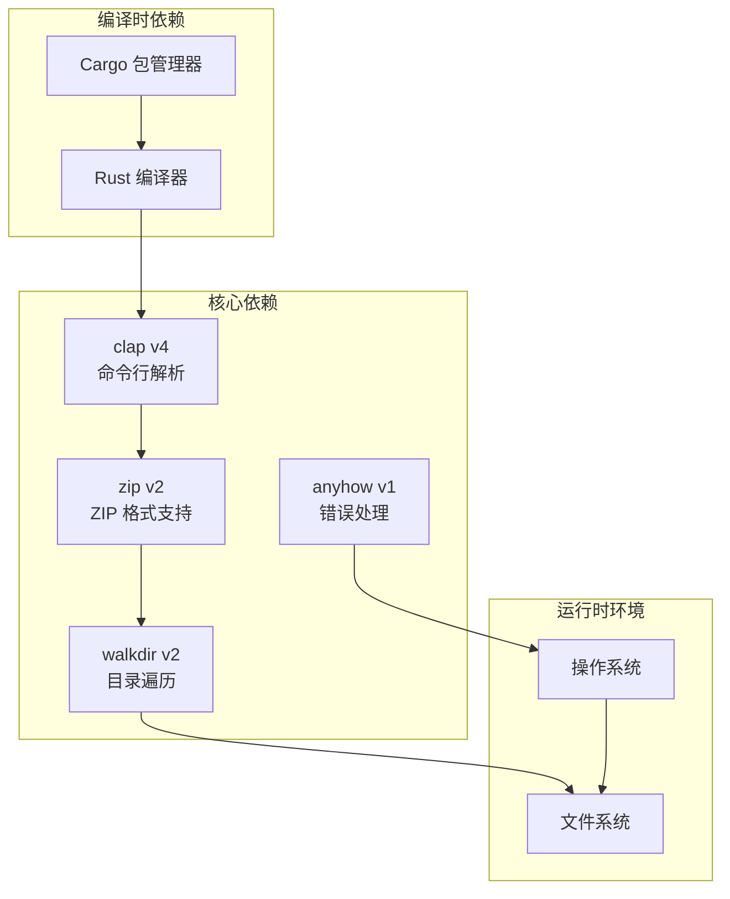

# 命令参考手册

<cite>
**本文档引用的文件**
- [main.rs](file://archive/src/main.rs)
- [zip.rs](file://archive/src/zip.rs)
- [Cargo.toml](file://archive/Cargo.toml)
- [README.md](file://README.md)
</cite>

## 目录
1. [简介](#简介)
2. [项目结构](#项目结构)
3. [核心组件](#核心组件)
4. [架构概览](#架构概览)
5. [详细组件分析](#详细组件分析)
6. [依赖分析](#依赖分析)
7. [性能考虑](#性能考虑)
8. [故障排除指南](#故障排除指南)
9. [结论](#结论)

## 简介

MyArchive 是一个基于 Rust 的文件压缩与解压工具，提供了简洁高效的命令行界面。该项目实现了三个核心功能：文件压缩（compress）、文件解压（extract）和内容列表（list），全部基于标准的 ZIP 格式实现。

该工具的主要特点：
- 使用现代 Rust 语言开发，具有良好的类型安全性和内存安全性
- 基于 `clap` 库实现优雅的命令行接口
- 支持单个文件和整个目录的递归压缩
- 提供完整的 ZIP 文件内容浏览功能
- 内置错误处理和用户友好的反馈信息

## 项目结构

MyArchive 项目采用标准的 Rust 项目布局，主要代码集中在 `archive/src/` 目录下：



**图表来源**
- [Cargo.toml:1-11](file://archive/Cargo.toml#L1-L11)
- [main.rs:1-68](file://archive/src/main.rs#L1-L68)
- [zip.rs:1-109](file://archive/src/zip.rs#L1-L109)

**章节来源**
- [Cargo.toml:1-11](file://archive/Cargo.toml#L1-L11)
- [main.rs:1-68](file://archive/src/main.rs#L1-L68)
- [zip.rs:1-109](file://archive/src/zip.rs#L1-L109)

## 核心组件

MyArchive 的核心由两个主要组件构成：

### 命令行接口组件
- 基于 `clap` 库实现的现代化命令行解析
- 支持子命令模式，提供清晰的命令结构
- 内置帮助系统和自动完成功能

### ZIP 处理组件
- 基于 `zip` 库实现的标准 ZIP 格式支持
- 支持 Deflate 压缩算法
- 提供完整的压缩、解压和内容列表功能

**章节来源**
- [main.rs:7-37](file://archive/src/main.rs#L7-L37)
- [zip.rs:1-109](file://archive/src/zip.rs#L1-L109)

## 架构概览

MyArchive 采用了清晰的分层架构设计：



**图表来源**
- [main.rs:39-67](file://archive/src/main.rs#L39-L67)
- [zip.rs:10-56](file://archive/src/zip.rs#L10-L56)
- [zip.rs:58-81](file://archive/src/zip.rs#L58-L81)
- [zip.rs:83-108](file://archive/src/zip.rs#L83-L108)

## 详细组件分析

### 命令总览

MyArchive 提供三个核心子命令，每个都针对不同的使用场景：

| 命令 | 功能描述 | 主要用途 |
|------|----------|----------|
| `compress` | 将文件或目录压缩为 ZIP 文件 | 数据备份、文件打包传输 |
| `extract` | 解压 ZIP 文件到指定目录 | 文件恢复、批量提取 |
| `list` | 列出 ZIP 文件中的内容 | 内容预览、文件检查 |

### compress 命令详解

#### 命令语法
```
archive compress [选项] <源路径>
```

#### 参数说明

**必需参数**
- `<源路径>`: 要压缩的源文件或目录路径

**可选选项**
- `-o, --output <输出路径>`: 指定输出的 ZIP 文件路径

#### 默认行为
- 如果未指定输出路径，工具会自动推导输出文件名
- 对于单个文件：输出文件名为原文件名加上 `.zip` 扩展名
- 对于目录：输出文件名为目录名加上 `.zip` 扩展名
- 使用 Deflate 压缩算法进行压缩

#### 压缩流程



**图表来源**
- [main.rs:42-50](file://archive/src/main.rs#L42-L50)
- [zip.rs:10-56](file://archive/src/zip.rs#L10-L56)

#### 使用示例

**基本用法**
```bash
# 压缩单个文件
archive compress document.txt

# 压缩目录
archive compress photos/

# 指定输出路径
archive compress src/ -o project.zip
```

**高级配置**
```bash
# 压缩时保持相对路径
archive compress ../project/src/ -o lib.zip

# 压缩多个文件
archive compress file1.txt file2.txt -o files.zip
```

#### 错误处理

| 错误情况 | 错误信息 | 可能原因 | 解决方案 |
|----------|----------|----------|----------|
| 源路径不存在 | "源路径不存在: [路径]" | 指定的文件或目录不存在 | 检查路径拼写，确认文件存在 |
| 权限不足 | "无法创建输出文件: [路径]" | 没有写入权限或目标目录不存在 | 检查目录权限，确保有写入权限 |
| 磁盘空间不足 | I/O 错误 | 磁盘空间不足 | 清理磁盘空间后重试 |

**章节来源**
- [main.rs:42-50](file://archive/src/main.rs#L42-L50)
- [zip.rs:10-56](file://archive/src/zip.rs#L10-L56)

### extract 命令详解

#### 命令语法
```
archive extract [选项] <ZIP 文件路径>
```

#### 参数说明

**必需参数**
- `<ZIP 文件路径>`: 要解压的 ZIP 文件路径

**可选选项**
- `-o, --output <输出目录>`: 指定解压输出目录

#### 默认行为
- 如果未指定输出目录，工具会使用 ZIP 文件名作为输出目录名
- 自动创建必要的中间目录结构
- 保持原始文件的时间戳和属性

#### 解压流程



**图表来源**
- [main.rs:51-60](file://archive/src/main.rs#L51-L60)
- [zip.rs:58-81](file://archive/src/zip.rs#L58-L81)

#### 使用示例

**基本用法**
```bash
# 解压到默认目录
archive extract archive.zip

# 指定输出目录
archive extract backup.zip -o /tmp/restore/

# 解压到当前目录
archive extract project.zip -o ./extracted/
```

**高级配置**
```bash
# 解压特定版本的文件
archive extract large_archive.zip -o extracted/

# 批量解压多个文件
for file in *.zip; do
    archive extract "$file" -o "${file%.zip}/"
done
```

#### 错误处理

| 错误情况 | 错误信息 | 可能原因 | 解决方案 |
|----------|----------|----------|----------|
| ZIP 文件损坏 | "无法打开 zip 文件: [路径]" | ZIP 文件格式不正确或已损坏 | 检查 ZIP 文件完整性，重新下载 |
| 权限不足 | "无法创建输出目录: [路径]" | 没有写入权限 | 检查目标目录权限，使用管理员权限 |
| 磁盘空间不足 | I/O 错误 | 目标磁盘空间不足 | 清理空间后重试 |

**章节来源**
- [main.rs:51-60](file://archive/src/main.rs#L51-L60)
- [zip.rs:58-81](file://archive/src/zip.rs#L58-L81)

### list 命令详解

#### 命令语法
```
archive list <ZIP 文件路径>
```

#### 参数说明

**必需参数**
- `<ZIP 文件路径>`: 要列出内容的 ZIP 文件路径

#### 默认行为
- 显示压缩前大小、最后修改时间和文件名
- 格式化输出表格，便于阅读
- 不修改任何文件

#### 列表显示格式



**图表来源**
- [zip.rs:83-108](file://archive/src/zip.rs#L83-L108)

#### 使用示例

**基本用法**
```bash
# 查看压缩包内容
archive list project.zip

# 结合管道过滤
archive list archive.zip | grep ".txt"

# 统计文件数量
archive list files.zip | wc -l
```

**高级用法**
```bash
# 查看大文件
archive list archive.zip | sort -k1 -nr

# 查看最近修改的文件
archive list archive.zip | sort -k2 -r

# 导出到文件
archive list project.zip > contents.txt
```

#### 输出格式说明

| 列名 | 描述 | 示例值 |
|------|------|--------|
| 大小 | 压缩前文件大小（字节） | 1024, 2048, 1048576 |
| 修改时间 | 文件最后修改时间 | 2024-01-15 14:30 |
| 文件名 | 文件在压缩包中的路径 | src/main.rs, docs/readme.md |

**章节来源**
- [main.rs:61-63](file://archive/src/main.rs#L61-L63)
- [zip.rs:83-108](file://archive/src/zip.rs#L83-L108)

### 命令间关系与组合使用

MyArchive 的三个命令可以灵活组合使用，形成完整的工作流程：



**最佳实践组合**
- **备份流程**: `compress` → `list` → `extract`（验证）
- **传输流程**: `compress` → 传输 → `extract`
- **审计流程**: `list` → 分析 → `compress`（更新）

## 依赖分析

MyArchive 项目使用了以下关键依赖：



**图表来源**
- [Cargo.toml:6-11](file://archive/Cargo.toml#L6-L11)

### 依赖特性

| 依赖库 | 版本 | 主要功能 | 使用场景 |
|--------|------|----------|----------|
| `clap` | v4 | 命令行参数解析 | CLI 接口定义和解析 |
| `zip` | v2 | ZIP 格式支持 | 压缩和解压功能 |
| `walkdir` | v2 | 目录遍历 | 递归处理目录结构 |
| `anyhow` | v1 | 错误处理 | 统一错误处理和报告 |

**章节来源**
- [Cargo.toml:6-11](file://archive/Cargo.toml#L6-L11)

## 性能考虑

### 压缩性能优化

1. **选择合适的压缩级别**
   - 当前实现使用 Deflate 算法，提供平衡的压缩比和速度
   - 对于大文件，考虑使用更高效的压缩算法

2. **内存使用优化**
   - 使用流式处理避免一次性加载大文件到内存
   - 合理设置缓冲区大小以平衡内存使用和性能

3. **I/O 操作优化**
   - 批量写入减少系统调用次数
   - 使用异步 I/O 提高并发性能

### 解压性能优化

1. **并行解压**
   - 对于多文件 ZIP，可以考虑并行解压提高效率
   - 注意磁盘 I/O 限制，避免过度并行

2. **缓存策略**
   - 对于重复解压操作，考虑使用缓存机制
   - 合理管理临时文件和缓存清理

### 内存管理

1. **资源清理**
   - 确保及时关闭文件句柄和网络连接
   - 使用 RAII 模式管理资源生命周期

2. **垃圾回收**
   - 避免创建不必要的字符串副本
   - 使用迭代器避免中间集合对象

## 故障排除指南

### 常见问题及解决方案

#### 命令执行问题

**问题**: 命令无法找到
**可能原因**: PATH 环境变量未配置
**解决方案**: 
- 确保可执行文件位于 PATH 中
- 使用完整路径执行命令
- 检查文件权限设置

**问题**: 参数解析错误
**可能原因**: 命令语法不正确
**解决方案**:
- 使用 `--help` 查看帮助信息
- 检查参数顺序和格式
- 验证必需参数是否提供

#### 压缩相关问题

**问题**: 源文件不存在
**错误信息**: "源路径不存在: [路径]"
**解决方案**:
- 检查文件路径拼写
- 确认文件权限
- 验证相对路径的正确性

**问题**: 磁盘空间不足
**错误信息**: I/O 错误
**解决方案**:
- 清理磁盘空间
- 检查目标分区剩余空间
- 考虑压缩前删除临时文件

#### 解压相关问题

**问题**: ZIP 文件损坏
**错误信息**: "无法打开 zip 文件: [路径]"
**解决方案**:
- 验证 ZIP 文件完整性
- 重新下载或生成 ZIP 文件
- 检查文件传输过程中的损坏

**问题**: 权限不足
**错误信息**: "无法创建输出目录: [路径]"
**解决方案**:
- 检查目标目录权限
- 使用管理员权限运行
- 更改输出目录位置

#### 列表功能问题

**问题**: 内容显示异常
**错误信息**: 列表输出格式错误
**解决方案**:
- 检查终端字符编码设置
- 验证 ZIP 文件格式
- 更新工具版本

### 调试技巧

1. **启用详细日志**
   - 使用调试模式查看更多内部信息
   - 检查系统日志和错误输出

2. **验证文件完整性**
   - 使用校验和验证文件一致性
   - 检查文件属性和权限

3. **性能监控**
   - 监控 CPU 和内存使用
   - 分析 I/O 操作性能

**章节来源**
- [zip.rs:12-14](file://archive/src/zip.rs#L12-L14)
- [zip.rs:60-61](file://archive/src/zip.rs#L60-L61)
- [zip.rs:85-86](file://archive/src/zip.rs#L85-L86)

## 结论

MyArchive 是一个设计精良的文件压缩工具，具有以下优势：

### 技术优势
- **简洁的 API 设计**: 基于子命令的清晰架构
- **强大的功能覆盖**: 支持压缩、解压、内容列表三大核心功能
- **优秀的错误处理**: 提供详细的错误信息和用户指导
- **跨平台兼容**: 基于标准 ZIP 格式，可在多种平台上使用

### 使用建议
1. **基础使用**: 从简单的压缩和解压开始，逐步探索高级功能
2. **批量处理**: 利用命令组合实现自动化工作流程
3. **性能优化**: 根据具体需求调整压缩级别和处理策略
4. **错误预防**: 建立完善的备份和验证机制

### 发展方向
- 支持更多压缩格式（如 TAR、GZIP）
- 添加进度显示和取消功能
- 实现增量压缩和差异备份
- 提供图形用户界面选项

通过合理使用 MyArchive，用户可以高效地管理文件压缩和解压任务，满足各种数据管理和传输需求。