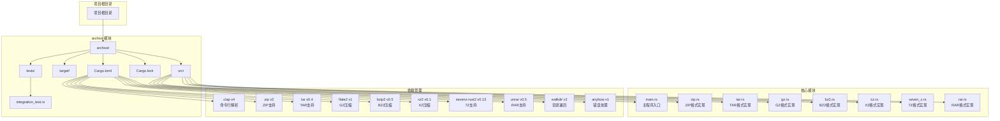
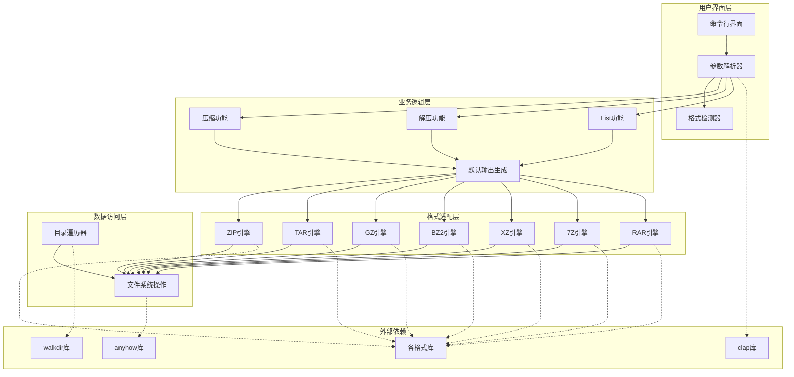
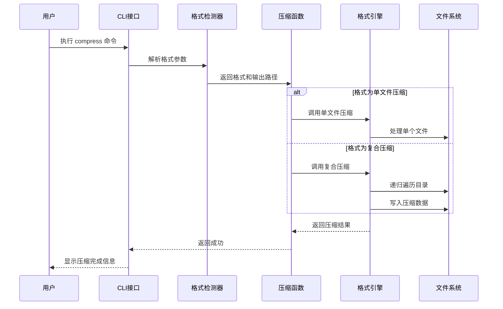
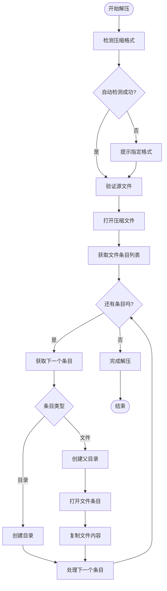
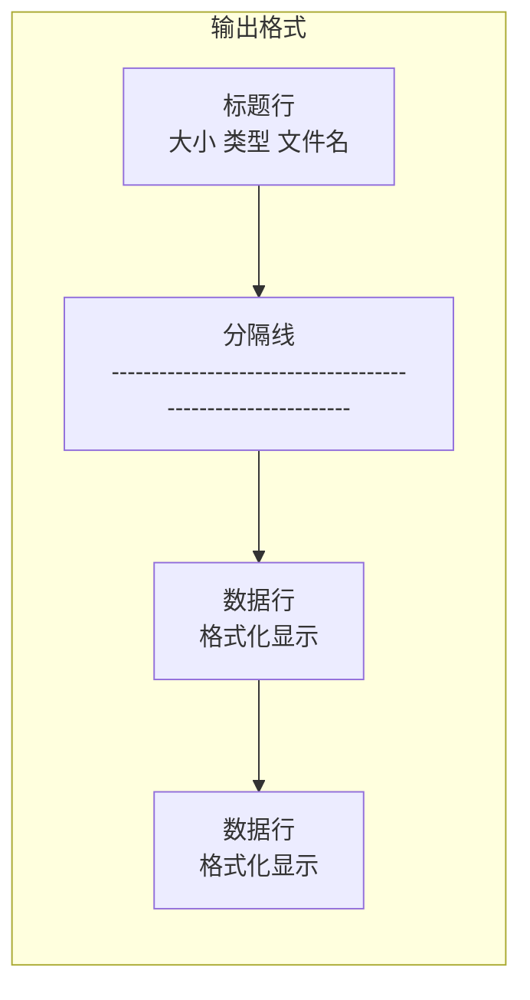
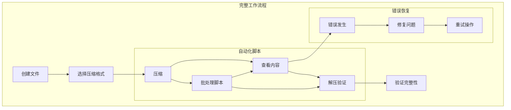
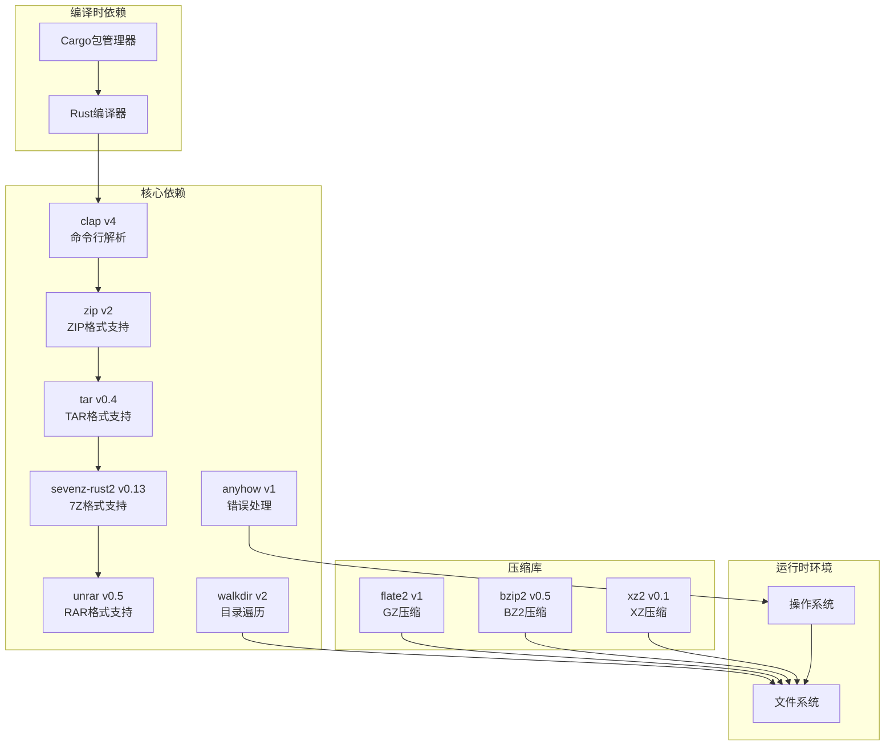

# 命令参考手册

<cite>
**本文档引用的文件**
- [main.rs](file://archive/src/main.rs)
- [zip.rs](file://archive/src/zip.rs)
- [tar.rs](file://archive/src/tar.rs)
- [gz.rs](file://archive/src/gz.rs)
- [bz2.rs](file://archive/src/bz2.rs)
- [xz.rs](file://archive/src/xz.rs)
- [seven_z.rs](file://archive/src/seven_z.rs)
- [rar.rs](file://archive/src/rar.rs)
- [Cargo.toml](file://archive/Cargo.toml)
- [integration_test.rs](file://archive/tests/integration_test.rs)
</cite>

## 更新摘要
**变更内容**
- 扩展支持10种压缩格式：zip、tar、gz、bz2、xz、tar.gz、tar.bz2、tar.xz、7z、rar
- 新增多格式自动检测功能
- 增强命令行参数系统，支持格式选择和输出控制
- 添加专门的单文件压缩格式（gz、bz2、xz）
- 实现复合格式支持（tar.gz、tar.bz2、tar.xz）
- 新增7z和rar格式支持

## 目录
1. [简介](#简介)
2. [支持的压缩格式](#支持的压缩格式)
3. [项目结构](#项目结构)
4. [核心组件](#核心组件)
5. [架构概览](#架构概览)
6. [详细组件分析](#详细组件分析)
7. [依赖分析](#依赖分析)
8. [性能考虑](#性能考虑)
9. [故障排除指南](#故障排除指南)
10. [结论](#结论)

## 简介

MyArchive 是一个基于 Rust 的多格式文件压缩与解压工具，支持10种主流压缩格式。该工具提供了简洁高效的命令行界面，实现了三个核心功能：文件压缩（compress）、文件解压（extract）和内容列表（list），支持从简单ZIP格式到复杂7z、rar等格式的全方位压缩需求。

该工具的主要特点：
- 使用现代 Rust 语言开发，具有良好的类型安全性和内存安全性
- 基于 `clap` 库实现优雅的命令行接口
- 支持10种压缩格式：zip、tar、gz、bz2、xz、tar.gz、tar.bz2、tar.xz、7z、rar
- 智能格式自动检测和默认输出文件名生成
- 支持单个文件和整个目录的递归压缩
- 提供完整的压缩包内容浏览功能
- 内置错误处理和用户友好的反馈信息

## 支持的压缩格式

MyArchive 支持以下10种压缩格式，每种格式都有其特定的使用场景和优势：

| 格式 | 扩展名 | 类型 | 压缩比 | 速度 | 兼容性 | 适用场景 |
|------|--------|------|--------|------|--------|----------|
| ZIP | .zip | 归档+压缩 | 中等 | 快速 | 最佳 | 通用文件打包 |
| TAR | .tar | 归档 | 无压缩 | 最快 | 良好 | Unix/Linux系统 |
| GZ | .gz | 单文件压缩 | 高 | 快速 | 最佳 | 文本文件压缩 |
| TAR.GZ | .tar.gz/.tgz | 复合压缩 | 非常高 | 中等 | 最佳 | 大文件压缩 |
| BZ2 | .bz2 | 单文件压缩 | 很高 | 较慢 | 良好 | 高压缩比需求 |
| TAR.BZ2 | .tar.bz2/.tbz2 | 复合压缩 | 非常高 | 较慢 | 良好 | 大文件高压缩 |
| XZ | .xz | 单文件压缩 | 极高 | 慢 | 良好 | 极高压缩比 |
| TAR.XZ | .tar.xz/.txz | 复合压缩 | 极高 | 慢 | 良好 | 大文件极高压缩 |
| 7Z | .7z | 归档+压缩 | 极高 | 中等 | 良好 | 高压缩比归档 |
| RAR | .rar | 归档+压缩 | 高 | 快速 | 一般 | Windows环境 |

## 项目结构

MyArchive 项目采用模块化的 Rust 项目布局，主要代码集中在 `archive/src/` 目录下，每个压缩格式都有独立的模块：



**图表来源**
- [Cargo.toml:6-16](file://archive/Cargo.toml#L6-L16)
- [main.rs:1-7](file://archive/src/main.rs#L1-L7)
- [zip.rs:1-109](file://archive/src/zip.rs#L1-L109)
- [tar.rs:1-80](file://archive/src/tar.rs#L1-L80)
- [gz.rs:1-124](file://archive/src/gz.rs#L1-L124)
- [bz2.rs:1-124](file://archive/src/bz2.rs#L1-L124)
- [xz.rs:1-123](file://archive/src/xz.rs#L1-L123)
- [seven_z.rs:1-62](file://archive/src/seven_z.rs#L1-L62)
- [rar.rs:1-81](file://archive/src/rar.rs#L1-L81)

**章节来源**
- [Cargo.toml:6-16](file://archive/Cargo.toml#L6-L16)
- [main.rs:1-7](file://archive/src/main.rs#L1-L7)
- [zip.rs:1-109](file://archive/src/zip.rs#L1-L109)
- [tar.rs:1-80](file://archive/src/tar.rs#L1-L80)
- [gz.rs:1-124](file://archive/src/gz.rs#L1-L124)
- [bz2.rs:1-124](file://archive/src/bz2.rs#L1-L124)
- [xz.rs:1-123](file://archive/src/xz.rs#L1-L123)
- [seven_z.rs:1-62](file://archive/src/seven_z.rs#L1-L62)
- [rar.rs:1-81](file://archive/src/rar.rs#L1-L81)

## 核心组件

MyArchive 的核心由四个主要组件构成：

### 命令行接口组件
- 基于 `clap` 库实现的现代化命令行解析
- 支持子命令模式，提供清晰的命令结构
- 内置帮助系统和自动完成功能
- 支持格式枚举和自动检测

### 格式选择组件
- 基于 `ValueEnum` 实现的格式枚举
- 支持10种压缩格式的统一选择界面
- 自动格式检测功能
- 默认输出文件名生成

### 多格式处理组件
- 每种压缩格式独立的模块化实现
- 统一的压缩、解压、列表接口
- 格式特定的优化和特性
- 错误处理和状态反馈

### 文件系统操作组件
- 基于 `walkdir` 库的递归目录遍历
- 统一的文件系统抽象层
- 跨平台文件操作支持
- 资源管理和清理

**章节来源**
- [main.rs:13-36](file://archive/src/main.rs#L13-L36)
- [main.rs:72-98](file://archive/src/main.rs#L72-L98)
- [main.rs:100-162](file://archive/src/main.rs#L100-L162)
- [main.rs:164-232](file://archive/src/main.rs#L164-L232)

## 架构概览

MyArchive 采用了清晰的分层架构设计，支持多格式的统一处理：



**图表来源**
- [main.rs:18-70](file://archive/src/main.rs#L18-L70)
- [main.rs:164-232](file://archive/src/main.rs#L164-L232)
- [zip.rs:1-109](file://archive/src/zip.rs#L1-L109)
- [tar.rs:1-80](file://archive/src/tar.rs#L1-L80)
- [gz.rs:1-124](file://archive/src/gz.rs#L1-L124)
- [bz2.rs:1-124](file://archive/src/bz2.rs#L1-L124)
- [xz.rs:1-123](file://archive/src/xz.rs#L1-L123)
- [seven_z.rs:1-62](file://archive/src/seven_z.rs#L1-L62)
- [rar.rs:1-81](file://archive/src/rar.rs#L1-L81)

## 详细组件分析

### 命令总览

MyArchive 提供三个核心子命令，每个都支持10种压缩格式：

| 命令 | 功能描述 | 支持格式 | 主要用途 |
|------|----------|----------|----------|
| `compress` | 将文件或目录压缩为指定格式 | zip, tar, gz, bz2, xz, tar-gz, tar-bz2, tar-xz, 7z, rar | 数据备份、文件打包传输 |
| `extract` | 解压指定格式的文件到指定目录 | zip, tar, gz, bz2, xz, tar-gz, tar-bz2, tar-xz, 7z, rar | 文件恢复、批量提取 |
| `list` | 列出指定格式压缩包的内容 | zip, tar, tar-gz, tar-bz2, tar-xz, 7z, rar | 内容预览、文件检查 |

### compress 命令详解

#### 命令语法
```
archive compress [选项] <源路径>
```

#### 参数说明

**必需参数**
- `<源路径>`: 要压缩的源文件或目录路径

**可选选项**
- `-f, --format <格式>`: 指定压缩格式，默认为 zip
- `-o, --output <输出路径>`: 指定输出文件路径

#### 支持的格式选项

| 格式标识 | 格式名称 | 默认输出扩展名 | 说明 |
|----------|----------|----------------|------|
| `zip` | ZIP格式 | .zip | 通用文件打包，最佳兼容性 |
| `tar` | TAR格式 | .tar | Unix/Linux系统标准 |
| `gz` | GZ格式 | .gz | 单文件压缩，文本文件优化 |
| `tar-gz` | TAR.GZ格式 | .tar.gz | 复合压缩，高压缩比 |
| `bz2` | BZ2格式 | .bz2 | 单文件压缩，更高压缩比 |
| `tar-bz2` | TAR.BZ2格式 | .tar.bz2 | 复合压缩，极高压缩比 |
| `xz` | XZ格式 | .xz | 单文件压缩，极高压缩比 |
| `tar-xz` | TAR.XZ格式 | .tar.xz | 复合压缩，极高压缩比 |
| `7z` | 7Z格式 | .7z | 高压缩比归档格式 |
| `rar` | RAR格式 | .rar | 专有格式，快速压缩 |

#### 默认行为
- 如果未指定输出路径，工具会根据格式自动推导输出文件名
- 不同格式有不同的默认输出规则
- RAR格式不支持压缩，仅支持解压
- 单文件压缩格式（gz、bz2、xz）不支持目录压缩

#### 压缩流程



**图表来源**
- [main.rs:167-189](file://archive/src/main.rs#L167-L189)
- [main.rs:100-116](file://archive/src/main.rs#L100-L116)
- [main.rs:177-188](file://archive/src/main.rs#L177-L188)

#### 使用示例

**基本用法**
```bash
# 压缩为ZIP格式（默认）
archive compress document.txt

# 压缩为TAR格式
archive compress photos/ -f tar -o photos.tar

# 压缩为GZ格式（单文件）
archive compress readme.txt -f gz -o readme.txt.gz

# 压缩为TAR.GZ格式（复合格式）
archive compress src/ -f tar-gz -o project.tar.gz

# 压缩为BZ2格式
archive compress large.log -f bz2 -o large.log.bz2

# 压缩为7Z格式
archive compress data/ -f 7z -o data.7z
```

**高级配置**
```bash
# 压缩为XZ格式（极高压缩）
archive compress backup/ -f xz -o backup.xz

# 压缩为TAR.XZ格式
archive compress logs/ -f tar-xz -o logs.tar.xz

# 压缩为RAR格式（注意：RAR不支持压缩）
# archive compress files/ -f rar -o files.rar  # 这将报错
```

#### 错误处理

| 错误情况 | 错误信息 | 可能原因 | 解决方案 |
|----------|----------|----------|----------|
| 源路径不存在 | "源路径不存在: [路径]" | 指定的文件或目录不存在 | 检查路径拼写，确认文件存在 |
| 格式不支持 | "RAR 格式不支持压缩" | RAR格式仅支持解压 | 使用其他格式如zip、7z等 |
| 单文件格式错误 | "只支持单文件压缩" | 目录使用单文件压缩格式 | 使用tar-gz、tar-bz2、tar-xz等复合格式 |
| 权限不足 | "无法创建输出文件: [路径]" | 没有写入权限或目标目录不存在 | 检查目录权限，确保有写入权限 |
| 磁盘空间不足 | I/O 错误 | 磁盘空间不足 | 清理磁盘空间后重试 |

**章节来源**
- [main.rs:167-189](file://archive/src/main.rs#L167-L189)
- [main.rs:100-116](file://archive/src/main.rs#L100-L116)
- [main.rs:177-188](file://archive/src/main.rs#L177-L188)

### extract 命令详解

#### 命令语法
```
archive extract [选项] <压缩文件路径>
```

#### 参数说明

**必需参数**
- `<压缩文件路径>`: 要解压的压缩文件路径

**可选选项**
- `-f, --format <格式>`: 指定压缩格式（可选，自动检测）
- `-o, --output <输出目录>`: 指定解压输出目录

#### 格式自动检测
- 支持基于文件扩展名的自动格式检测
- 支持的自动检测扩展名：.zip, .tar, .gz, .tar.gz/.tgz, .bz2, .tar.bz2/.tbz2, .xz, .tar.xz/.txz, .7z, .rar
- 如果未指定格式且无法自动检测，将报错

#### 默认行为
- 如果未指定输出目录，工具会根据格式和源文件自动推导输出路径
- 不同格式有不同的默认输出规则
- 单文件压缩格式会去除压缩扩展名作为输出文件名

#### 解压流程



**图表来源**
- [main.rs:190-211](file://archive/src/main.rs#L190-L211)
- [main.rs:72-98](file://archive/src/main.rs#L72-L98)
- [main.rs:118-162](file://archive/src/main.rs#L118-L162)

#### 使用示例

**基本用法**
```bash
# 自动检测格式解压（推荐）
archive extract archive.zip

# 指定ZIP格式解压
archive extract backup.zip -f zip -o /tmp/restore/

# 指定TAR.GZ格式解压
archive extract project.tar.gz -f tar-gz -o extracted/

# 指定7Z格式解压
archive extract data.7z -f 7z -o data/

# 指定RAR格式解压
archive extract files.rar -f rar -o files/
```

**高级配置**
```bash
# 解压到当前目录
archive extract project.tar.xz -o ./extracted/

# 批量解压多个文件
for file in *.tar.gz; do
    archive extract "$file" -o "${file%.tar.gz}/"
done

# 解压特定版本的文件
archive extract large_archive.7z -f 7z -o extracted/
```

#### 错误处理

| 错误情况 | 错误信息 | 可能原因 | 解决方案 |
|----------|----------|----------|----------|
| 格式无法检测 | "无法自动检测格式，请使用 -f 指定格式" | 文件扩展名不在支持列表中 | 使用 -f 参数明确指定格式 |
| 源文件不存在 | "源文件不存在: [路径]" | 指定的压缩文件不存在 | 检查文件路径和权限 |
| 格式不支持 | "无法打开 [格式] 文件" | 格式库未安装或文件损坏 | 安装相应格式库，检查文件完整性 |
| 权限不足 | "无法创建输出目录: [路径]" | 没有写入权限 | 检查目标目录权限，使用管理员权限 |
| 磁盘空间不足 | I/O 错误 | 目标磁盘空间不足 | 清理空间后重试 |

**章节来源**
- [main.rs:190-211](file://archive/src/main.rs#L190-L211)
- [main.rs:72-98](file://archive/src/main.rs#L72-L98)
- [main.rs:118-162](file://archive/src/main.rs#L118-L162)

### list 命令详解

#### 命令语法
```
archive list [选项] <压缩文件路径>
```

#### 参数说明

**必需参数**
- `<压缩文件路径>`: 要列出内容的压缩文件路径

**可选选项**
- `-f, --format <格式>`: 指定压缩格式（可选，自动检测）

#### 格式自动检测
- 支持基于文件扩展名的自动格式检测
- 单文件压缩格式（gz、bz2、xz）不支持列出内容
- 复合格式（tar.gz、tar.bz2、tar.xz）支持列出内容

#### 默认行为
- 显示压缩前大小、条目类型和文件名
- 格式化输出表格，便于阅读
- 不修改任何文件

#### 列表显示格式



**图表来源**
- [tar.rs:56-79](file://archive/src/tar.rs#L56-L79)
- [gz.rs:99-123](file://archive/src/gz.rs#L99-L123)
- [bz2.rs:99-123](file://archive/src/bz2.rs#L99-L123)
- [xz.rs:98-122](file://archive/src/xz.rs#L98-L122)
- [seven_z.rs:36-61](file://archive/src/seven_z.rs#L36-L61)
- [rar.rs:50-80](file://archive/src/rar.rs#L50-80)

#### 使用示例

**基本用法**
```bash
# 自动检测格式列出内容
archive list project.zip

# 指定ZIP格式列出
archive list archive.zip -f zip

# 列出TAR.GZ内容
archive list backup.tar.gz -f tar-gz

# 列出7Z内容
archive list data.7z -f 7z

# 列出RAR内容
archive list files.rar -f rar
```

**高级用法**
```bash
# 结合管道过滤
archive list project.tar.gz | grep ".txt"

# 统计文件数量
archive list archive.tar.xz | wc -l

# 查看大文件
archive list archive.7z | sort -k1 -nr

# 导出到文件
archive list project.tar.bz2 > contents.txt
```

#### 输出格式说明

| 格式 | 列名 | 描述 | 示例值 |
|------|------|------|--------|
| ZIP/TAR/7Z/RAR | 大小 | 压缩前文件大小（字节） | 1024, 2048, 1048576 |
| ZIP/TAR/7Z/RAR | 类型 | 文件条目类型 | 文件, 目录, 符号链接 |
| ZIP/TAR/7Z/RAR | 文件名 | 文件在压缩包中的路径 | src/main.rs, docs/readme.md |
| TAR.GZ/TAR.BZ2/TAR.XZ | 大小 | 压缩前文件大小（字节） | 1024, 2048, 1048576 |
| TAR.GZ/TAR.BZ2/TAR.XZ | 类型 | 文件条目类型 | 文件, 目录, 符号链接 |
| TAR.GZ/TAR.BZ2/TAR.XZ | 文件名 | 文件在压缩包中的路径 | src/main.rs, docs/readme.md |

**章节来源**
- [main.rs:212-229](file://archive/src/main.rs#L212-L229)
- [tar.rs:56-79](file://archive/src/tar.rs#L56-L79)
- [gz.rs:99-123](file://archive/src/gz.rs#L99-L123)
- [bz2.rs:99-123](file://archive/src/bz2.rs#L99-L123)
- [xz.rs:98-122](file://archive/src/xz.rs#L98-L122)
- [seven_z.rs:36-61](file://archive/src/seven_z.rs#L36-L61)
- [rar.rs:50-80](file://archive/src/rar.rs#L50-L80)

### 命令间关系与组合使用

MyArchive 的三个命令可以灵活组合使用，形成完整的工作流程：



**最佳实践组合**
- **备份流程**: `compress` → `list` → `extract`（验证）
- **传输流程**: `compress` → 传输 → `extract`
- **审计流程**: `list` → 分析 → `compress`（更新）
- **格式迁移**: `extract` → `compress`（转换格式）

**格式选择指南**
- **通用文件打包**: zip（最佳兼容性）
- **Unix/Linux系统**: tar（标准格式）
- **文本文件压缩**: gz（快速压缩）
- **大文件压缩**: tar.gz（高压缩比）
- **极高压缩比**: tar.bz2 或 tar.xz
- **7Z格式**: 7z（最高压缩比）
- **Windows环境**: rar（专有格式）

## 依赖分析

MyArchive 项目使用了以下关键依赖：



**图表来源**
- [Cargo.toml:6-16](file://archive/Cargo.toml#L6-L16)

### 依赖特性

| 依赖库 | 版本 | 主要功能 | 使用场景 |
|--------|------|----------|----------|
| `clap` | v4 | 命令行参数解析 | CLI接口定义和解析 |
| `zip` | v2 | ZIP格式支持 | ZIP压缩和解压 |
| `tar` | v0.4 | TAR格式支持 | TAR归档操作 |
| `sevenz-rust2` | v0.13 | 7Z格式支持 | 7Z压缩和解压 |
| `unrar` | v0.5 | RAR格式支持 | RAR解压和列表 |
| `walkdir` | v2 | 目录遍历 | 递归处理目录结构 |
| `anyhow` | v1 | 错误处理 | 统一错误处理和报告 |
| `flate2` | v1 | GZ压缩 | GZ单文件压缩 |
| `bzip2` | v0.5 | BZ2压缩 | BZ2单文件压缩 |
| `xz2` | v0.1 | XZ压缩 | XZ单文件压缩 |

**章节来源**
- [Cargo.toml:6-16](file://archive/Cargo.toml#L6-L16)

## 性能考虑

### 压缩性能优化

1. **选择合适的压缩格式**
   - **ZIP**: 平衡的压缩比和速度，最佳兼容性
   - **GZ**: 快速压缩，适合文本文件
   - **BZ2**: 更高的压缩比，较慢的速度
   - **XZ**: 极高的压缩比，最慢的速度
   - **7Z**: 高压缩比，中等速度
   - **TAR**: 无压缩，最快的速度

2. **内存使用优化**
   - 使用流式处理避免一次性加载大文件到内存
   - 合理设置压缩级别（GZ、BZ2、XZ支持压缩级别设置）
   - 对于大目录，使用tar格式先打包再压缩

3. **I/O操作优化**
   - 批量写入减少系统调用次数
   - 使用异步I/O提高并发性能
   - 避免不必要的文件系统操作

### 解压性能优化

1. **并行解压**
   - 对于多文件压缩包，可以考虑并行解压提高效率
   - 注意磁盘I/O限制，避免过度并行

2. **缓存策略**
   - 对于重复解压操作，考虑使用缓存机制
   - 合理管理临时文件和缓存清理

3. **格式选择优化**
   - 单文件压缩格式（gz、bz2、xz）解压速度较快
   - 复合格式（tar.gz、tar.bz2、tar.xz）需要额外的解包步骤

### 内存管理

1. **资源清理**
   - 确保及时关闭文件句柄和网络连接
   - 使用RAII模式管理资源生命周期

2. **垃圾回收**
   - 避免创建不必要的字符串副本
   - 使用迭代器避免中间集合对象

3. **格式特定优化**
   - TAR格式使用流式处理，内存占用较低
   - 7Z格式支持增量解压
   - RAR格式需要额外的解码器资源

## 故障排除指南

### 常见问题及解决方案

#### 命令执行问题

**问题**: 命令无法找到
**可能原因**: PATH环境变量未配置
**解决方案**:
- 确保可执行文件位于PATH中
- 使用完整路径执行命令
- 检查文件权限设置

**问题**: 参数解析错误
**可能原因**: 命令语法不正确
**解决方案**:
- 使用 `--help` 查看帮助信息
- 检查参数顺序和格式
- 验证必需参数是否提供

#### 格式相关问题

**问题**: 格式不支持
**错误信息**: "无法打开 [格式] 文件"
**可能原因**: 相应的格式库未安装
**解决方案**:
- 安装对应的格式支持库
- 检查格式库版本兼容性
- 验证文件格式完整性

**问题**: 自动检测失败
**错误信息**: "无法自动检测格式，请使用 -f 指定格式"
**可能原因**: 文件扩展名不在支持列表中
**解决方案**:
- 使用 `-f` 参数明确指定格式
- 检查文件扩展名是否正确
- 验证文件头部魔数

#### 压缩相关问题

**问题**: 源文件不存在
**错误信息**: "源路径不存在: [路径]"
**解决方案**:
- 检查文件路径拼写
- 确认文件权限
- 验证相对路径的正确性

**问题**: 单文件格式错误
**错误信息**: "只支持单文件压缩，目录请使用 [复合格式]"
**解决方案**:
- 使用tar-gz、tar-bz2、tar-xz等复合格式
- 或者单独压缩单个文件

**问题**: RAR格式不支持压缩
**错误信息**: "RAR 格式不支持压缩，仅支持解压"
**解决方案**:
- 使用zip、7z等其他格式进行压缩
- 或者使用专业的RAR工具

#### 解压相关问题

**问题**: ZIP文件损坏
**错误信息**: "无法打开 zip 文件: [路径]"
**解决方案**:
- 验证ZIP文件完整性
- 重新下载或生成ZIP文件
- 检查文件传输过程中的损坏

**问题**: 权限不足
**错误信息**: "无法创建输出目录: [路径]"
**解决方案**:
- 检查目标目录权限
- 使用管理员权限运行
- 更改输出目录位置

#### 列表功能问题

**问题**: 单文件压缩格式不支持列出
**错误信息**: "单文件压缩格式不支持列出内容，请直接解压"
**解决方案**:
- 使用相应的解压命令查看内容
- 或者转换为复合格式（如tar.gz）

### 调试技巧

1. **启用详细日志**
   - 使用调试模式查看更多内部信息
   - 检查系统日志和错误输出

2. **验证文件完整性**
   - 使用校验和验证文件一致性
   - 检查文件属性和权限

3. **性能监控**
   - 监控CPU和内存使用
   - 分析I/O操作性能

4. **格式验证**
   - 使用file命令检查文件类型
   - 验证压缩文件的头部信息

**章节来源**
- [main.rs:100-116](file://archive/src/main.rs#L100-L116)
- [main.rs:118-162](file://archive/src/main.rs#L118-L162)
- [main.rs:224-226](file://archive/src/main.rs#L224-L226)

## 结论

MyArchive 是一个功能强大且设计精良的多格式文件压缩工具，具有以下优势：

### 技术优势
- **全面的格式支持**: 支持10种主流压缩格式，满足不同使用场景
- **智能格式检测**: 基于文件扩展名的自动格式识别
- **统一的API设计**: 基于子命令的清晰架构，一致的用户体验
- **强大的功能覆盖**: 支持压缩、解压、内容列表三大核心功能
- **优秀的错误处理**: 提供详细的错误信息和用户指导
- **跨平台兼容**: 基于标准格式，可在多种平台上使用

### 使用建议
1. **格式选择**: 根据文件类型和使用场景选择合适的压缩格式
2. **性能优化**: 根据具体需求调整压缩级别和处理策略
3. **批量处理**: 利用命令组合实现自动化工作流程
4. **错误预防**: 建立完善的备份和验证机制
5. **格式迁移**: 利用工具进行格式转换和迁移

### 发展方向
- **格式扩展**: 支持更多压缩格式（如LZ4、ZSTD等）
- **性能提升**: 实现并行压缩和解压功能
- **用户界面**: 提供图形用户界面选项
- **云集成**: 支持云存储服务的直接操作
- **加密支持**: 添加密码保护和数字签名功能

通过合理使用 MyArchive，用户可以高效地管理各种格式的文件压缩和解压任务，满足从个人使用到企业级应用的各种数据管理和传输需求。