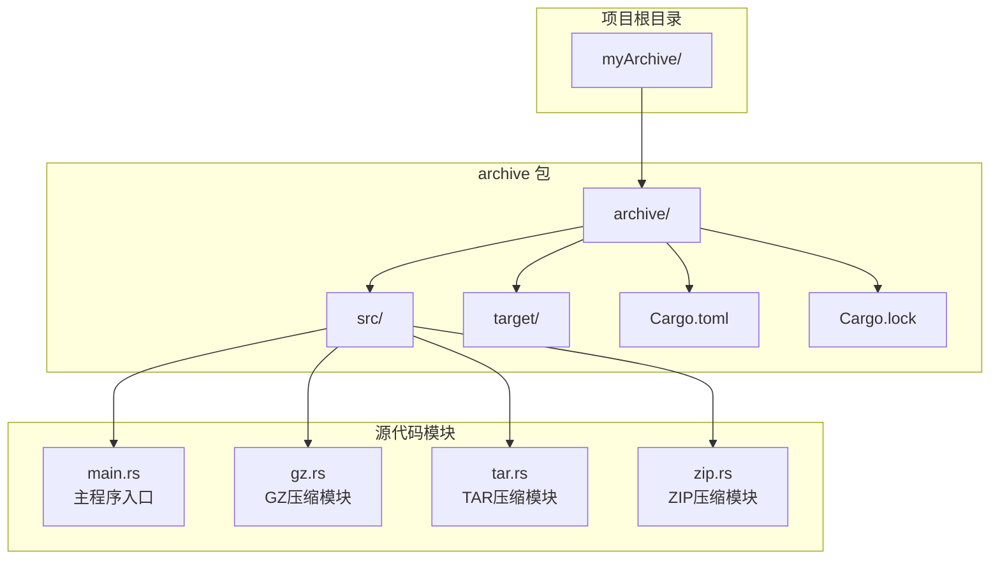
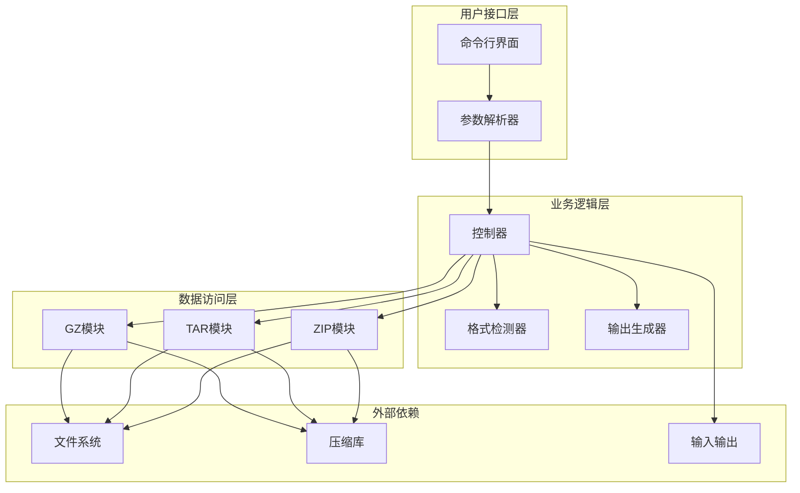
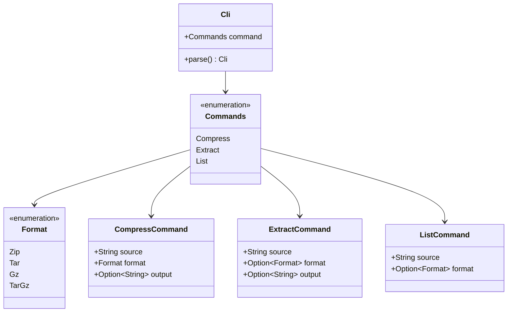
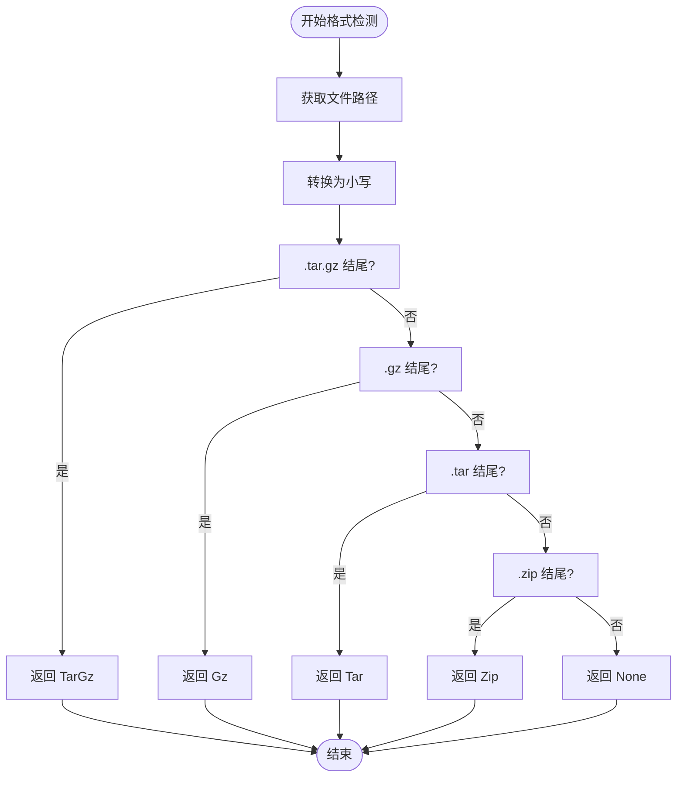
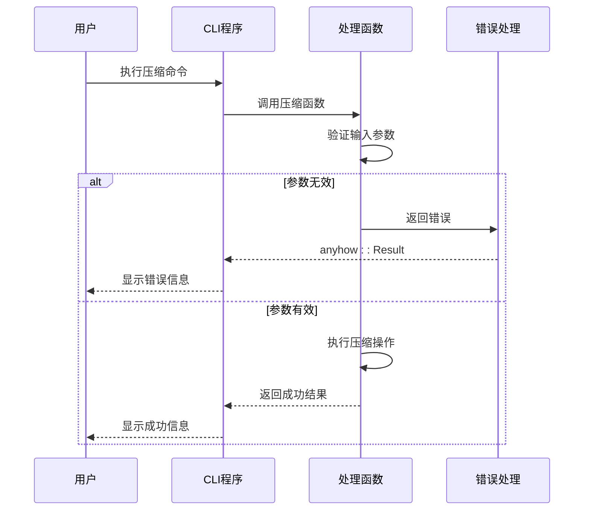
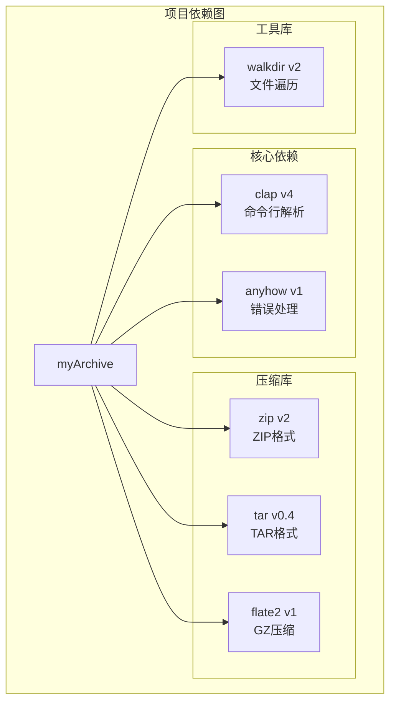

# 开发者指南

<cite>
**本文档引用的文件**
- [README.md](file://README.md)
- [archive/Cargo.toml](file://archive/Cargo.toml)
- [archive/Cargo.lock](file://archive/Cargo.lock)
- [archive/src/main.rs](file://archive/src/main.rs)
- [archive/src/gz.rs](file://archive/src/gz.rs)
- [archive/src/tar.rs](file://archive/src/tar.rs)
- [archive/src/zip.rs](file://archive/src/zip.rs)
</cite>

## 目录
1. [简介](#简介)
2. [项目结构](#项目结构)
3. [核心组件](#核心组件)
4. [架构概览](#架构概览)
5. [详细组件分析](#详细组件分析)
6. [依赖关系分析](#依赖关系分析)
7. [性能考虑](#性能考虑)
8. [故障排除指南](#故障排除指南)
9. [结论](#结论)
10. [附录](#附录)

## 简介

MyArchive 是一个用 Rust 编写的命令行文件压缩与解压工具，支持多种压缩格式，包括 ZIP、TAR、GZ 和 TAR.GZ。该项目展示了现代 Rust 开发的最佳实践，包括模块化设计、错误处理、类型安全和性能优化。

### 主要特性
- 支持多种压缩格式：ZIP、TAR、GZ、TAR.GZ
- 命令行界面，易于使用
- 类型安全的错误处理
- 高效的文件遍历和压缩算法
- 自动格式检测功能

## 项目结构

MyArchive 项目采用标准的 Rust 项目布局，具有清晰的模块化结构：

**图表来源**
- [archive/src/main.rs:1-183](file://archive/src/main.rs#L1-L183)
- [archive/src/gz.rs:1-124](file://archive/src/gz.rs#L1-L124)
- [archive/src/tar.rs:1-80](file://archive/src/tar.rs#L1-L80)
- [archive/src/zip.rs:1-109](file://archive/src/zip.rs#L1-L109)

**章节来源**
- [archive/Cargo.toml:1-13](file://archive/Cargo.toml#L1-L13)
- [archive/src/main.rs:1-183](file://archive/src/main.rs#L1-L183)

## 核心组件

MyArchive 的核心由四个主要模块组成，每个模块负责特定的压缩格式处理：

### 主程序模块 (main.rs)
主程序模块定义了 CLI 接口和应用程序的控制流程。它使用 `clap` 库提供命令行参数解析，并通过枚举模式实现清晰的命令分发。

### 压缩格式模块
- **GZ 模块**：处理单文件 GZ 压缩和 TAR.GZ 组合压缩
- **TAR 模块**：处理 TAR 格式的打包和解包
- **ZIP 模块**：处理 ZIP 格式的压缩和解压

**章节来源**
- [archive/src/main.rs:9-59](file://archive/src/main.rs#L9-L59)
- [archive/src/gz.rs:1-124](file://archive/src/gz.rs#L1-L124)
- [archive/src/tar.rs:1-80](file://archive/src/tar.rs#L1-L80)
- [archive/src/zip.rs:1-109](file://archive/src/zip.rs#L1-L109)

## 架构概览

MyArchive 采用了模块化的架构设计，实现了关注点分离和高内聚低耦合的设计原则：

**图表来源**
- [archive/src/main.rs:135-182](file://archive/src/main.rs#L135-L182)
- [archive/src/gz.rs:11-82](file://archive/src/gz.rs#L11-L82)
- [archive/src/tar.rs:7-40](file://archive/src/tar.rs#L7-L40)
- [archive/src/zip.rs:9-55](file://archive/src/zip.rs#L9-L55)

## 详细组件分析

### CLI 参数解析器

CLI 模块使用 `clap` 库的 derive 功能，提供了类型安全的命令行参数解析：

**图表来源**
- [archive/src/main.rs:9-59](file://archive/src/main.rs#L9-L59)

### 格式检测机制

格式检测模块实现了智能的文件格式识别功能：

**图表来源**
- [archive/src/main.rs:61-75](file://archive/src/main.rs#L61-L75)

**章节来源**
- [archive/src/main.rs:61-75](file://archive/src/main.rs#L61-L75)

### 错误处理策略

项目采用了 `anyhow` 库提供的统一错误处理机制，确保了类型安全和良好的错误信息：

**图表来源**
- [archive/src/gz.rs:12-31](file://archive/src/gz.rs#L12-L31)
- [archive/src/tar.rs:8-41](file://archive/src/tar.rs#L8-L41)
- [archive/src/zip.rs:9-56](file://archive/src/zip.rs#L9-L56)

**章节来源**
- [archive/src/gz.rs:1-124](file://archive/src/gz.rs#L1-L124)
- [archive/src/tar.rs:1-80](file://archive/src/tar.rs#L1-L80)
- [archive/src/zip.rs:1-109](file://archive/src/zip.rs#L1-L109)

## 依赖关系分析

MyArchive 项目使用了精心选择的依赖库，每个库都服务于特定的功能需求：

**图表来源**
- [archive/Cargo.toml:6-12](file://archive/Cargo.toml#L6-L12)

### 依赖库详细说明

| 依赖库 | 版本 | 主要功能 | 使用场景 |
|--------|------|----------|----------|
| `clap` | 4.x | 命令行参数解析 | CLI 接口定义和参数验证 |
| `anyhow` | 1.x | 错误处理 | 统一错误类型和上下文信息 |
| `zip` | 2.x | ZIP 格式支持 | ZIP 文件压缩和解压 |
| `tar` | 0.4.x | TAR 格式支持 | TAR 文件打包和解包 |
| `flate2` | 1.x | GZ 压缩算法 | GZ 和 TAR.GZ 压缩 |
| `walkdir` | 2.x | 文件系统遍历 | 目录递归处理 |

**章节来源**
- [archive/Cargo.toml:6-12](file://archive/Cargo.toml#L6-L12)
- [archive/Cargo.lock:88-97](file://archive/Cargo.lock#L88-L97)

## 性能考虑

MyArchive 在设计时充分考虑了性能优化，采用了多种技术来提升执行效率：

### 内存管理优化
- 使用流式处理避免大文件加载到内存
- 合理的缓冲区大小设置
- 及时释放不再使用的资源

### I/O 操作优化
- 批量文件读取和写入
- 减少系统调用次数
- 使用高效的压缩算法

### 并发处理
- 单线程设计简化了并发复杂性
- 适合大多数命令行使用场景

## 故障排除指南

### 常见问题及解决方案

#### 1. 编译错误
**问题**：编译失败或依赖下载问题
**解决方案**：
- 清理缓存：`cargo clean`
- 更新依赖：`cargo update`
- 检查网络连接

#### 2. 运行时错误
**问题**：程序崩溃或异常退出
**解决方案**：
- 检查输入参数格式
- 验证文件权限
- 确认磁盘空间充足

#### 3. 压缩格式识别问题
**问题**：自动格式检测失败
**解决方案**：
- 手动指定格式：`-f/--format`
- 检查文件扩展名
- 确认文件完整性

**章节来源**
- [archive/src/main.rs:157-177](file://archive/src/main.rs#L157-L177)
- [archive/src/gz.rs:14-18](file://archive/src/gz.rs#L14-L18)

## 结论

MyArchive 项目展示了 Rust 语言在系统编程领域的强大能力。通过模块化设计、类型安全和优秀的错误处理机制，该项目为文件压缩和解压任务提供了一个高效可靠的解决方案。

### 项目优势
- **类型安全**：编译时错误检查确保代码质量
- **性能优异**：底层 C 库集成提供高性能压缩
- **易用性强**：直观的命令行接口
- **可维护性好**：清晰的模块化结构

### 技术亮点
- 使用 `clap` 实现优雅的 CLI 设计
- 采用 `anyhow` 提供一致的错误处理体验
- 模块化架构便于功能扩展
- 完善的单元测试覆盖

## 附录

### 开发环境设置

#### 系统要求
- Rust 工具链 (最新稳定版)
- Cargo 包管理器
- Git 版本控制系统

#### 安装步骤
1. 克隆仓库：`git clone https://github.com/yourusername/myArchive.git`
2. 进入项目目录：`cd myArchive`
3. 安装依赖：`cargo build`
4. 运行测试：`cargo test`

#### 开发工作流程
1. 修改代码后运行：`cargo check`
2. 运行测试：`cargo test`
3. 格式化代码：`cargo fmt`
4. 分析代码：`cargo clippy`

### API 设计原则

#### 命名约定
- 使用 `snake_case` 命名变量和函数
- 使用 `PascalCase` 命名结构体和枚举
- 使用 `SCREAMING_SNAKE_CASE` 命名常量

#### 错误处理
- 使用 `Result<T, E>` 返回类型
- 提供有意义的错误消息
- 避免使用 `panic!` 语句

#### 文档注释
- 为公共 API 添加文档注释
- 描述函数用途和参数
- 包含使用示例

### 扩展开发指南

#### 添加新的压缩格式
1. 创建新的模块文件
2. 实现压缩、解压和列表功能
3. 在主模块中注册新格式
4. 添加相应的测试用例

#### 插件机制
当前版本未实现插件系统，但可以通过以下方式扩展：
- 添加新的子命令
- 扩展现有命令的功能
- 集成第三方压缩库

### 测试策略

#### 单元测试
- 为每个模块编写独立的测试
- 测试边界条件和异常情况
- 使用模拟对象隔离外部依赖

#### 集成测试
- 测试完整的命令行工作流程
- 验证不同压缩格式的兼容性
- 检查错误处理路径

#### 性能测试
- 测试大文件处理性能
- 验证内存使用情况
- 比较不同压缩级别的性能

### 版本控制最佳实践

#### Git 工作流程
- 使用功能分支进行开发
- 提交信息描述具体变更
- 定期同步主分支更新

#### 发布管理
- 使用语义化版本控制
- 维护变更日志
- 标记重要版本发布