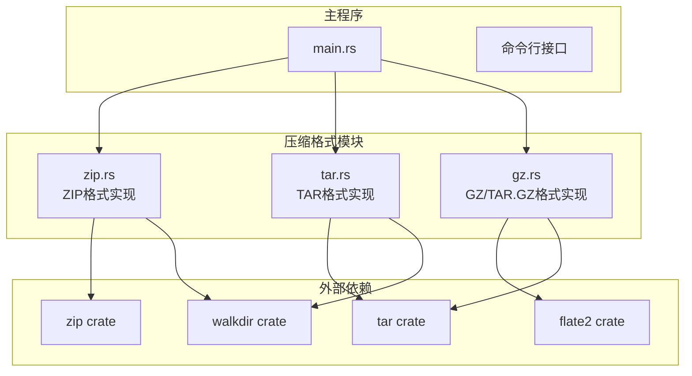
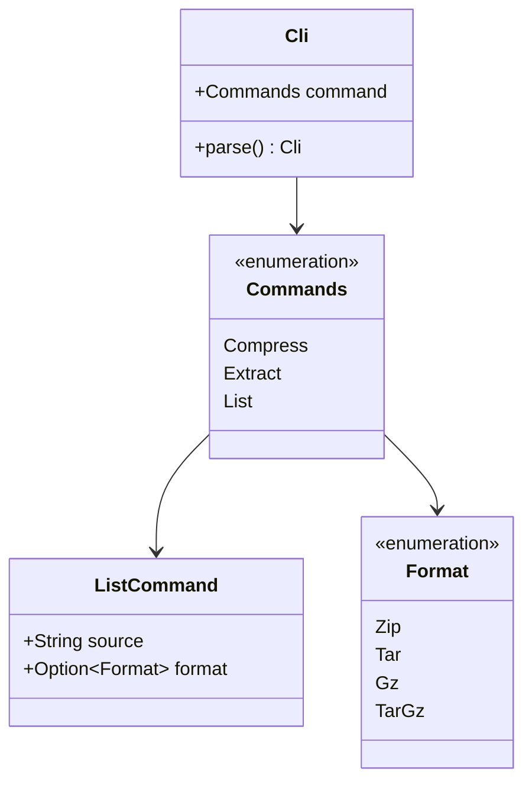
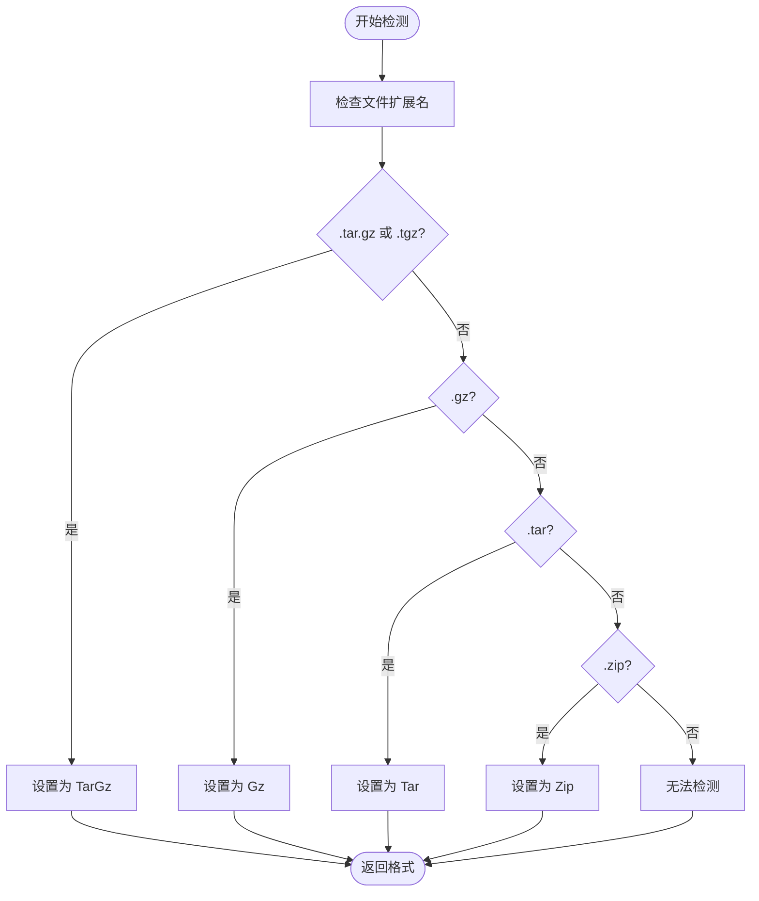
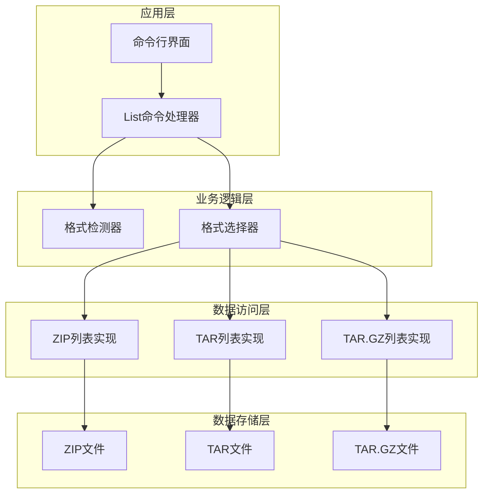
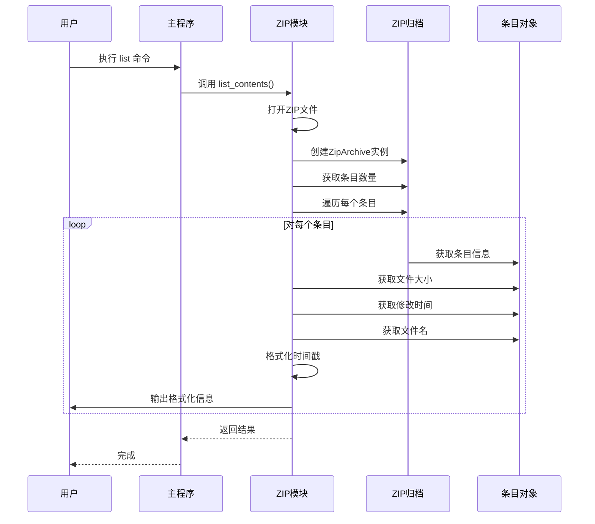
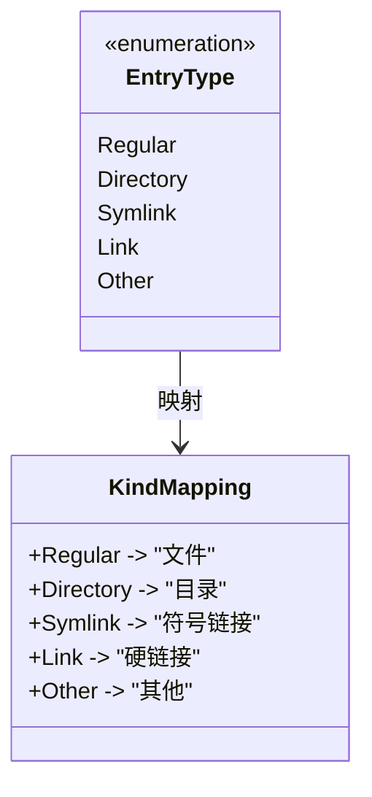
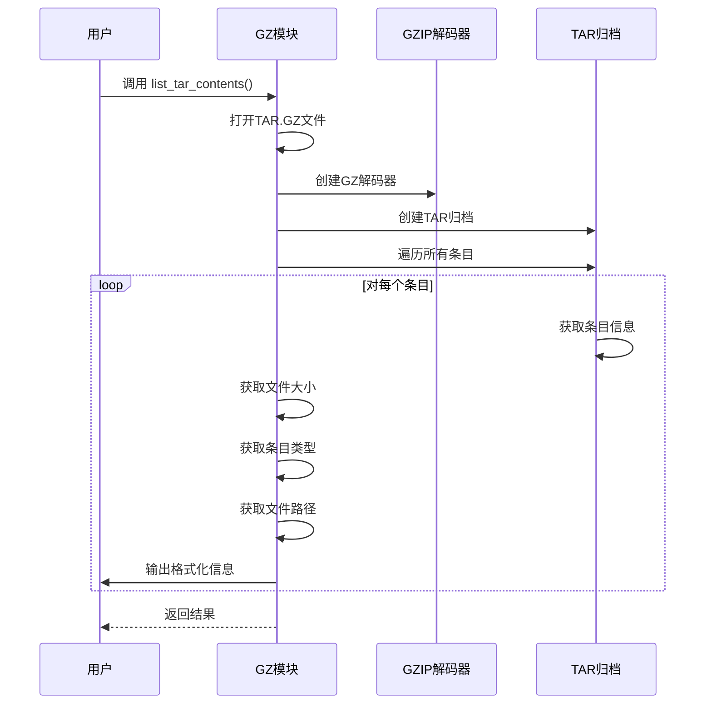
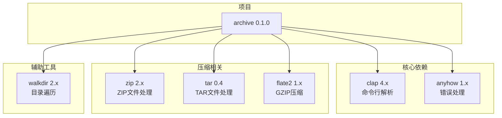
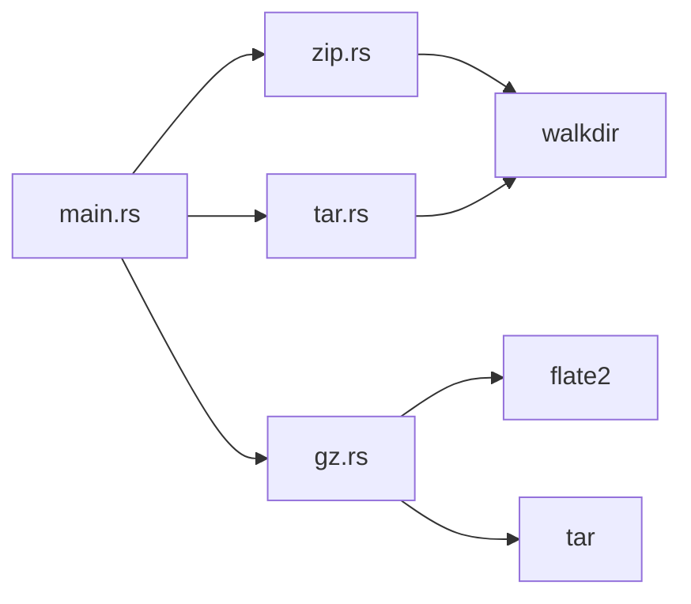

# 列表功能实现

<cite>
**本文档引用的文件**
- [main.rs](file://archive/src/main.rs)
- [zip.rs](file://archive/src/zip.rs)
- [tar.rs](file://archive/src/tar.rs)
- [gz.rs](file://archive/src/gz.rs)
- [Cargo.toml](file://archive/Cargo.toml)
</cite>

## 目录
1. [简介](#简介)
2. [项目结构](#项目结构)
3. [核心组件](#核心组件)
4. [架构概览](#架构概览)
5. [详细组件分析](#详细组件分析)
6. [依赖关系分析](#依赖关系分析)
7. [性能考虑](#性能考虑)
8. [故障排除指南](#故障排除指南)
9. [结论](#结论)

## 简介

MyArchive是一个支持多种压缩格式的命令行工具，其中列表功能允许用户查看压缩包内部的内容结构。该功能通过统一的接口支持ZIP、TAR、TAR.GZ等格式，为用户提供清晰的文件信息展示。

## 项目结构

该项目采用模块化设计，每个压缩格式都有独立的模块实现：

**图表来源**
- [main.rs:1-183](file://archive/src/main.rs#L1-L183)
- [zip.rs:1-109](file://archive/src/zip.rs#L1-L109)
- [tar.rs:1-80](file://archive/src/tar.rs#L1-L80)
- [gz.rs:1-124](file://archive/src/gz.rs#L1-L124)

**章节来源**
- [main.rs:1-183](file://archive/src/main.rs#L1-L183)
- [Cargo.toml:1-13](file://archive/Cargo.toml#L1-L13)

## 核心组件

### 命令行接口设计

系统通过Clap库提供统一的命令行接口，支持三种主要操作：压缩、解压和列表。

**图表来源**
- [main.rs:9-59](file://archive/src/main.rs#L9-L59)

### 格式检测机制

系统实现了智能的格式自动检测功能，能够根据文件扩展名判断压缩格式：

**图表来源**
- [main.rs:62-75](file://archive/src/main.rs#L62-L75)

**章节来源**
- [main.rs:9-59](file://archive/src/main.rs#L9-L59)
- [main.rs:62-75](file://archive/src/main.rs#L62-L75)

## 架构概览

列表功能的整体架构遵循分层设计原则，每个压缩格式都有独立的实现模块：

**图表来源**
- [main.rs:168-178](file://archive/src/main.rs#L168-L178)
- [zip.rs:83-108](file://archive/src/zip.rs#L83-L108)
- [tar.rs:56-79](file://archive/src/tar.rs#L56-L79)
- [gz.rs:99-123](file://archive/src/gz.rs#L99-L123)

## 详细组件分析

### ZIP列表功能实现

ZIP格式的列表功能是最复杂的实现，因为它需要处理时间戳格式化和逐个条目枚举。

#### 核心实现流程

**图表来源**
- [main.rs:172-173](file://archive/src/main.rs#L172-L173)
- [zip.rs:84-108](file://archive/src/zip.rs#L84-L108)

#### 数据提取和格式化

ZIP列表功能从条目对象中提取以下关键信息：

| 元数据字段 | 获取方法 | 格式化规则 |
|-----------|----------|-----------|
| 文件大小 | `entry.size()` | 字符串格式，右对齐 |
| 修改时间 | `entry.last_modified()` | YYYY-MM-DD HH:MM 格式 |
| 文件名 | `entry.name()` | 原始字符串 |

时间戳格式化逻辑展示了具体的实现细节：

**图表来源**
- [zip.rs:93-104](file://archive/src/zip.rs#L93-L104)

**章节来源**
- [zip.rs:83-108](file://archive/src/zip.rs#L83-L108)

### TAR列表功能实现

TAR格式的列表功能相对简单，主要处理不同类型的文件条目：

#### 条目类型识别

**图表来源**
- [tar.rs:67-73](file://archive/src/tar.rs#L67-L73)

**章节来源**
- [tar.rs:56-79](file://archive/src/tar.rs#L56-L79)

### TAR.GZ列表功能实现

TAR.GZ格式结合了GZIP压缩和TAR打包的特点：

#### 处理流程

**图表来源**
- [gz.rs:100-123](file://archive/src/gz.rs#L100-L123)

**章节来源**
- [gz.rs:99-123](file://archive/src/gz.rs#L99-L123)

## 依赖关系分析

### 外部依赖管理

项目使用Cargo进行依赖管理，主要依赖包括：

**图表来源**
- [Cargo.toml:6-12](file://archive/Cargo.toml#L6-L12)

### 内部模块依赖

**图表来源**
- [main.rs:1-3](file://archive/src/main.rs#L1-L3)
- [zip.rs:5-7](file://archive/src/zip.rs#L5-L7)

**章节来源**
- [Cargo.toml:6-12](file://archive/Cargo.toml#L6-L12)

## 性能考虑

### 时间复杂度分析

- **ZIP列表功能**: O(n)，其中n是压缩包中条目的数量
- **TAR列表功能**: O(m)，其中m是TAR归档中条目的数量  
- **TAR.GZ列表功能**: O(k)，其中k是解码后条目的数量

### 内存使用优化

1. **流式处理**: 所有格式都采用流式读取，避免一次性加载整个文件
2. **按需解码**: TAR.GZ格式使用GZIP解码器进行增量解码
3. **最小化缓存**: 列表功能只读取必要的元数据信息

### I/O性能优化

- 使用标准库的File和IO模块进行高效的文件操作
- 避免不必要的文件系统查询
- 合理的缓冲区大小设置

## 故障排除指南

### 常见问题及解决方案

#### 格式检测失败

**问题**: 系统无法自动检测压缩格式
**解决方案**: 显式指定格式参数 `-f` 或 `--format`

#### 文件打开错误

**问题**: 无法打开压缩文件
**解决方案**: 
1. 检查文件路径是否正确
2. 验证文件权限
3. 确认文件完整性

#### 列表功能限制

**问题**: GZ单文件格式不支持列表功能
**解决方案**: 直接解压查看内容，或使用其他格式

**章节来源**
- [main.rs:168-177](file://archive/src/main.rs#L168-L177)

## 结论

MyArchive的列表功能实现了统一的多格式支持，具有以下特点：

### 技术优势

1. **模块化设计**: 每种压缩格式都有独立的实现模块
2. **统一接口**: 提供一致的命令行体验
3. **智能检测**: 自动识别压缩格式，提升用户体验
4. **错误处理**: 完善的错误处理和用户反馈机制

### 功能特性

- 支持ZIP、TAR、TAR.GZ格式的列表显示
- 统一的表格输出格式
- 智能的时间戳格式化
- 详细的文件元数据展示

### 开发建议

对于开发者来说，这个实现提供了良好的参考模式：
- 使用模块化架构分离不同格式的实现
- 通过统一接口提供一致的用户体验
- 实现智能的格式检测机制
- 注重错误处理和用户反馈