# 列表功能实现

<cite>
**本文档引用的文件**
- [main.rs](file://archive/src/main.rs)
- [zip.rs](file://archive/src/zip.rs)
- [tar.rs](file://archive/src/tar.rs)
- [gz.rs](file://archive/src/gz.rs)
- [bz2.rs](file://archive/src/bz2.rs)
- [xz.rs](file://archive/src/xz.rs)
- [seven_z.rs](file://archive/src/seven_z.rs)
- [rar.rs](file://archive/src/rar.rs)
- [Cargo.toml](file://archive/Cargo.toml)
</cite>

## 更新摘要
**变更内容**
- 扩展支持10种压缩格式的列表功能，包括BZ2、XZ、7Z、RAR
- 新增多格式内容列表功能的完整实现
- 更新格式检测机制以支持更多文件扩展名
- 增强列表功能的统一接口设计

## 目录
1. [简介](#简介)
2. [项目结构](#项目结构)
3. [核心组件](#核心组件)
4. [架构概览](#架构概览)
5. [详细组件分析](#详细组件分析)
6. [依赖关系分析](#依赖关系分析)
7. [性能考虑](#性能考虑)
8. [故障排除指南](#故障排除指南)
9. [结论](#结论)

## 简介

MyArchive是一个支持多种压缩格式的命令行工具，现已扩展支持10种不同的压缩格式，包括ZIP、TAR、GZ、BZ2、XZ、TAR.GZ、TAR.BZ2、TAR.XZ、7Z和RAR。列表功能允许用户查看各种压缩包内部的内容结构，为用户提供清晰的文件信息展示和统一的操作体验。

## 项目结构

该项目采用模块化设计，每个压缩格式都有独立的模块实现，支持统一的列表功能接口：

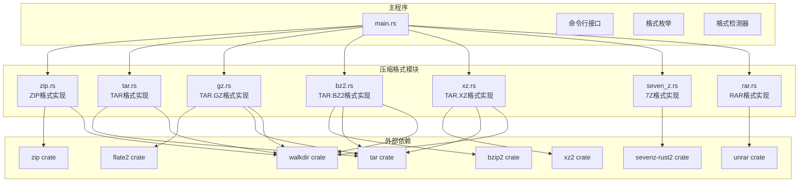

**图表来源**
- [main.rs:1-7](file://archive/src/main.rs#L1-L7)
- [main.rs:23-36](file://archive/src/main.rs#L23-L36)
- [main.rs:72-98](file://archive/src/main.rs#L72-L98)
- [Cargo.toml:6-16](file://archive/Cargo.toml#L6-L16)

**章节来源**
- [main.rs:1-233](file://archive/src/main.rs#L1-L233)
- [Cargo.toml:1-22](file://archive/Cargo.toml#L1-L22)

## 核心组件

### 命令行接口设计

系统通过Clap库提供统一的命令行接口，支持三种主要操作：压缩、解压和列表。新增的Format枚举支持10种不同的压缩格式：

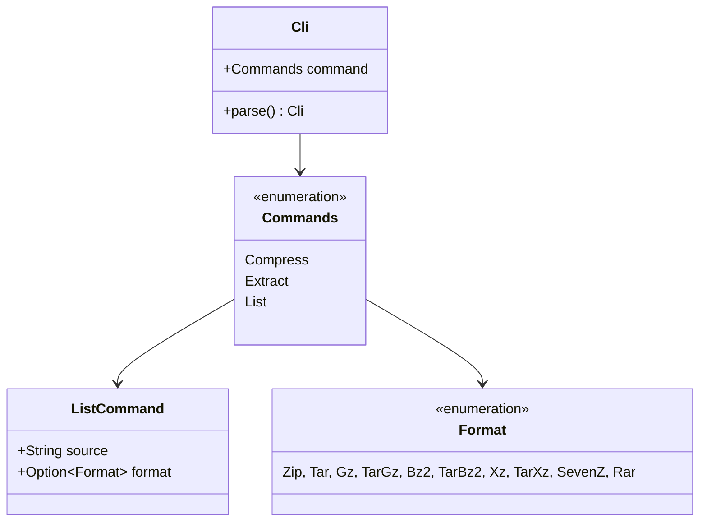

**图表来源**
- [main.rs:13-70](file://archive/src/main.rs#L13-L70)

### 格式检测机制

系统实现了智能的格式自动检测功能，能够根据文件扩展名判断压缩格式，支持更多格式的检测：

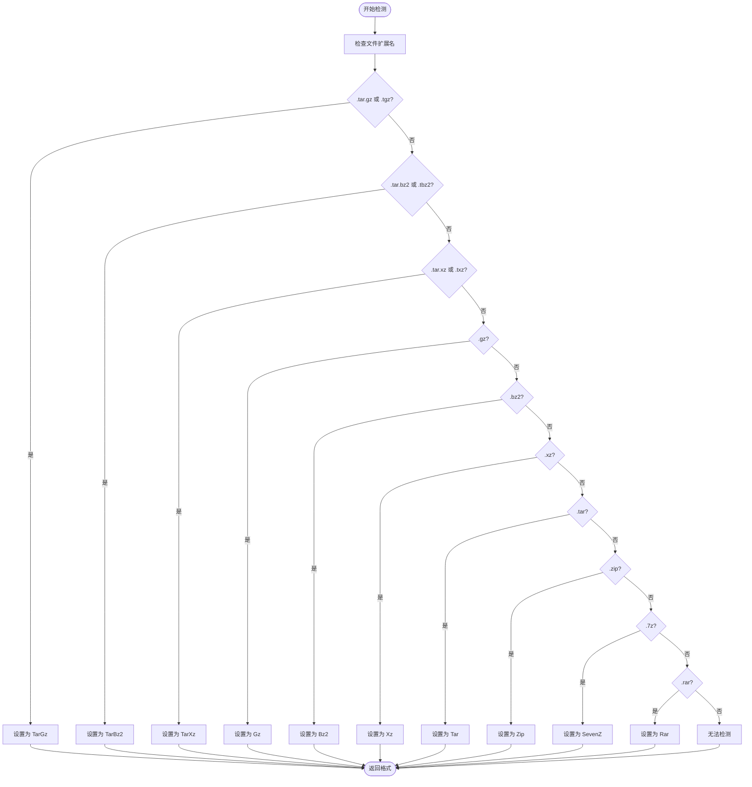

**图表来源**
- [main.rs:72-98](file://archive/src/main.rs#L72-L98)

**章节来源**
- [main.rs:13-70](file://archive/src/main.rs#L13-L70)
- [main.rs:72-98](file://archive/src/main.rs#L72-L98)

## 架构概览

列表功能的整体架构遵循分层设计原则，每个压缩格式都有独立的实现模块，支持统一的接口调用：

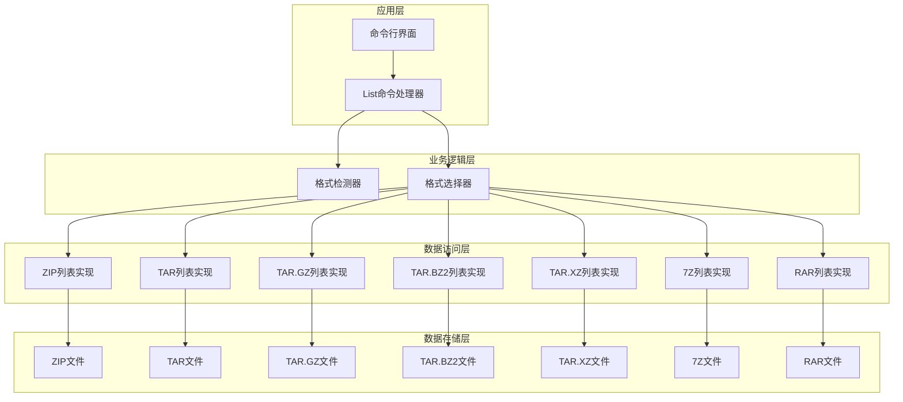

**图表来源**
- [main.rs:212-228](file://archive/src/main.rs#L212-L228)
- [zip.rs:83-108](file://archive/src/zip.rs#L83-L108)
- [tar.rs:56-79](file://archive/src/tar.rs#L56-L79)
- [gz.rs:99-123](file://archive/src/gz.rs#L99-L123)
- [bz2.rs:99-123](file://archive/src/bz2.rs#L99-L123)
- [xz.rs:98-122](file://archive/src/xz.rs#L98-L122)
- [seven_z.rs:36-61](file://archive/src/seven_z.rs#L36-L61)
- [rar.rs:50-80](file://archive/src/rar.rs#L50-L80)

## 详细组件分析

### ZIP列表功能实现

ZIP格式的列表功能是最复杂的实现，因为它需要处理时间戳格式化和逐个条目枚举。

#### 核心实现流程

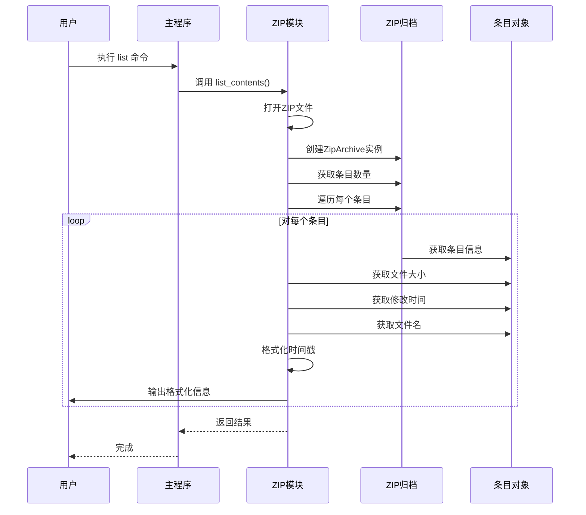

**图表来源**
- [main.rs:217](file://archive/src/main.rs#L217)
- [zip.rs:84-108](file://archive/src/zip.rs#L84-L108)

#### 数据提取和格式化

ZIP列表功能从条目对象中提取以下关键信息：

| 元数据字段 | 获取方法 | 格式化规则 |
|-----------|----------|-----------|
| 文件大小 | `entry.size()` | 字符串格式，右对齐 |
| 修改时间 | `entry.last_modified()` | YYYY-MM-DD HH:MM 格式 |
| 文件名 | `entry.name()` | 原始字符串 |

时间戳格式化逻辑展示了具体的实现细节：

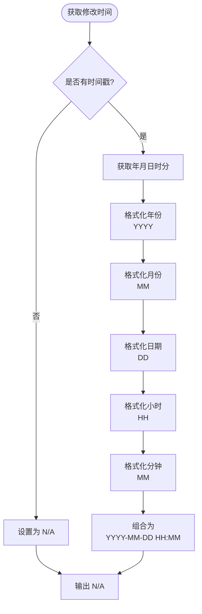

**图表来源**
- [zip.rs:93-104](file://archive/src/zip.rs#L93-L104)

**章节来源**
- [zip.rs:83-108](file://archive/src/zip.rs#L83-L108)

### TAR列表功能实现

TAR格式的列表功能相对简单，主要处理不同类型的文件条目：

#### 条目类型识别

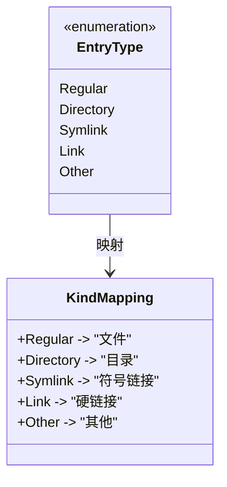

**图表来源**
- [tar.rs:67-73](file://archive/src/tar.rs#L67-L73)

**章节来源**
- [tar.rs:56-79](file://archive/src/tar.rs#L56-L79)

### TAR.GZ列表功能实现

TAR.GZ格式结合了GZIP压缩和TAR打包的特点：

#### 处理流程

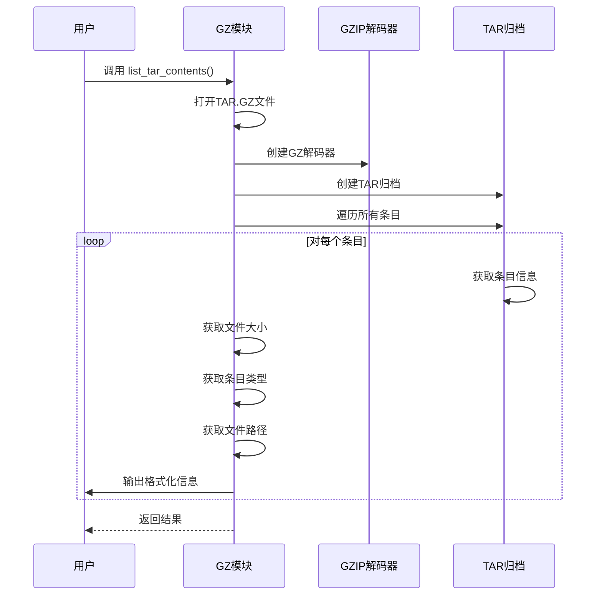

**图表来源**
- [gz.rs:100-123](file://archive/src/gz.rs#L100-L123)

**章节来源**
- [gz.rs:99-123](file://archive/src/gz.rs#L99-L123)

### TAR.BZ2列表功能实现

TAR.BZ2格式结合了BZIP2压缩和TAR打包的特点：

#### 处理流程

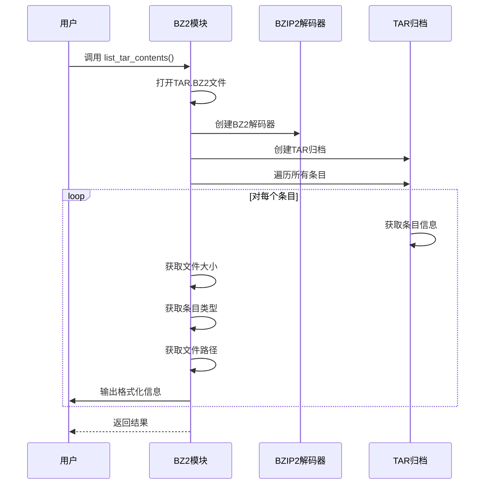

**图表来源**
- [bz2.rs:100-123](file://archive/src/bz2.rs#L100-L123)

**章节来源**
- [bz2.rs:99-123](file://archive/src/bz2.rs#L99-L123)

### TAR.XZ列表功能实现

TAR.XZ格式结合了XZ压缩和TAR打包的特点：

#### 处理流程

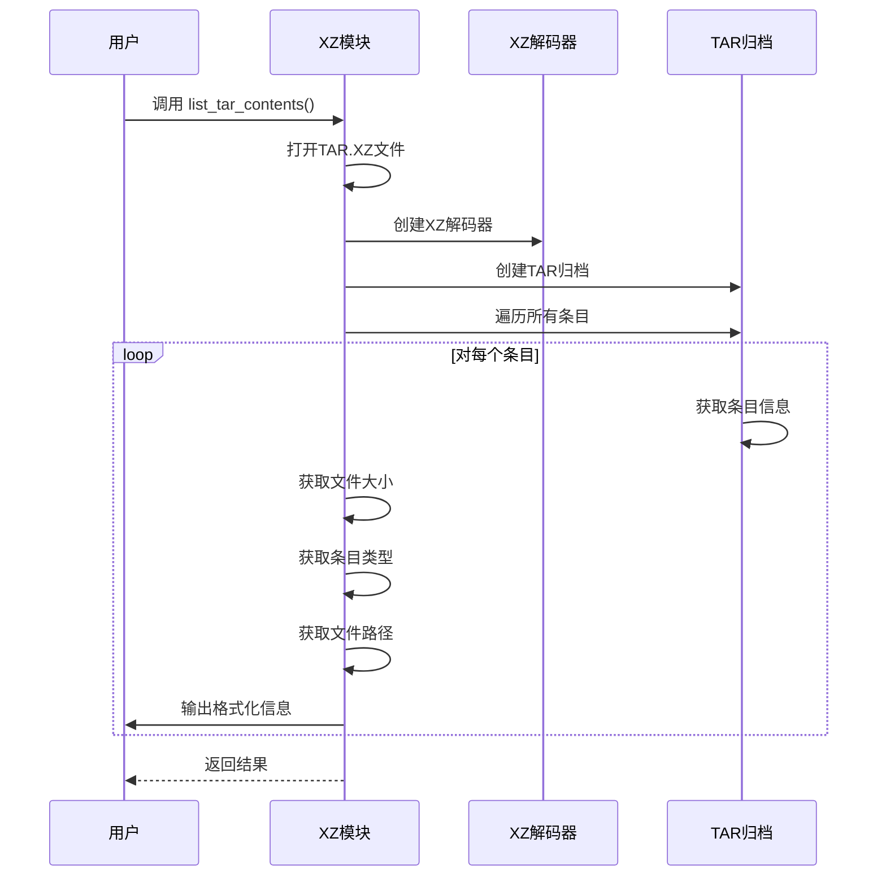

**图表来源**
- [xz.rs:99-122](file://archive/src/xz.rs#L99-L122)

**章节来源**
- [xz.rs:98-122](file://archive/src/xz.rs#L98-L122)

### 7Z列表功能实现

7Z格式使用专门的sevenz-rust2库进行处理：

#### 处理流程

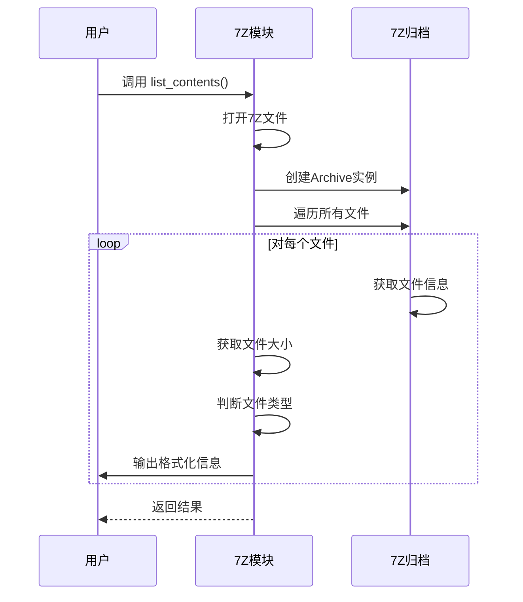

**图表来源**
- [seven_z.rs:37-61](file://archive/src/seven_z.rs#L37-L61)

**章节来源**
- [seven_z.rs:36-61](file://archive/src/seven_z.rs#L36-L61)

### RAR列表功能实现

RAR格式使用unrar库进行处理，支持专有的RAR格式：

#### 处理流程

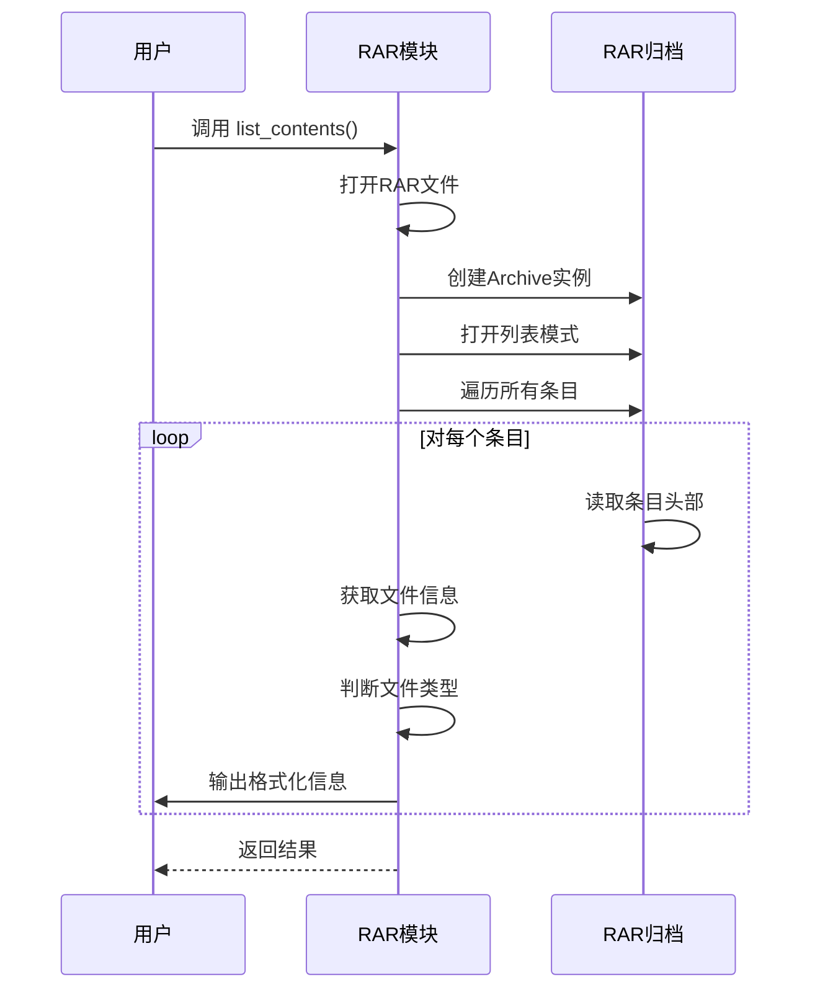

**图表来源**
- [rar.rs:51-80](file://archive/src/rar.rs#L51-L80)

**章节来源**
- [rar.rs:50-80](file://archive/src/rar.rs#L50-L80)

## 依赖关系分析

### 外部依赖管理

项目使用Cargo进行依赖管理，主要依赖包括：

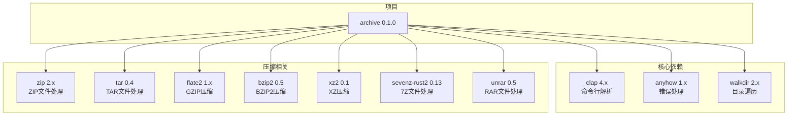

**图表来源**
- [Cargo.toml:6-16](file://archive/Cargo.toml#L6-L16)

### 内部模块依赖

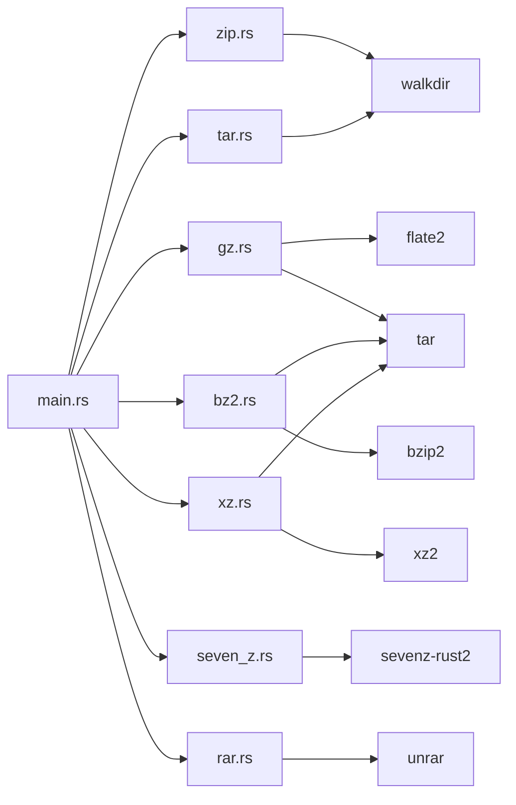

**图表来源**
- [main.rs:1-7](file://archive/src/main.rs#L1-L7)
- [zip.rs:5](file://archive/src/zip.rs#L5)
- [tar.rs:5](file://archive/src/tar.rs#L5)

**章节来源**
- [Cargo.toml:6-16](file://archive/Cargo.toml#L6-L16)

## 性能考虑

### 时间复杂度分析

- **ZIP列表功能**: O(n)，其中n是压缩包中条目的数量
- **TAR列表功能**: O(m)，其中m是TAR归档中条目的数量  
- **TAR.GZ列表功能**: O(k)，其中k是解码后条目的数量
- **TAR.BZ2列表功能**: O(k)，其中k是解码后条目的数量
- **TAR.XZ列表功能**: O(k)，其中k是解码后条目的数量
- **7Z列表功能**: O(p)，其中p是7Z归档中文件的数量
- **RAR列表功能**: O(q)，其中q是RAR归档中条目的数量

### 内存使用优化

1. **流式处理**: 所有格式都采用流式读取，避免一次性加载整个文件
2. **按需解码**: TAR.GZ、TAR.BZ2、TAR.XZ格式使用对应的解码器进行增量解码
3. **最小化缓存**: 列表功能只读取必要的元数据信息
4. **统一接口**: 所有格式都实现相同的列表接口，便于内存管理

### I/O性能优化

- 使用标准库的File和IO模块进行高效的文件操作
- 避免不必要的文件系统查询
- 合理的缓冲区大小设置
- 流式解码减少内存占用

## 故障排除指南

### 常见问题及解决方案

#### 格式检测失败

**问题**: 系统无法自动检测压缩格式
**解决方案**: 显式指定格式参数 `-f` 或 `--format`

#### 文件打开错误

**问题**: 无法打开压缩文件
**解决方案**: 
1. 检查文件路径是否正确
2. 验证文件权限
3. 确认文件完整性

#### 列表功能限制

**问题**: 单文件压缩格式不支持列表功能
**解决方案**: 直接解压查看内容，或使用其他格式
- GZ单文件格式：使用 `archive extract -s file.gz -f gz` 查看内容
- BZ2单文件格式：使用 `archive extract -s file.bz2 -f bz2` 查看内容  
- XZ单文件格式：使用 `archive extract -s file.xz -f xz` 查看内容

#### 专有格式限制

**问题**: RAR格式不支持压缩功能
**解决方案**: RAR格式仅支持解压和列表功能，不支持创建压缩包

**章节来源**
- [main.rs:224-227](file://archive/src/main.rs#L224-L227)

## 结论

MyArchive的列表功能实现了统一的多格式支持，现已扩展到支持10种不同的压缩格式，具有以下特点：

### 技术优势

1. **模块化设计**: 每种压缩格式都有独立的实现模块
2. **统一接口**: 提供一致的命令行体验
3. **智能检测**: 自动识别压缩格式，提升用户体验
4. **错误处理**: 完善的错误处理和用户反馈机制
5. **扩展性**: 支持更多压缩格式的轻松添加

### 功能特性

- 支持ZIP、TAR、TAR.GZ、TAR.BZ2、TAR.XZ、7Z、RAR等格式的列表显示
- 统一的表格输出格式
- 智能的时间戳格式化
- 详细的文件元数据展示
- 支持单文件压缩格式的特殊处理

### 开发建议

对于开发者来说，这个实现提供了良好的参考模式：
- 使用模块化架构分离不同格式的实现
- 通过统一接口提供一致的用户体验
- 实现智能的格式检测机制
- 注重错误处理和用户反馈
- 考虑专有格式的特殊处理需求

### 支持的格式列表

| 格式 | 扩展名 | 支持功能 | 特殊说明 |
|------|--------|----------|----------|
| ZIP | .zip | 压缩、解压、列表 | 标准格式，功能完整 |
| TAR | .tar | 压缩、解压、列表 | 标准打包格式 |
| TAR.GZ | .tar.gz, .tgz | 压缩、解压、列表 | GZIP压缩的TAR |
| TAR.BZ2 | .tar.bz2, .tbz2 | 压缩、解压、列表 | BZIP2压缩的TAR |
| TAR.XZ | .tar.xz, .txz | 压缩、解压、列表 | XZ压缩的TAR |
| 7Z | .7z | 压缩、解压、列表 | 现代压缩格式 |
| RAR | .rar | 解压、列表 | 专有格式，不支持压缩 |
| GZ | .gz | 解压、列表 | 单文件压缩，不支持列表 |
| BZ2 | .bz2 | 解压、列表 | 单文件压缩，不支持列表 |
| XZ | .xz | 解压、列表 | 单文件压缩，不支持列表 |