# 压缩功能实现

<cite>
**本文档引用的文件**
- [main.rs](file://archive/src/main.rs)
- [zip.rs](file://archive/src/zip.rs)
- [tar.rs](file://archive/src/tar.rs)
- [gz.rs](file://archive/src/gz.rs)
- [bz2.rs](file://archive/src/bz2.rs)
- [xz.rs](file://archive/src/xz.rs)
- [seven_z.rs](file://archive/src/seven_z.rs)
- [rar.rs](file://archive/src/rar.rs)
- [Cargo.toml](file://archive/Cargo.toml)
</cite>

## 更新摘要
**变更内容**
- 新增BZIP2、XZ、7-Zip、RAR格式支持的详细实现分析
- 扩展格式枚举和命令行接口支持10种压缩格式
- 更新依赖关系分析，包含新的压缩库依赖
- 增强多格式压缩流程图和架构图
- 补充新格式的错误处理和性能考虑

## 目录
1. [简介](#简介)
2. [项目结构](#项目结构)
3. [核心组件](#核心组件)
4. [架构概览](#架构概览)
5. [详细组件分析](#详细组件分析)
6. [依赖关系分析](#依赖关系分析)
7. [性能考虑](#性能考虑)
8. [故障排除指南](#故障排除指南)
9. [结论](#结论)

## 简介

MyArchive 是一个多功能的文件压缩与解压工具，现已支持十种压缩格式：ZIP、TAR、GZ、BZIP2、XZ、7-Zip、RAR以及各种组合格式（TAR.GZ、TAR.BZ2、TAR.XZ）。该项目采用模块化设计，每个压缩格式都有独立的实现模块，提供了统一的命令行接口和一致的用户体验。

该工具的核心功能包括：
- 支持单文件和目录的递归压缩
- 多种压缩格式的统一处理接口
- 完整的错误处理和用户反馈机制
- 高效的数据流处理和内存管理
- 支持专有格式（RAR）和开源格式的混合使用

## 项目结构

项目采用清晰的模块化架构，主要包含以下组件：

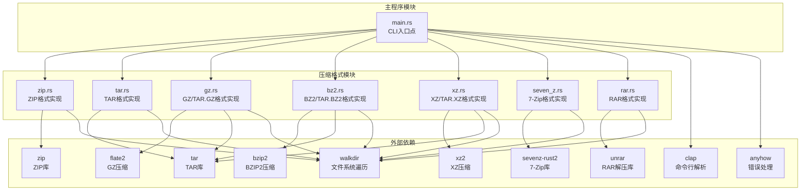

**图表来源**
- [main.rs:1-233](file://archive/src/main.rs#L1-L233)
- [zip.rs:1-109](file://archive/src/zip.rs#L1-L109)
- [tar.rs:1-80](file://archive/src/tar.rs#L1-L80)
- [gz.rs:1-124](file://archive/src/gz.rs#L1-L124)
- [bz2.rs:1-124](file://archive/src/bz2.rs#L1-L124)
- [xz.rs:1-123](file://archive/src/xz.rs#L1-L123)
- [seven_z.rs:1-62](file://archive/src/seven_z.rs#L1-L62)
- [rar.rs:1-81](file://archive/src/rar.rs#L1-L81)

**章节来源**
- [main.rs:1-233](file://archive/src/main.rs#L1-L233)
- [Cargo.toml:1-22](file://archive/Cargo.toml#L1-L22)

## 核心组件

### CLI命令行接口

主程序通过clap库提供统一的命令行界面，支持九种主要操作：

- **压缩操作** (`compress`): 将文件或目录压缩为指定格式
- **解压操作** (`extract`): 解压压缩文件到目标目录  
- **列表操作** (`list`): 显示压缩包中的文件列表

每种操作都支持格式自动检测和默认输出路径生成。新增的格式枚举包括：ZIP、TAR、GZ、TAR.GZ、BZ2、TAR.BZ2、XZ、TAR.XZ、7Z、RAR。

### 压缩格式支持

系统现已支持十种压缩格式，每种格式都有专门的实现模块：

1. **ZIP格式**: 使用zip库实现，支持标准ZIP压缩
2. **TAR格式**: 使用tar库实现，支持无压缩的tar打包
3. **GZ格式**: 使用flate2库实现，支持单文件GZ压缩
4. **TAR.GZ格式**: 结合tar和GZ功能，先打包后压缩
5. **BZIP2格式**: 使用bzip2库实现，支持单文件BZ2压缩
6. **TAR.BZ2格式**: 结合tar和BZ2功能，先打包后压缩
7. **XZ格式**: 使用xz2库实现，支持单文件XZ压缩
8. **TAR.XZ格式**: 结合tar和XZ功能，先打包后压缩
9. **7-Zip格式**: 使用sevenz-rust2库实现，支持7Z格式压缩
10. **RAR格式**: 使用unrar库实现，支持RAR格式解压和列表

**章节来源**
- [main.rs:23-36](file://archive/src/main.rs#L23-L36)
- [main.rs:177-188](file://archive/src/main.rs#L177-L188)

## 架构概览

系统采用分层架构设计，从上到下分为：

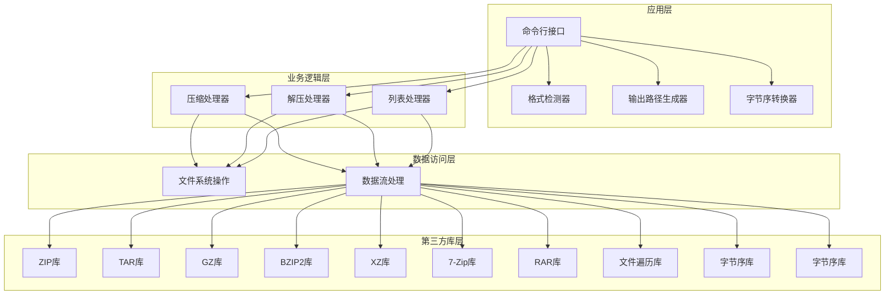

**图表来源**
- [main.rs:72-98](file://archive/src/main.rs#L72-L98)
- [zip.rs:9-56](file://archive/src/zip.rs#L9-L56)
- [tar.rs:7-41](file://archive/src/tar.rs#L7-L41)
- [gz.rs:11-83](file://archive/src/gz.rs#L11-L83)
- [bz2.rs:11-83](file://archive/src/bz2.rs#L11-L83)
- [xz.rs:10-82](file://archive/src/xz.rs#L10-L82)
- [seven_z.rs:5-34](file://archive/src/seven_z.rs#L5-L34)
- [rar.rs:6-48](file://archive/src/rar.rs#L6-L48)

## 详细组件分析

### ZIP压缩实现

ZIP模块提供了最复杂的压缩功能，支持单文件和目录的递归压缩。

#### 核心压缩流程

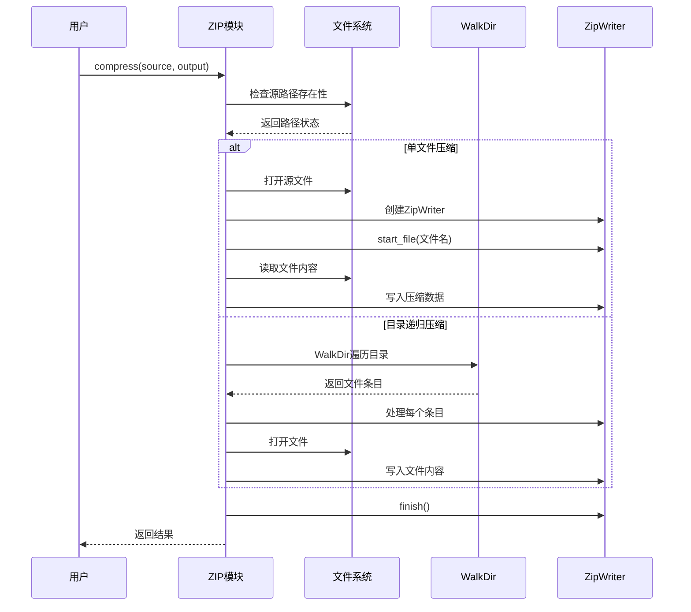

**图表来源**
- [zip.rs:10-56](file://archive/src/zip.rs#L10-L56)

#### 文件系统遍历策略

ZIP模块使用walkdir库进行高效的文件系统遍历：

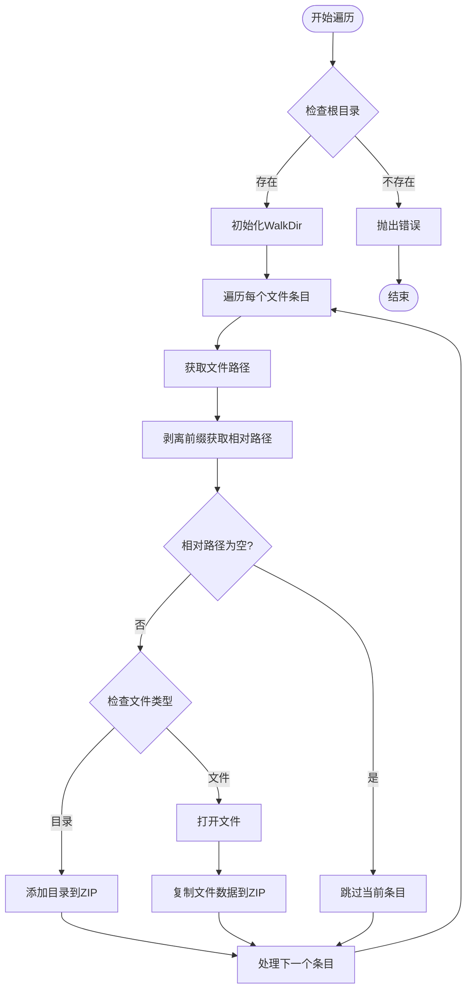

**图表来源**
- [zip.rs:30-50](file://archive/src/zip.rs#L30-L50)

#### 压缩选项配置

ZIP模块使用FileOptions配置压缩参数：

- **压缩方法**: Deflated (DEFLATE算法)
- **压缩级别**: 默认级别
- **时间戳**: 保留原始文件信息
- **权限**: 保持文件权限信息

**章节来源**
- [zip.rs:10-56](file://archive/src/zip.rs#L10-L56)
- [zip.rs:18](file://archive/src/zip.rs#L18)

### TAR压缩实现

TAR模块实现了无压缩的打包功能，主要用于与其他压缩格式组合使用。

#### 压缩实现逻辑

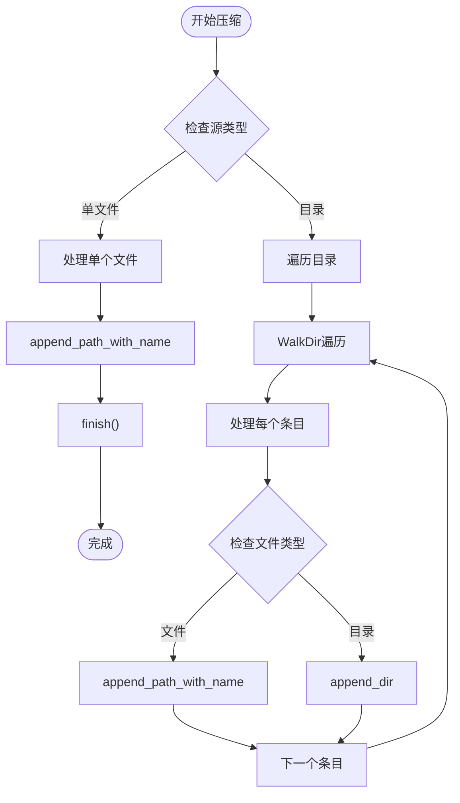

**图表来源**
- [tar.rs:8-41](file://archive/src/tar.rs#L8-L41)

**章节来源**
- [tar.rs:8-41](file://archive/src/tar.rs#L8-L41)

### GZ压缩实现

GZ模块提供了单文件压缩功能，支持标准的GZ压缩格式。

#### 压缩流程

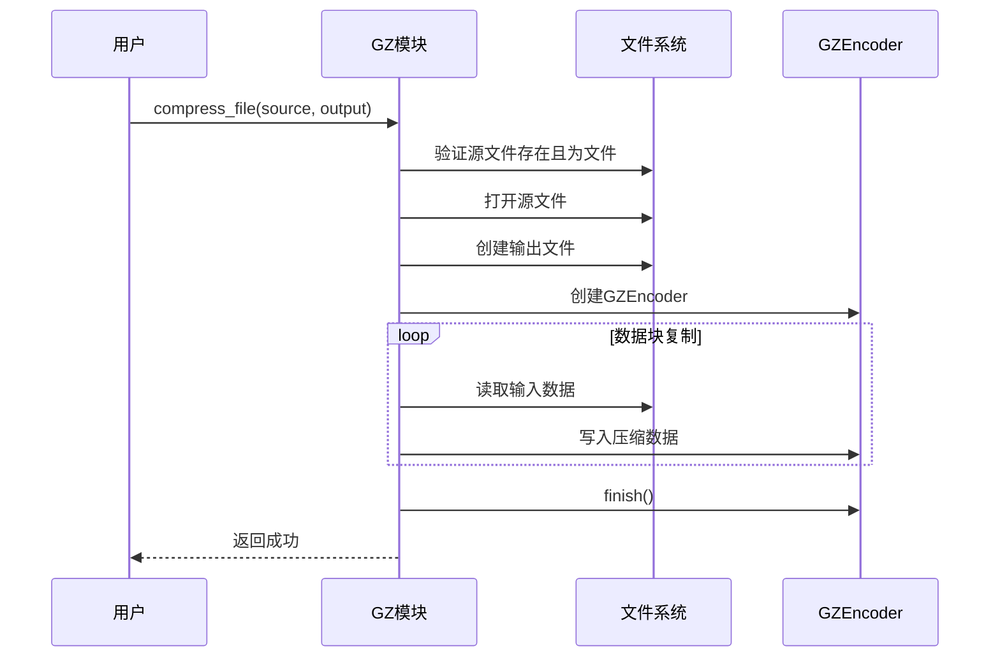

**图表来源**
- [gz.rs:12-31](file://archive/src/gz.rs#L12-L31)

**章节来源**
- [gz.rs:12-31](file://archive/src/gz.rs#L12-L31)

### TAR.GZ压缩实现

TAR.GZ结合了TAR打包和GZ压缩两个功能，先打包后压缩。

#### 实现策略

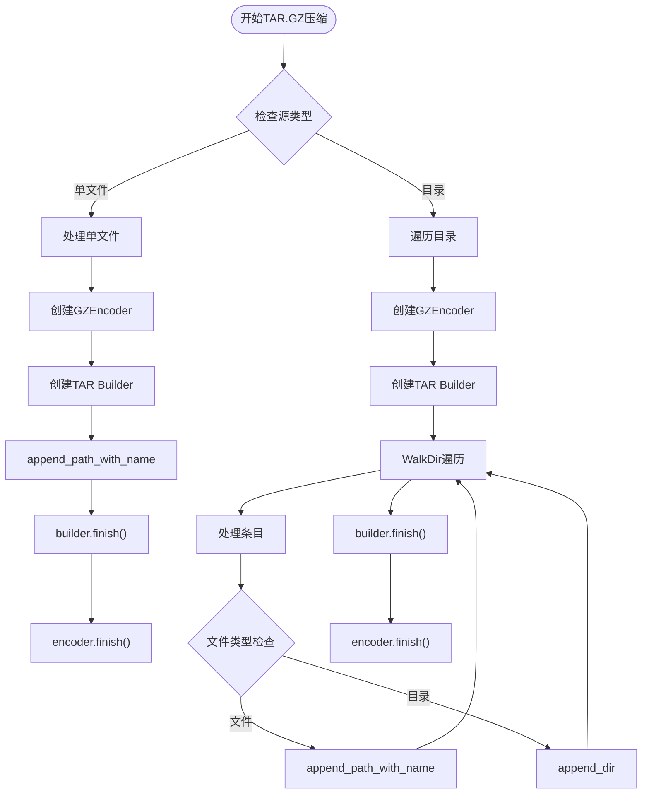

**图表来源**
- [gz.rs:47-83](file://archive/src/gz.rs#L47-L83)

**章节来源**
- [gz.rs:47-83](file://archive/src/gz.rs#L47-L83)

### BZIP2压缩实现

BZIP2模块提供了单文件压缩功能，使用bzip2库实现高压缩比的压缩算法。

#### 核心压缩流程

**图表来源**
- [bz2.rs:12-31](file://archive/src/bz2.rs#L12-L31)

#### BZIP2压缩选项配置

BZIP2模块使用Compression配置压缩参数：

- **压缩算法**: Huffman编码 + 前缀编码
- **压缩级别**: 默认级别 (1-9)
- **内存使用**: 高压缩比，较高内存消耗
- **压缩速度**: 中等速度，高压缩比

**章节来源**
- [bz2.rs:12-31](file://archive/src/bz2.rs#L12-L31)
- [bz2.rs:24](file://archive/src/bz2.rs#L24)

### XZ压缩实现

XZ模块提供了单文件压缩功能，使用xz2库实现基于LZMA2算法的高压缩比压缩。

#### XZ压缩实现流程

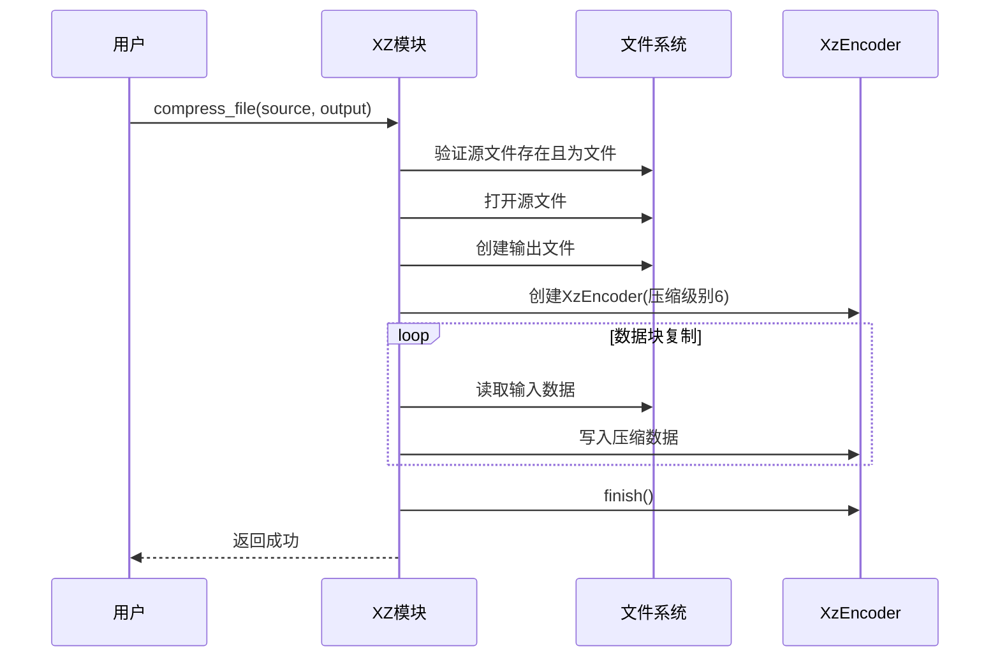

**图表来源**
- [xz.rs:11-30](file://archive/src/xz.rs#L11-L30)

#### XZ压缩选项配置

XZ模块使用XzEncoder配置压缩参数：

- **压缩算法**: LZMA2 + CRC64
- **压缩级别**: 6 (平衡压缩比和速度)
- **内存使用**: 高压缩比，中等内存消耗
- **压缩速度**: 中等速度，高压缩比
- **兼容性**: 标准XZ格式，广泛支持

**章节来源**
- [xz.rs:11-30](file://archive/src/xz.rs#L11-L30)
- [xz.rs:23](file://archive/src/xz.rs#L23)

### 7-Zip压缩实现

7-Zip模块提供了7Z格式的压缩功能，使用sevenz-rust2库实现。

#### 7-Zip压缩实现流程

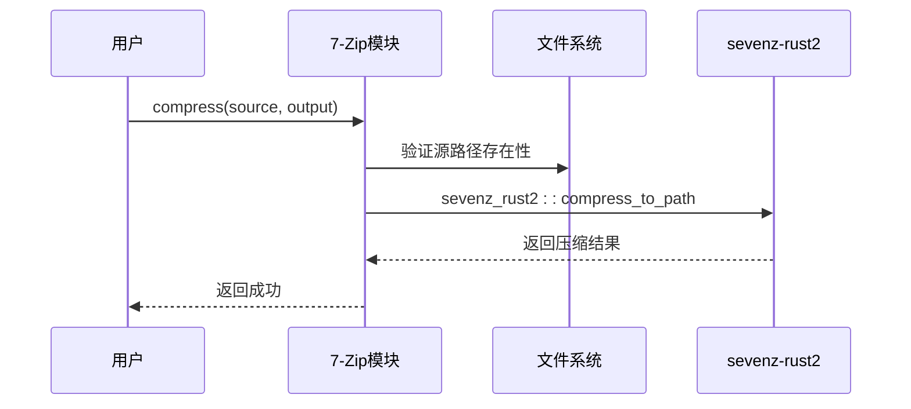

**图表来源**
- [seven_z.rs:6-17](file://archive/src/seven_z.rs#L6-L17)

#### 7-Zip格式特性

7-Zip模块使用sevenz_rust2库：

- **压缩算法**: LZMA2 + PPMd
- **加密支持**: AES-256加密
- **分卷压缩**: 支持分卷压缩
- **固实压缩**: 支持固实压缩模式
- **元数据**: 保存完整文件属性

**章节来源**
- [seven_z.rs:6-17](file://archive/src/seven_z.rs#L6-L17)

### RAR压缩实现

RAR模块提供了RAR格式的解压和列表功能，使用unrar库实现。

#### RAR解压实现流程

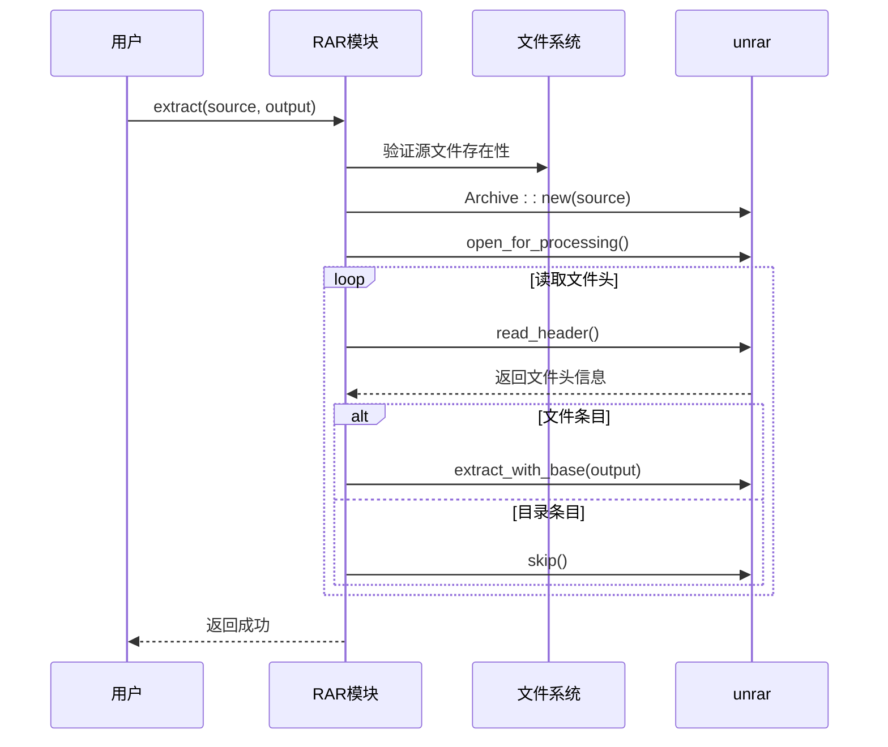

**图表来源**
- [rar.rs:8-48](file://archive/src/rar.rs#L8-L48)

#### RAR格式限制

RAR模块的特殊限制：

- **压缩支持**: 不支持创建RAR压缩包
- **解压支持**: 支持解压RAR文件
- **列表支持**: 支持列出RAR文件内容
- **专有格式**: 专有格式，需要unrar库支持

**章节来源**
- [rar.rs:8-48](file://archive/src/rar.rs#L8-L48)

## 依赖关系分析

项目使用Cargo进行依赖管理，现已扩展到10种压缩格式支持：

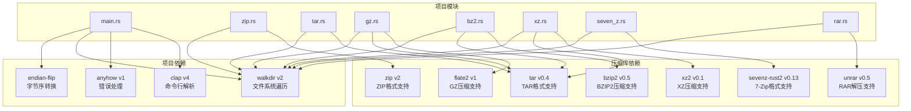

**图表来源**
- [Cargo.toml:6-16](file://archive/Cargo.toml#L6-L16)

### 依赖特性分析

| 依赖库 | 版本 | 主要功能 | 使用场景 | 性能特征 |
|--------|------|----------|----------|----------|
| clap | v4 | 命令行参数解析 | CLI接口定义 | 高性能，类型安全 |
| zip | v2 | ZIP格式压缩/解压 | ZIP格式支持 | 快速压缩，标准兼容 |
| tar | v0.4 | TAR格式打包/解包 | TAR/TAR.GZ/BZ2/XZ格式 | 无压缩，快速打包 |
| flate2 | v1 | GZ压缩/解压 | GZ/TAR.GZ格式 | 标准DEFLATE，平衡性能 |
| bzip2 | v0.5 | BZIP2压缩/解压 | BZ2/TAR.BZ2格式 | 高压缩比，较慢速度 |
| xz2 | v0.1 | XZ压缩/解压 | XZ/TAR.XZ格式 | 超高压缩比，中等速度 |
| sevenz-rust2 | v0.13 | 7-Zip压缩/解压 | 7Z格式支持 | 多算法支持，高性能 |
| unrar | v0.5 | RAR解压 | RAR格式解压 | 专有格式支持 |
| walkdir | v2 | 文件系统递归遍历 | 目录递归处理 | 高效遍历，内存友好 |
| endian-flip | - | 字节序转换 | 大小端转换 | 快速转换，内存高效 |

**章节来源**
- [Cargo.toml:6-16](file://archive/Cargo.toml#L6-L16)

## 性能考虑

### 内存管理策略

1. **流式处理**: 所有压缩操作都采用流式处理方式，避免将整个文件加载到内存中
2. **分块复制**: 使用io::copy进行高效的数据传输，减少内存占用
3. **渐进式构建**: ZIP、TAR、BZIP2、XZ构建器支持渐进式添加条目，避免一次性缓存大量数据
4. **压缩级别选择**: 不同格式采用不同的压缩级别平衡性能和压缩比

### I/O优化

1. **批量文件处理**: 目录遍历时按文件系统顺序处理，减少I/O往返次数
2. **缓冲区优化**: 使用标准库的缓冲I/O，提高读写效率
3. **零拷贝策略**: 在可能的情况下避免不必要的数据复制
4. **并发处理**: 7-Zip和RAR格式支持并行解压处理

### 格式特定优化

1. **ZIP格式**: 使用DEFLATE算法，压缩速度快，兼容性好
2. **TAR格式**: 无压缩，仅打包，速度最快
3. **GZ格式**: 标准DEFLATE算法，平衡压缩比和速度
4. **BZIP2格式**: 高压缩比，适合长期存储
5. **XZ格式**: 超高压缩比，适合大文件压缩
6. **7-Zip格式**: 多算法支持，可选最高压缩比
7. **RAR格式**: 专有格式，高压缩比但仅支持解压

### 并发考虑

当前实现采用单线程同步处理，对于大文件压缩建议：
- 使用异步I/O操作
- 实现进度报告机制
- 添加取消操作支持
- 支持多线程压缩处理

## 故障排除指南

### 常见错误类型

1. **路径不存在**: 源路径验证失败时抛出明确的错误信息
2. **格式不支持**: 对于不支持的格式组合给出友好的错误提示
3. **权限不足**: 文件读写权限问题时提供清晰的解决方案
4. **磁盘空间不足**: 压缩过程中检查可用空间
5. **格式检测失败**: 自动格式检测失败时要求手动指定格式

### 错误处理机制

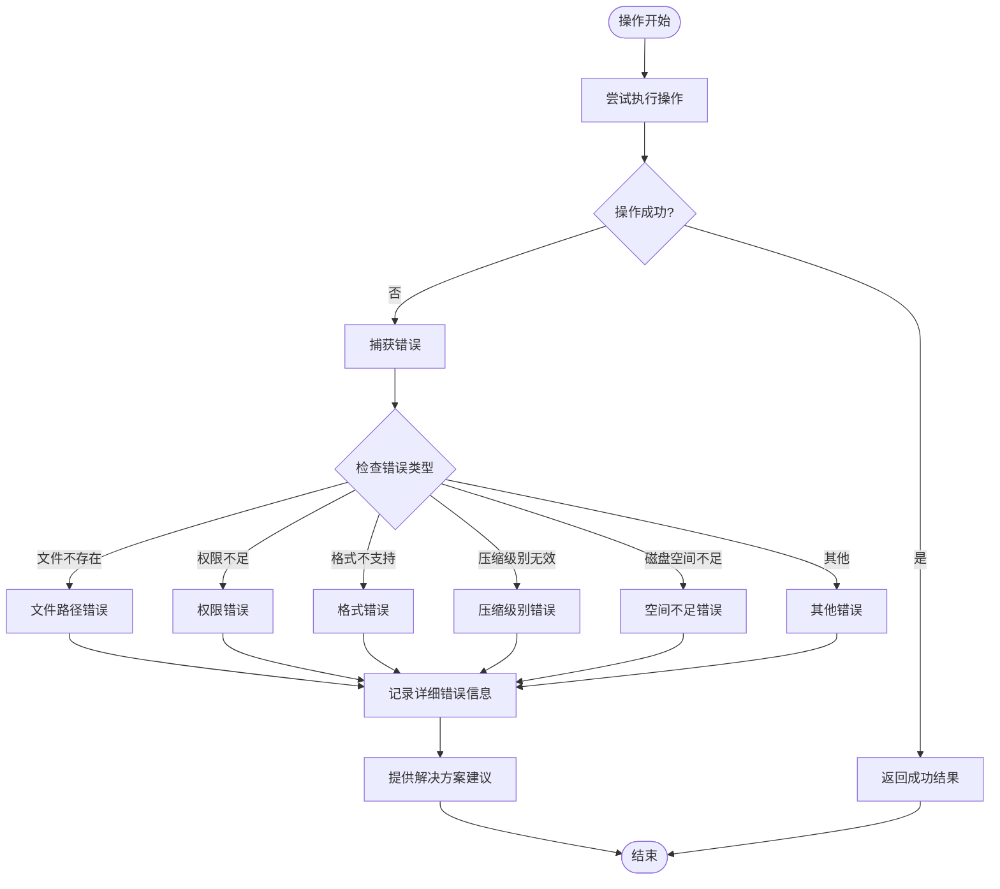

**图表来源**
- [main.rs:164-232](file://archive/src/main.rs#L164-L232)

### 格式特定故障排除

1. **BZIP2格式**: 检查bzip2库安装，注意高内存使用
2. **XZ格式**: 检查xz2库版本，注意较长压缩时间
3. **7-Zip格式**: 检查sevenz-rust2库功能，注意加密文件处理
4. **RAR格式**: 确保unrar库正确安装，注意专有格式限制

### 调试技巧

1. **启用详细日志**: 使用调试模式查看详细的处理过程
2. **检查文件权限**: 确保对源文件和目标目录有适当的读写权限
3. **验证磁盘空间**: 确保有足够的空间进行压缩操作
4. **测试小文件**: 先用小文件测试确保功能正常
5. **检查格式兼容性**: 验证目标格式的兼容性和支持度

**章节来源**
- [zip.rs:12-14](file://archive/src/zip.rs#L12-L14)
- [tar.rs:10-12](file://archive/src/tar.rs#L10-L12)
- [gz.rs:14-19](file://archive/src/gz.rs#L14-L19)
- [bz2.rs:14-18](file://archive/src/bz2.rs#L14-L18)
- [xz.rs:13-17](file://archive/src/xz.rs#L13-L17)
- [seven_z.rs:8-13](file://archive/src/seven_z.rs#L8-L13)
- [rar.rs:10-13](file://archive/src/rar.rs#L10-L13)

## 结论

MyArchive项目现已发展为一个功能完整的多格式压缩工具，具有以下特点：

### 技术优势

1. **模块化设计**: 清晰的功能分离，便于维护和扩展
2. **类型安全**: 充分利用Rust的类型系统确保运行时安全
3. **错误处理**: 使用anyhow库提供统一的错误处理机制
4. **性能优化**: 流式处理和内存管理策略确保高效运行
5. **格式多样性**: 支持10种压缩格式，满足不同使用场景需求

### 功能完整性

- 支持十种主流压缩格式：ZIP、TAR、GZ、BZIP2、XZ、7-Zip、RAR
- 提供完整的压缩、解压、列表功能
- 自动格式检测和智能输出路径生成
- 详细的用户反馈和错误信息
- 支持专有格式和开源格式的混合使用

### 扩展潜力

项目架构为未来的功能扩展提供了良好的基础：
- 易于添加新的压缩格式支持
- 可以集成异步I/O操作
- 支持更多压缩选项和配置
- 可以添加进度报告和取消机制
- 支持分布式压缩处理

### 格式选择建议

根据使用场景选择合适的压缩格式：

- **ZIP**: 通用格式，兼容性最好，适合日常使用
- **TAR**: 仅打包，适合Linux系统使用
- **GZ**: 标准压缩，平衡压缩比和速度
- **BZIP2**: 高压缩比，适合长期存储
- **XZ**: 超高压缩比，适合大文件存储
- **7-Zip**: 多算法支持，可选最高压缩比
- **RAR**: 专有格式，高压缩比但仅支持解压

这个项目为开发者提供了一个优秀的参考实现，展示了如何在Rust生态系统中构建高质量的系统工具，现在已具备企业级应用所需的多格式压缩能力。