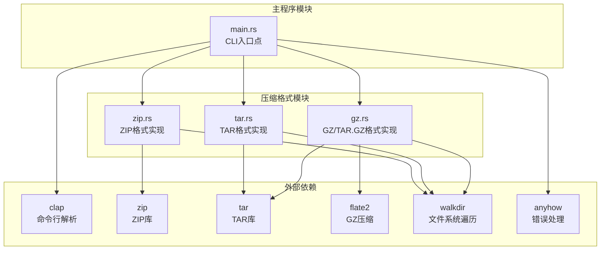
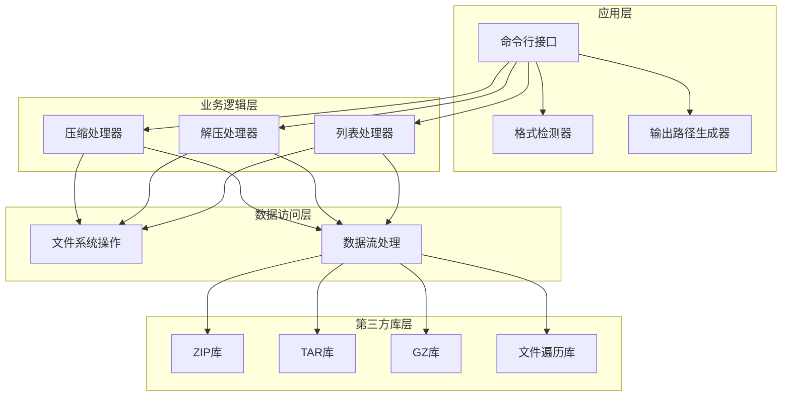
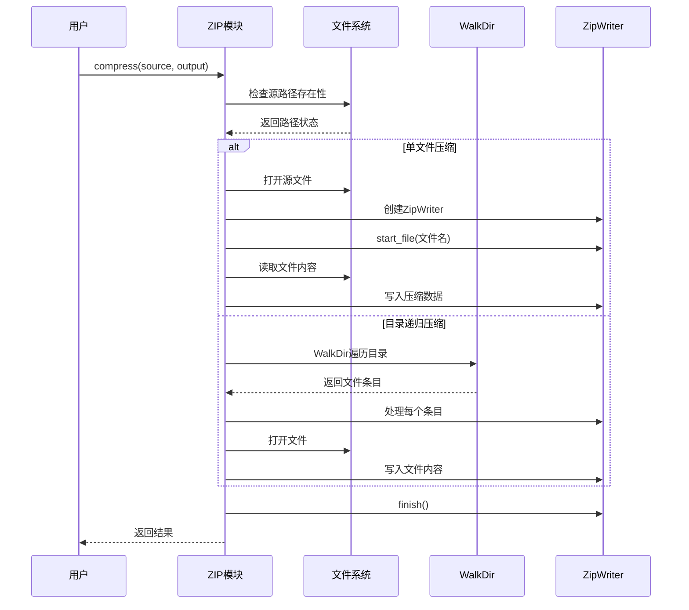
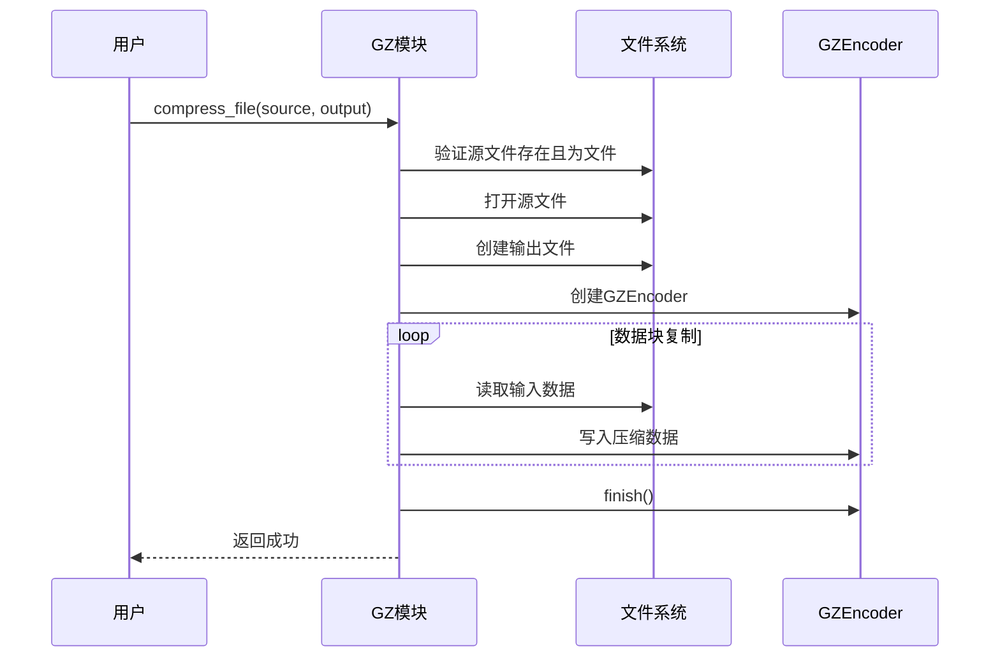
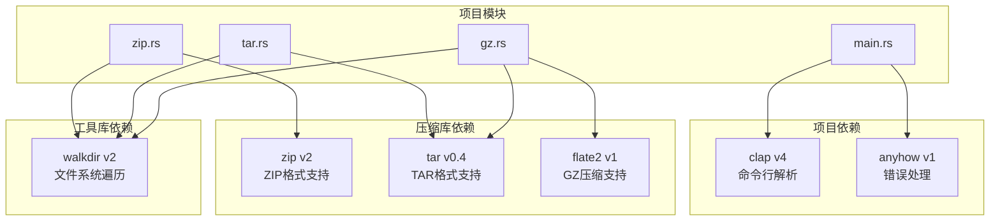
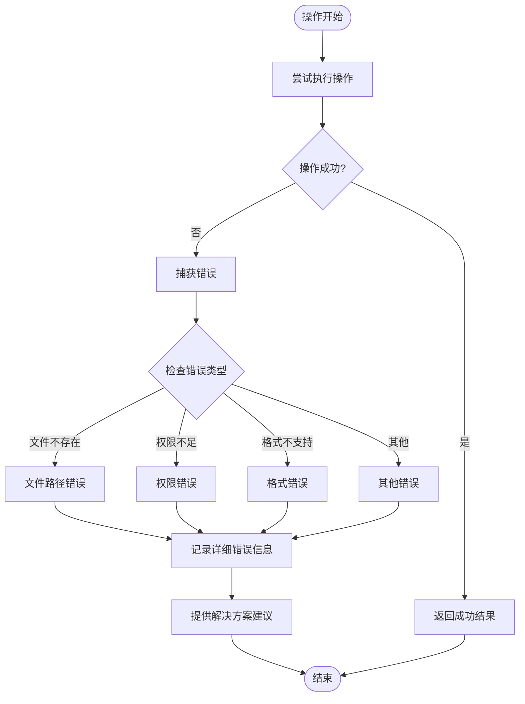

# 压缩功能实现

<cite>
**本文档引用的文件**
- [main.rs](file://archive/src/main.rs)
- [zip.rs](file://archive/src/zip.rs)
- [tar.rs](file://archive/src/tar.rs)
- [gz.rs](file://archive/src/gz.rs)
- [Cargo.toml](file://archive/Cargo.toml)
</cite>

## 目录
1. [简介](#简介)
2. [项目结构](#项目结构)
3. [核心组件](#核心组件)
4. [架构概览](#架构概览)
5. [详细组件分析](#详细组件分析)
6. [依赖关系分析](#依赖关系分析)
7. [性能考虑](#性能考虑)
8. [故障排除指南](#故障排除指南)
9. [结论](#结论)

## 简介

MyArchive 是一个多功能的文件压缩与解压工具，支持多种压缩格式：ZIP、TAR、GZ 和 TAR.GZ。该项目采用模块化设计，每个压缩格式都有独立的实现模块，提供了统一的命令行接口和一致的用户体验。

该工具的核心功能包括：
- 支持单文件和目录的递归压缩
- 多种压缩格式的统一处理接口
- 完整的错误处理和用户反馈机制
- 高效的数据流处理和内存管理

## 项目结构

项目采用清晰的模块化架构，主要包含以下组件：

**图表来源**
- [main.rs:1-183](file://archive/src/main.rs#L1-L183)
- [zip.rs:1-109](file://archive/src/zip.rs#L1-L109)
- [tar.rs:1-80](file://archive/src/tar.rs#L1-L80)
- [gz.rs:1-124](file://archive/src/gz.rs#L1-L124)

**章节来源**
- [main.rs:1-183](file://archive/src/main.rs#L1-L183)
- [Cargo.toml:1-13](file://archive/Cargo.toml#L1-L13)

## 核心组件

### CLI命令行接口

主程序通过clap库提供统一的命令行界面，支持三种主要操作：

- **压缩操作** (`compress`): 将文件或目录压缩为指定格式
- **解压操作** (`extract`): 解压压缩文件到目标目录  
- **列表操作** (`list`): 显示压缩包中的文件列表

每种操作都支持格式自动检测和默认输出路径生成。

### 压缩格式支持

系统支持四种压缩格式，每种格式都有专门的实现模块：

1. **ZIP格式**: 使用zip库实现，支持标准ZIP压缩
2. **TAR格式**: 使用tar库实现，支持无压缩的tar打包
3. **GZ格式**: 使用flate2库实现，支持单文件GZ压缩
4. **TAR.GZ格式**: 结合tar和GZ功能，先打包后压缩

**章节来源**
- [main.rs:27-59](file://archive/src/main.rs#L27-L59)
- [main.rs:135-182](file://archive/src/main.rs#L135-L182)

## 架构概览

系统采用分层架构设计，从上到下分为：

**图表来源**
- [main.rs:61-133](file://archive/src/main.rs#L61-L133)
- [zip.rs:9-56](file://archive/src/zip.rs#L9-L56)
- [tar.rs:7-41](file://archive/src/tar.rs#L7-L41)
- [gz.rs:11-83](file://archive/src/gz.rs#L11-L83)

## 详细组件分析

### ZIP压缩实现

ZIP模块提供了最复杂的压缩功能，支持单文件和目录的递归压缩。

#### 核心压缩流程

**图表来源**
- [zip.rs:10-56](file://archive/src/zip.rs#L10-L56)

#### 文件系统遍历策略

ZIP模块使用walkdir库进行高效的文件系统遍历：

**图表来源**
- [zip.rs:30-50](file://archive/src/zip.rs#L30-L50)

#### 压缩选项配置

ZIP模块使用FileOptions配置压缩参数：

- **压缩方法**: Deflated (DEFLATE算法)
- **压缩级别**: 默认级别
- **时间戳**: 保留原始文件信息
- **权限**: 保持文件权限信息

**章节来源**
- [zip.rs:10-56](file://archive/src/zip.rs#L10-L56)
- [zip.rs:18](file://archive/src/zip.rs#L18)

### TAR压缩实现

TAR模块实现了无压缩的打包功能，主要用于与其他压缩格式组合使用。

#### 压缩实现逻辑

**图表来源**
- [tar.rs:8-41](file://archive/src/tar.rs#L8-L41)

**章节来源**
- [tar.rs:8-41](file://archive/src/tar.rs#L8-L41)

### GZ压缩实现

GZ模块提供了单文件压缩功能，支持标准的GZ压缩格式。

#### 压缩流程

**图表来源**
- [gz.rs:12-31](file://archive/src/gz.rs#L12-L31)

**章节来源**
- [gz.rs:12-31](file://archive/src/gz.rs#L12-L31)

### TAR.GZ压缩实现

TAR.GZ结合了TAR打包和GZ压缩两个功能，先打包后压缩。

#### 实现策略

**图表来源**
- [gz.rs:47-83](file://archive/src/gz.rs#L47-L83)

**章节来源**
- [gz.rs:47-83](file://archive/src/gz.rs#L47-L83)

## 依赖关系分析

项目使用Cargo进行依赖管理，主要依赖关系如下：

**图表来源**
- [Cargo.toml:6-12](file://archive/Cargo.toml#L6-L12)

### 依赖特性分析

| 依赖库 | 版本 | 主要功能 | 使用场景 |
|--------|------|----------|----------|
| clap | v4 | 命令行参数解析 | CLI接口定义 |
| zip | v2 | ZIP格式压缩/解压 | ZIP格式支持 |
| tar | v0.4 | TAR格式打包/解包 | TAR/TAR.GZ格式 |
| flate2 | v1 | GZ压缩/解压 | GZ/TAR.GZ格式 |
| walkdir | v2 | 文件系统递归遍历 | 目录递归处理 |
| anyhow | v1 | 错误处理 | 统一错误处理 |

**章节来源**
- [Cargo.toml:6-12](file://archive/Cargo.toml#L6-L12)

## 性能考虑

### 内存管理策略

1. **流式处理**: 所有压缩操作都采用流式处理方式，避免将整个文件加载到内存中
2. **分块复制**: 使用io::copy进行高效的数据传输，减少内存占用
3. **渐进式构建**: ZIP和TAR构建器支持渐进式添加条目，避免一次性缓存大量数据

### I/O优化

1. **批量文件处理**: 目录遍历时按文件系统顺序处理，减少I/O往返次数
2. **缓冲区优化**: 使用标准库的缓冲I/O，提高读写效率
3. **零拷贝策略**: 在可能的情况下避免不必要的数据复制

### 并发考虑

当前实现采用单线程同步处理，对于大文件压缩建议：
- 使用异步I/O操作
- 实现进度报告机制
- 添加取消操作支持

## 故障排除指南

### 常见错误类型

1. **路径不存在**: 源路径验证失败时抛出明确的错误信息
2. **格式不支持**: 对于不支持的格式组合给出友好的错误提示
3. **权限不足**: 文件读写权限问题时提供清晰的解决方案
4. **磁盘空间不足**: 压缩过程中检查可用空间

### 错误处理机制

**图表来源**
- [main.rs:135-182](file://archive/src/main.rs#L135-L182)

### 调试技巧

1. **启用详细日志**: 使用调试模式查看详细的处理过程
2. **检查文件权限**: 确保对源文件和目标目录有适当的读写权限
3. **验证磁盘空间**: 确保有足够的空间进行压缩操作
4. **测试小文件**: 先用小文件测试确保功能正常

**章节来源**
- [zip.rs:12-14](file://archive/src/zip.rs#L12-L14)
- [tar.rs:10-12](file://archive/src/tar.rs#L10-L12)
- [gz.rs:14-19](file://archive/src/gz.rs#L14-L19)

## 结论

MyArchive项目展示了现代Rust应用程序的最佳实践，具有以下特点：

### 技术优势

1. **模块化设计**: 清晰的功能分离，便于维护和扩展
2. **类型安全**: 充分利用Rust的类型系统确保运行时安全
3. **错误处理**: 使用anyhow库提供统一的错误处理机制
4. **性能优化**: 流式处理和内存管理策略确保高效运行

### 功能完整性

- 支持四种主流压缩格式
- 提供完整的压缩、解压、列表功能
- 自动格式检测和智能输出路径生成
- 详细的用户反馈和错误信息

### 扩展潜力

项目架构为未来的功能扩展提供了良好的基础：
- 易于添加新的压缩格式支持
- 可以集成异步I/O操作
- 支持更多压缩选项和配置
- 可以添加进度报告和取消机制

这个项目为开发者提供了一个优秀的参考实现，展示了如何在Rust生态系统中构建高质量的系统工具。