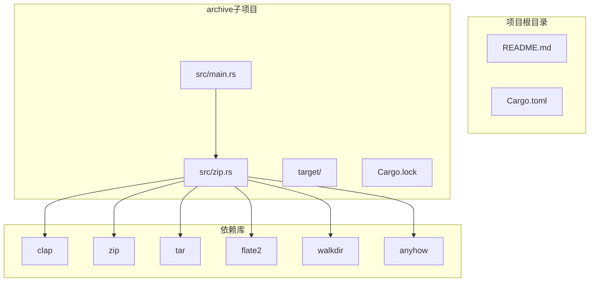
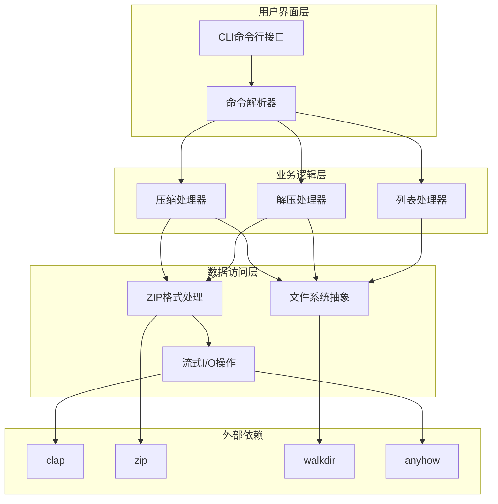
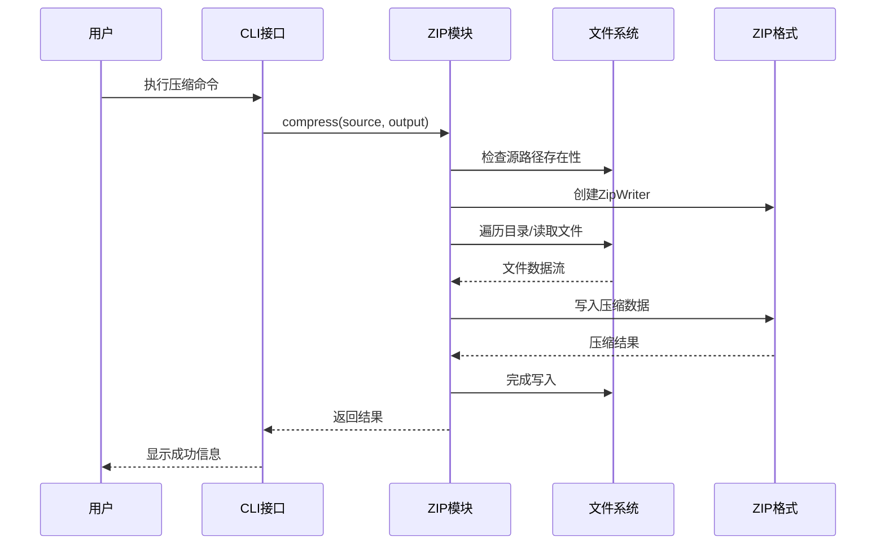
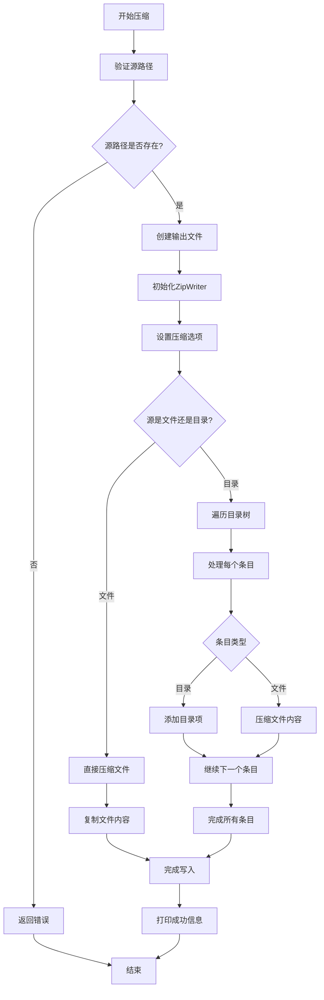
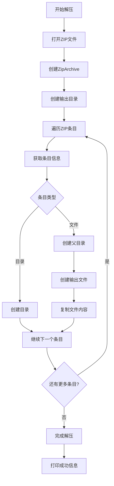
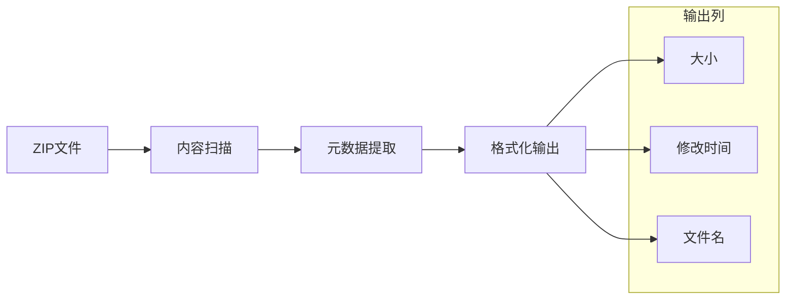
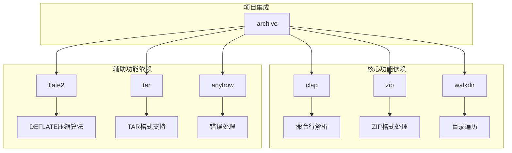

# 核心功能实现

<cite>
**本文档引用的文件**
- [main.rs](file://archive/src/main.rs)
- [zip.rs](file://archive/src/zip.rs)
- [Cargo.toml](file://archive/Cargo.toml)
- [README.md](file://README.md)
</cite>

## 目录
1. [简介](#简介)
2. [项目结构](#项目结构)
3. [核心组件](#核心组件)
4. [架构概览](#架构概览)
5. [详细组件分析](#详细组件分析)
6. [依赖分析](#依赖分析)
7. [性能考虑](#性能考虑)
8. [故障排除指南](#故障排除指南)
9. [结论](#结论)

## 简介

MyArchive是一个基于Rust语言开发的命令行文件压缩与解压工具。该项目实现了ZIP格式的压缩、解压和内容列表功能，提供了简洁高效的文件归档解决方案。项目采用模块化设计，主要包含一个核心的zip模块和一个CLI入口点。

该工具支持以下核心功能：
- 将单个文件或整个目录树压缩为ZIP格式
- 从ZIP文件中解压内容到指定目录
- 列出ZIP文件中的所有条目及其元数据

## 项目结构

项目采用标准的Rust crate结构，主要由以下部分组成：

**图表来源**
- [main.rs:1-68](file://archive/src/main.rs#L1-L68)
- [zip.rs:1-109](file://archive/src/zip.rs#L1-L109)
- [Cargo.toml:1-13](file://archive/Cargo.toml#L1-L13)

**章节来源**
- [main.rs:1-68](file://archive/src/main.rs#L1-L68)
- [zip.rs:1-109](file://archive/src/zip.rs#L1-L109)
- [Cargo.toml:1-13](file://archive/Cargo.toml#L1-L13)

## 核心组件

MyArchive的核心功能由三个主要组件构成：CLI命令解析器、ZIP压缩引擎和文件系统操作模块。

### CLI命令系统

应用程序使用clap库实现命令行界面，支持三种基本操作模式：

- **压缩模式（Compress）**：将输入的文件或目录转换为ZIP格式
- **解压模式（Extract）**：从ZIP文件恢复原始内容
- **列表模式（List）**：显示ZIP文件的内容清单

每个命令都支持可选的输出参数，如果没有指定输出路径，程序会自动推导默认值。

### ZIP处理引擎

核心的ZIP处理功能封装在独立的zip.rs模块中，提供了三个主要函数：

- `compress()`: 实现文件和目录的压缩逻辑
- `extract()`: 实现ZIP文件的解压功能  
- `list_contents()`: 实现ZIP文件内容的列表展示

### 文件系统集成

项目集成了多个文件系统相关的功能：
- 使用walkdir库遍历目录树
- 通过std::fs进行文件系统操作
- 支持相对路径和绝对路径的处理

**章节来源**
- [main.rs:7-37](file://archive/src/main.rs#L7-L37)
- [zip.rs:9-109](file://archive/src/zip.rs#L9-L109)

## 架构概览

MyArchive采用了清晰的分层架构设计，实现了关注点分离：

**图表来源**
- [main.rs:39-67](file://archive/src/main.rs#L39-L67)
- [zip.rs:10-109](file://archive/src/zip.rs#L10-L109)

### 数据流架构

**图表来源**
- [main.rs:42-50](file://archive/src/main.rs#L42-L50)
- [zip.rs:10-56](file://archive/src/zip.rs#L10-L56)

## 详细组件分析

### 压缩功能实现

压缩功能是整个系统的核心，负责将输入的文件或目录转换为ZIP格式。

#### 算法流程

**图表来源**
- [zip.rs:10-56](file://archive/src/zip.rs#L10-L56)

#### 关键实现细节

1. **路径验证**：首先检查源路径的有效性，确保不会对不存在的文件进行操作
2. **压缩选项配置**：使用Deflated压缩方法，提供良好的压缩比和速度平衡
3. **目录递归处理**：使用walkdir库深度遍历目录结构，保持原有的目录层次
4. **流式写入**：采用io::copy实现零拷贝的数据传输，提高处理效率

#### 数据结构设计

- **FileOptions**：配置压缩参数和文件属性
- **ZipWriter**：维护ZIP文件的写入状态
- **WalkDir迭代器**：提供惰性遍历机制，节省内存资源

**章节来源**
- [zip.rs:10-56](file://archive/src/zip.rs#L10-L56)

### 解压功能实现

解压功能负责从ZIP文件中恢复原始内容到目标目录。

#### 处理流程

**图表来源**
- [zip.rs:58-81](file://archive/src/zip.rs#L58-L81)

#### 错误处理策略

解压过程实现了多层次的错误处理：
- 文件打开失败的优雅降级
- 目录创建权限问题的处理
- 文件内容复制过程中的异常捕获

#### 性能优化措施

- **延迟创建**：仅在需要时创建输出目录
- **流式读取**：避免一次性加载整个ZIP文件到内存
- **路径安全**：使用mangled_name()防止路径遍历攻击

**章节来源**
- [zip.rs:58-81](file://archive/src/zip.rs#L58-L81)

### 列表功能实现

列表功能提供了ZIP文件内容的快速预览能力。

#### 输出格式设计

**图表来源**
- [zip.rs:83-109](file://archive/src/zip.rs#L83-L109)

#### 元数据处理

列表功能展示了以下关键信息：
- **文件大小**：以字节为单位显示
- **修改时间**：格式化的日期时间信息
- **文件名**：完整路径信息

**章节来源**
- [zip.rs:83-109](file://archive/src/zip.rs#L83-L109)

## 依赖分析

MyArchive项目使用了精心选择的第三方依赖库，每个库都有明确的功能定位：

**图表来源**
- [Cargo.toml:6-12](file://archive/Cargo.toml#L6-L12)

### 依赖关系特点

1. **专注性**：每个依赖库都专注于特定功能领域
2. **成熟度**：选择的都是经过广泛测试的稳定库
3. **互操作性**：各库之间配合良好，没有冲突

### 版本管理

- **clap 4.x**：提供现代化的命令行界面
- **zip 2.x**：支持最新的ZIP格式特性
- **walkdir 2.x**：高效的目录遍历解决方案

**章节来源**
- [Cargo.toml:6-12](file://archive/Cargo.toml#L6-L12)

## 性能考虑

### 内存管理策略

MyArchive采用了多种内存优化技术：

1. **流式处理**：所有文件操作都采用流式I/O，避免大文件的内存峰值
2. **惰性遍历**：walkdir提供迭代器模式，按需生成目录项
3. **零拷贝优化**：使用io::copy实现高效的数据传输

### 压缩性能优化

- **Deflated压缩**：在压缩率和速度之间取得平衡
- **批量写入**：减少文件系统调用次数
- **路径缓存**：避免重复计算相对路径

### 并发处理

当前版本采用单线程处理模式，适合大多数命令行使用场景。对于超大文件，可以考虑：
- 异步I/O操作
- 多线程压缩/解压
- 进度报告机制

## 故障排除指南

### 常见错误类型

1. **文件权限错误**：检查源文件和目标目录的访问权限
2. **磁盘空间不足**：确保有足够的存储空间进行压缩或解压
3. **路径无效**：验证输入路径的正确性和可访问性

### 错误处理机制

项目使用anyhow库提供统一的错误处理框架：
- **上下文包装**：为底层错误添加有意义的上下文信息
- **链式错误**：支持错误的传播和组合
- **调试友好**：提供详细的错误堆栈信息

### 调试建议

1. **启用详细日志**：使用RUST_LOG环境变量控制日志级别
2. **验证输入参数**：确保命令行参数的正确性
3. **检查文件完整性**：验证ZIP文件的完整性和有效性

**章节来源**
- [zip.rs:12-14](file://archive/src/zip.rs#L12-L14)
- [zip.rs:60-61](file://archive/src/zip.rs#L60-L61)

## 结论

MyArchive项目展现了现代Rust生态系统中命令行工具开发的最佳实践。通过精心设计的模块化架构、高效的ZIP处理算法和稳健的错误处理机制，该项目提供了一个可靠且高性能的文件归档解决方案。

### 主要优势

1. **简洁性**：代码结构清晰，易于理解和维护
2. **可靠性**：完善的错误处理和边界条件检查
3. **性能**：采用流式处理和惰性计算优化资源使用
4. **可扩展性**：模块化设计便于功能扩展和改进

### 技术亮点

- 基于标准ZIP格式的完整实现
- 高效的目录树遍历和处理
- 流式I/O操作的内存优化
- 现代化的Rust编程实践

这个项目为开发者提供了一个优秀的参考案例，展示了如何在Rust中构建实用的系统工具。