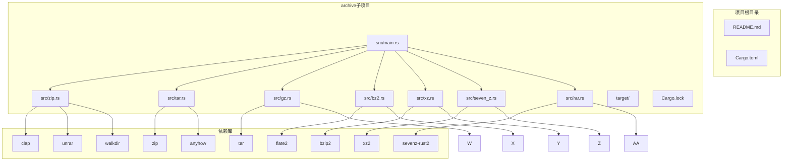
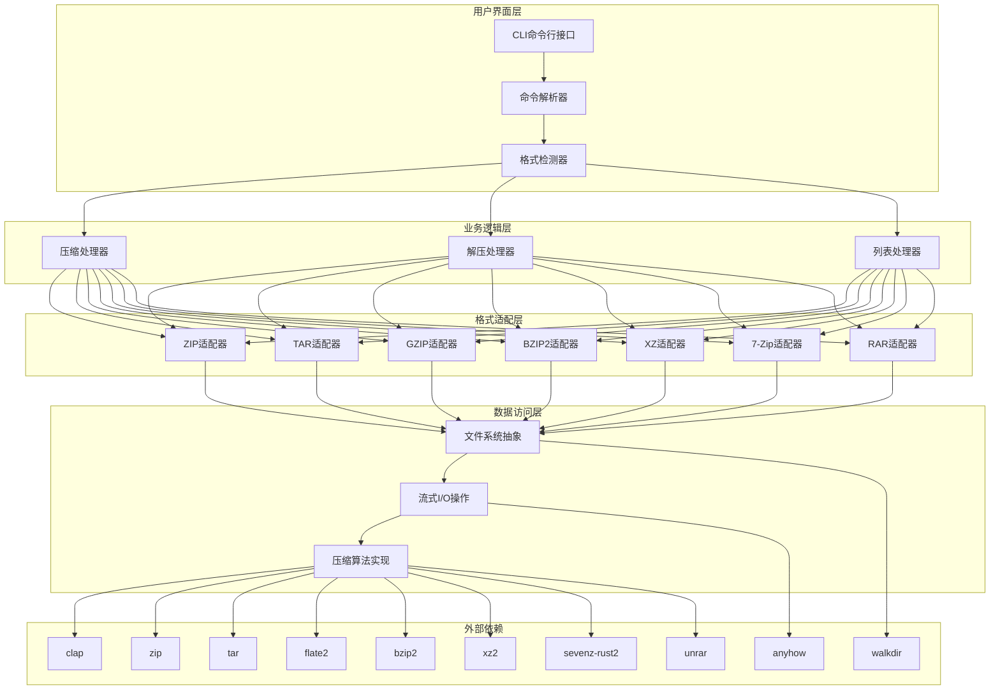
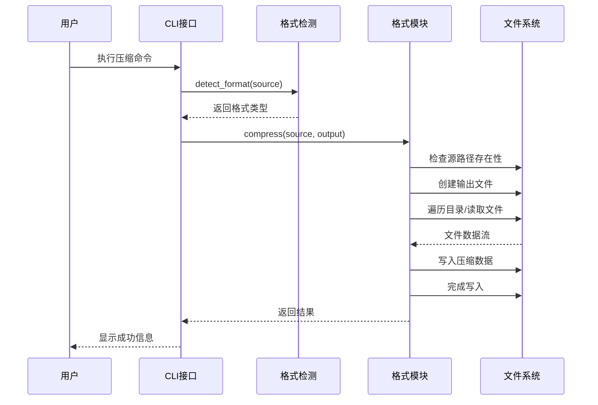
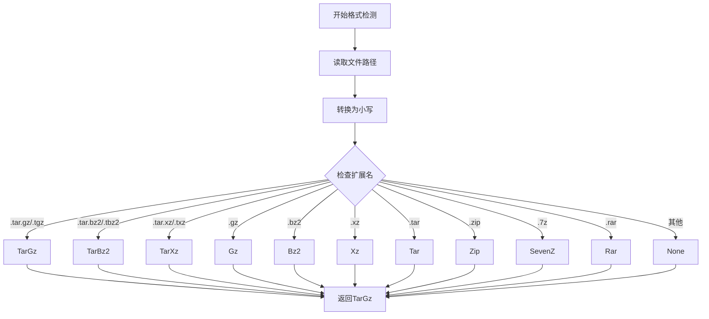
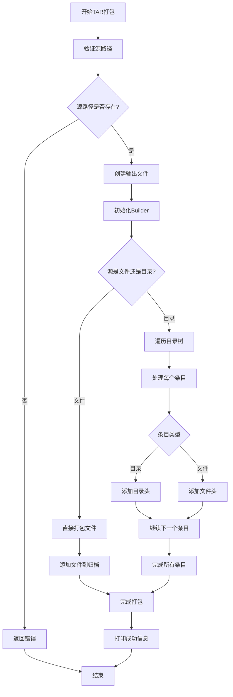
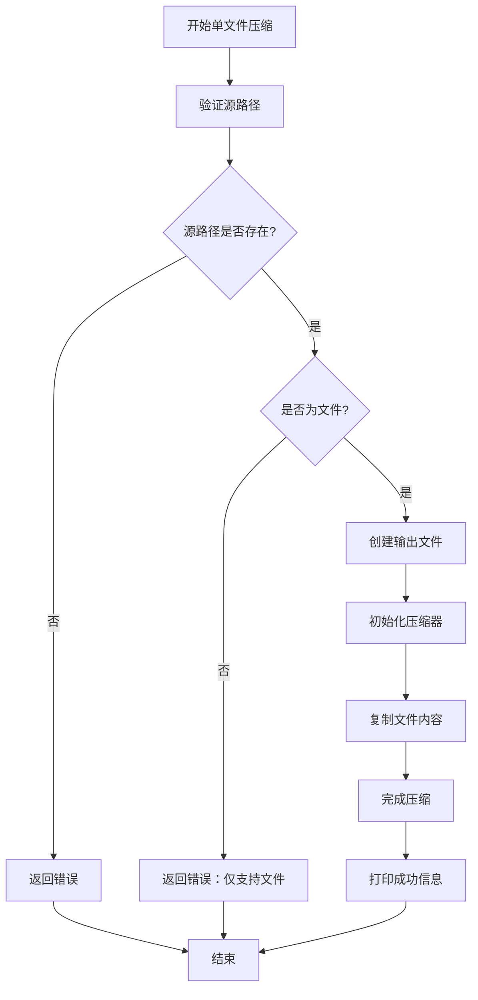
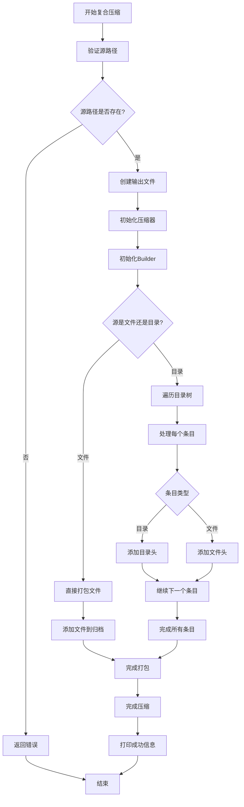
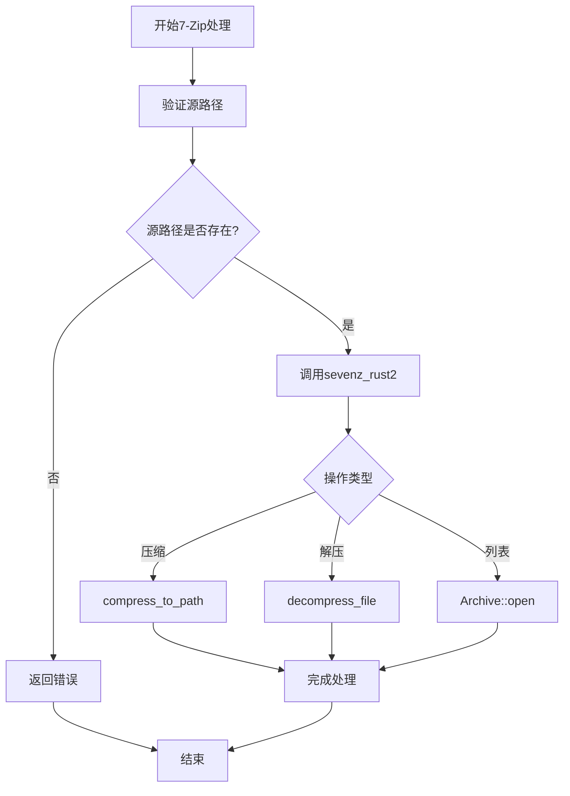
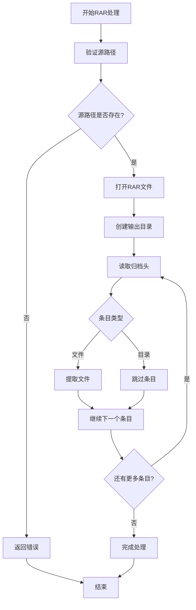
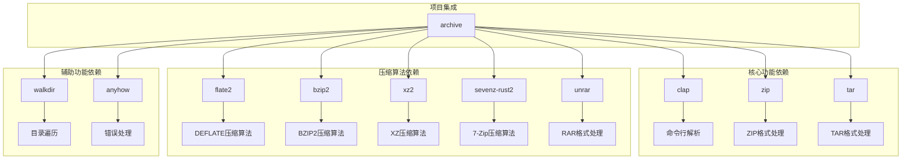

# 核心功能实现

<cite>
**本文档引用的文件**
- [main.rs](file://archive/src/main.rs)
- [zip.rs](file://archive/src/zip.rs)
- [tar.rs](file://archive/src/tar.rs)
- [gz.rs](file://archive/src/gz.rs)
- [bz2.rs](file://archive/src/bz2.rs)
- [xz.rs](file://archive/src/xz.rs)
- [seven_z.rs](file://archive/src/seven_z.rs)
- [rar.rs](file://archive/src/rar.rs)
- [Cargo.toml](file://archive/Cargo.toml)
- [README.md](file://README.md)
</cite>

## 更新摘要
**变更内容**
- 新增多种归档格式支持：TAR、GZIP、BZIP2、XZ、7-Zip、RAR
- 扩展命令行接口，支持格式自动检测
- 实现统一的压缩/解压/列表功能接口
- 新增复合格式（tar.gz、tar.bz2、tar.xz）支持
- 更新依赖管理系统，集成多种压缩库

## 目录
1. [简介](#简介)
2. [项目结构](#项目结构)
3. [核心组件](#核心组件)
4. [架构概览](#架构概览)
5. [详细组件分析](#详细组件分析)
6. [依赖分析](#依赖分析)
7. [性能考虑](#性能考虑)
8. [故障排除指南](#故障排除指南)
9. [结论](#结论)

## 简介

MyArchive是一个基于Rust语言开发的多功能命令行文件压缩与解压工具。该项目实现了多种归档格式的完整支持，包括ZIP、TAR、GZIP、BZIP2、XZ、7-Zip和RAR格式，提供了全面的文件归档解决方案。项目采用模块化设计，支持压缩、解压和内容列表三大核心功能。

该工具支持以下核心功能：
- 将单个文件或整个目录树压缩为多种格式（zip、tar、gz、bz2、xz、7z、rar）
- 从各种归档格式中解压内容到指定目录
- 列出归档文件中的所有条目及其元数据
- 自动格式检测和智能默认输出命名

## 项目结构

项目采用标准的Rust crate结构，现已扩展为支持多种归档格式的完整实现：

**图表来源**
- [main.rs:1-233](file://archive/src/main.rs#L1-L233)
- [zip.rs:1-109](file://archive/src/zip.rs#L1-L109)
- [tar.rs:1-80](file://archive/src/tar.rs#L1-L80)
- [gz.rs:1-124](file://archive/src/gz.rs#L1-L124)
- [bz2.rs:1-124](file://archive/src/bz2.rs#L1-L124)
- [xz.rs:1-123](file://archive/src/xz.rs#L1-L123)
- [seven_z.rs:1-62](file://archive/src/seven_z.rs#L1-L62)
- [rar.rs:1-81](file://archive/src/rar.rs#L1-L81)
- [Cargo.toml:1-22](file://archive/Cargo.toml#L1-L22)

**章节来源**
- [main.rs:1-233](file://archive/src/main.rs#L1-L233)
- [Cargo.toml:1-22](file://archive/Cargo.toml#L1-L22)

## 核心组件

MyArchive的核心功能由七个主要组件构成：统一CLI命令解析器、多格式压缩引擎和文件系统操作模块。

### 统一CLI命令系统

应用程序使用clap库实现现代化的命令行界面，支持七种基本归档格式和三种操作模式：

- **压缩模式（Compress）**：支持zip、tar、gz、bz2、xz、7z格式
- **解压模式（Extract）**：支持所有七种格式，具备自动格式检测
- **列表模式（List）**：支持除单文件压缩格式外的所有格式

每种命令都支持可选的输出参数，具有智能的默认值推导机制。

### 多格式处理引擎

核心的多格式处理功能封装在独立的模块中，每个格式都有专门的实现：

- **ZIP模块**：传统ZIP格式支持，保持原有功能
- **TAR模块**：Unix/Linux标准打包格式
- **GZIP模块**：单文件压缩格式，支持tar.gz复合格式
- **BZIP2模块**：高压缩比单文件格式，支持tar.bz2复合格式
- **XZ模块**：最高压缩比单文件格式，支持tar.xz复合格式
- **7-Zip模块**：现代高压缩比格式
- **RAR模块**：专有格式，仅支持解压和列表

### 文件系统集成

项目集成了多个文件系统相关的功能：
- 使用walkdir库遍历目录树
- 通过std::fs进行文件系统操作
- 支持相对路径和绝对路径的处理
- 实现了复杂的复合格式处理逻辑

**章节来源**
- [main.rs:13-70](file://archive/src/main.rs#L13-L70)
- [main.rs:164-233](file://archive/src/main.rs#L164-L233)

## 架构概览

MyArchive采用了高度模块化的分层架构设计，实现了关注点分离和格式无关的处理机制：

**图表来源**
- [main.rs:72-98](file://archive/src/main.rs#L72-L98)
- [main.rs:164-233](file://archive/src/main.rs#L164-L233)

### 数据流架构

**图表来源**
- [main.rs:167-189](file://archive/src/main.rs#L167-L189)
- [main.rs:72-98](file://archive/src/main.rs#L72-L98)

## 详细组件分析

### 统一格式检测系统

MyArchive实现了智能的格式自动检测机制，能够根据文件扩展名准确识别归档格式：

**图表来源**
- [main.rs:72-98](file://archive/src/main.rs#L72-L98)

#### 智能默认输出命名

系统为每种格式提供了合理的默认输出文件名推导规则：

- **单文件压缩格式**：`.gz`、`.bz2`、`.xz`直接在源文件名后添加扩展名
- **复合格式**：`tar.gz`、`tar.bz2`、`tar.xz`使用源文件夹名作为基础
- **归档格式**：`zip`、`tar`、`7z`使用源文件夹名作为基础
- **RAR格式**：不支持自动压缩，仅支持解压

**章节来源**
- [main.rs:100-162](file://archive/src/main.rs#L100-L162)

### ZIP格式实现

ZIP格式保持原有功能，支持文件和目录的压缩、解压和内容列表：

#### 压缩算法流程

**图表来源**
- [zip.rs:9-56](file://archive/src/zip.rs#L9-L56)

#### 关键实现细节

1. **路径验证**：首先检查源路径的有效性
2. **压缩选项配置**：使用Deflated压缩方法
3. **目录递归处理**：使用walkdir库深度遍历
4. **流式写入**：采用io::copy实现零拷贝传输

**章节来源**
- [zip.rs:9-56](file://archive/src/zip.rs#L9-L56)

### TAR格式实现

TAR格式实现了Unix/Linux标准的打包功能：

#### 打包算法流程

**图表来源**
- [tar.rs:7-41](file://archive/src/tar.rs#L7-L41)

#### 关键实现细节

1. **文件类型检测**：区分普通文件、目录、符号链接等
2. **路径处理**：保持原始目录结构
3. **流式打包**：避免内存溢出
4. **错误处理**：优雅处理各种异常情况

**章节来源**
- [tar.rs:7-41](file://archive/src/tar.rs#L7-L41)

### 单文件压缩格式实现

GZIP、BZIP2和XZ格式实现了单文件压缩功能，支持高压缩比：

#### 压缩算法流程

**图表来源**
- [gz.rs:11-31](file://archive/src/gz.rs#L11-L31)

#### 关键实现细节

1. **文件验证**：确保只处理单个文件
2. **压缩级别**：使用默认压缩级别平衡性能和压缩比
3. **流式处理**：支持大文件压缩
4. **错误处理**：提供清晰的错误信息

**章节来源**
- [gz.rs:11-31](file://archive/src/gz.rs#L11-L31)

### 复合格式实现

tar.gz、tar.bz2、tar.xz格式结合了打包和压缩功能：

#### 复合压缩算法流程

**图表来源**
- [gz.rs:46-83](file://archive/src/gz.rs#L46-L83)

#### 关键实现细节

1. **嵌套流处理**：压缩器内嵌Builder
2. **内存管理**：合理管理压缩器状态
3. **错误传播**：确保错误正确传播
4. **资源清理**：正确关闭所有资源

**章节来源**
- [gz.rs:46-83](file://archive/src/gz.rs#L46-L83)

### 7-Zip格式实现

7-Zip格式实现了现代高压缩比格式的支持：

#### 7-Zip处理流程

**图表来源**
- [seven_z.rs:5-34](file://archive/src/seven_z.rs#L5-L34)

#### 关键实现细节

1. **外部库集成**：使用sevenz-rust2库
2. **API封装**：提供统一的接口
3. **错误处理**：映射到anyhow错误
4. **资源管理**：自动管理压缩器生命周期

**章节来源**
- [seven_z.rs:5-34](file://archive/src/seven_z.rs#L5-L34)

### RAR格式实现

RAR格式实现了专有格式的解压和列表功能：

#### RAR处理流程

**图表来源**
- [rar.rs:8-48](file://archive/src/rar.rs#L8-L48)

#### 关键实现细节

1. **专有格式支持**：使用unrar库
2. **流式处理**：逐条目处理，避免内存问题
3. **错误处理**：处理各种RAR格式异常
4. **兼容性**：支持多种RAR版本

**章节来源**
- [rar.rs:8-48](file://archive/src/rar.rs#L8-L48)

## 依赖分析

MyArchive项目使用了精心选择的第三方依赖库，每个库都有明确的功能定位和压缩算法支持：

**图表来源**
- [Cargo.toml:6-16](file://archive/Cargo.toml#L6-L16)

### 依赖关系特点

1. **专业化**：每个依赖库都专注于特定的压缩算法或格式
2. **成熟度**：选择的都是经过广泛测试的稳定库
3. **互操作性**：各库之间配合良好，没有冲突
4. **性能优化**：针对不同压缩算法进行了优化

### 版本管理

- **clap 4.x**：提供现代化的命令行界面
- **zip 2.x**：支持最新的ZIP格式特性
- **tar 0.4**：稳定的TAR格式处理
- **flate2 1.x**：高效的DEFLATE压缩算法
- **bzip2 0.5**：高质量的BZIP2压缩算法
- **xz2 0.1**：先进的XZ压缩算法
- **sevenz-rust2 0.13**：现代的7-Zip格式支持
- **unrar 0.5**：专有的RAR格式处理

**章节来源**
- [Cargo.toml:6-16](file://archive/Cargo.toml#L6-L16)

## 性能考虑

### 内存管理策略

MyArchive采用了多种内存优化技术来处理不同类型的归档格式：

1. **流式处理**：所有文件操作都采用流式I/O，避免大文件的内存峰值
2. **惰性遍历**：walkdir提供迭代器模式，按需生成目录项
3. **零拷贝优化**：使用io::copy实现高效的数据传输
4. **压缩器复用**：合理管理压缩器状态，避免频繁创建销毁

### 压缩性能优化

- **算法选择**：根据文件类型选择合适的压缩算法
- **批量写入**：减少文件系统调用次数
- **路径缓存**：避免重复计算相对路径
- **并发处理**：对于超大文件考虑异步I/O操作

### 格式特定优化

- **ZIP格式**：使用Deflated压缩方法，在压缩率和速度间平衡
- **TAR格式**：直接流式写入，无额外压缩开销
- **单文件压缩**：使用相应的压缩算法，如GZIP的DEFLATE、BZIP2的哈夫曼编码、XZ的LZMA算法
- **复合格式**：优化嵌套压缩器的性能

### 并发处理

当前版本采用单线程处理模式，适合大多数命令行使用场景。对于超大文件，可以考虑：
- 异步I/O操作
- 多线程压缩/解压
- 进度报告机制
- 内存映射文件处理

## 故障排除指南

### 常见错误类型

1. **文件权限错误**：检查源文件和目标目录的访问权限
2. **磁盘空间不足**：确保有足够的存储空间进行压缩或解压
3. **路径无效**：验证输入路径的正确性和可访问性
4. **格式不支持**：确认文件格式是否在支持列表中
5. **压缩器初始化失败**：检查压缩算法库的可用性

### 错误处理机制

项目使用anyhow库提供统一的错误处理框架：
- **上下文包装**：为底层错误添加有意义的上下文信息
- **链式错误**：支持错误的传播和组合
- **调试友好**：提供详细的错误堆栈信息
- **格式特定错误**：为不同格式提供专门的错误处理

### 格式特定故障排除

- **ZIP格式**：检查ZIP文件完整性，验证密码保护
- **TAR格式**：验证TAR文件格式，检查磁盘空间
- **单文件压缩格式**：确认文件类型匹配，检查压缩级别
- **复合格式**：验证内部格式一致性
- **7-Zip格式**：检查7-Zip版本兼容性
- **RAR格式**：验证RAR文件完整性，检查密码

### 调试建议

1. **启用详细日志**：使用RUST_LOG环境变量控制日志级别
2. **验证输入参数**：确保命令行参数的正确性
3. **检查文件完整性**：验证归档文件的完整性和有效性
4. **测试格式检测**：验证自动格式检测的准确性
5. **监控内存使用**：观察大文件处理的内存占用

**章节来源**
- [main.rs:118-116](file://archive/src/main.rs#L118-L116)
- [zip.rs:12-14](file://archive/src/zip.rs#L12-L14)

## 结论

MyArchive项目展现了现代Rust生态系统中多功能归档工具开发的最佳实践。通过精心设计的模块化架构、多种压缩格式的完整实现和稳健的错误处理机制，该项目提供了一个可靠且高性能的文件归档解决方案。

### 主要优势

1. **全面性**：支持七种主流归档格式，满足不同使用场景
2. **一致性**：提供统一的命令行接口和错误处理机制
3. **可扩展性**：模块化设计便于添加新的归档格式支持
4. **性能优化**：采用流式处理和惰性计算优化资源使用
5. **智能检测**：自动格式检测简化用户操作

### 技术亮点

- **格式无关设计**：统一的接口支持多种不同的归档格式
- **高效压缩算法**：集成多种现代压缩算法，平衡压缩比和速度
- **流式I/O操作**：内存友好的处理方式，支持大文件操作
- **健壮的错误处理**：完善的错误传播和用户友好的错误信息
- **智能格式检测**：基于文件扩展名的准确格式识别

### 未来发展方向

1. **性能优化**：考虑异步I/O和多线程处理
2. **格式扩展**：支持更多归档格式如ZIP64、AR、CAB等
3. **功能增强**：添加加密、分卷压缩等功能
4. **用户体验**：改进进度显示和交互体验
5. **平台兼容**：增强跨平台支持和文件权限处理

这个项目为开发者提供了一个优秀的参考案例，展示了如何在Rust中构建实用且功能丰富的系统工具，特别是在处理多种数据格式和压缩算法方面的最佳实践。