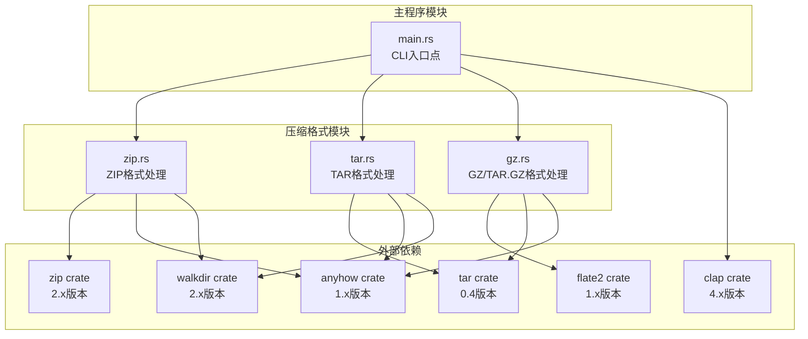
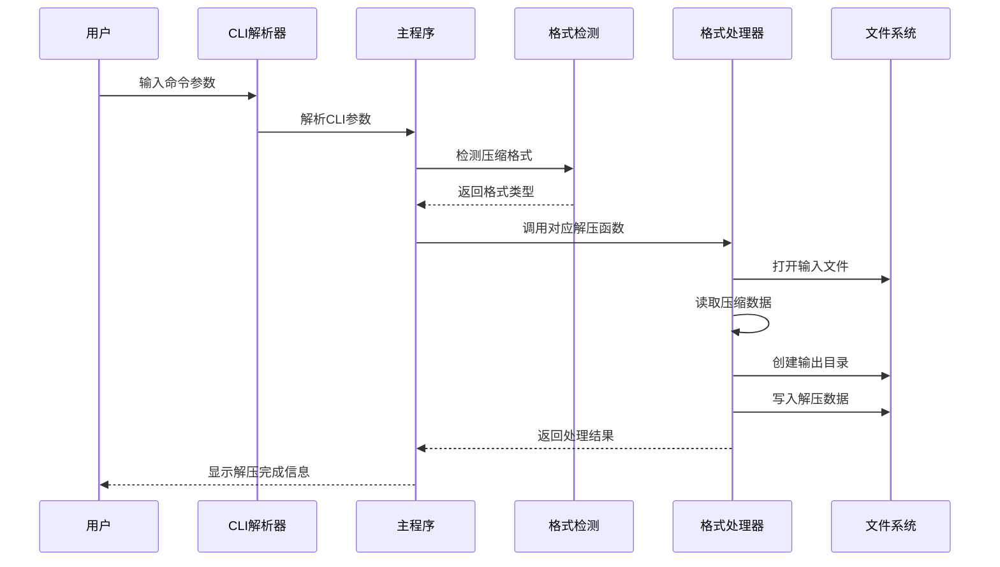
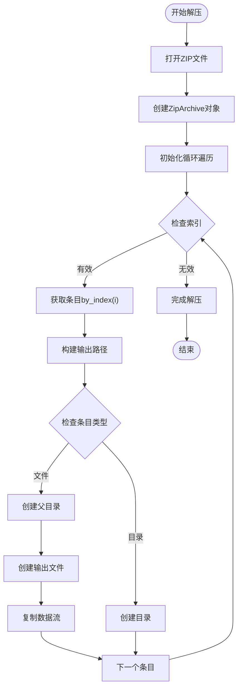
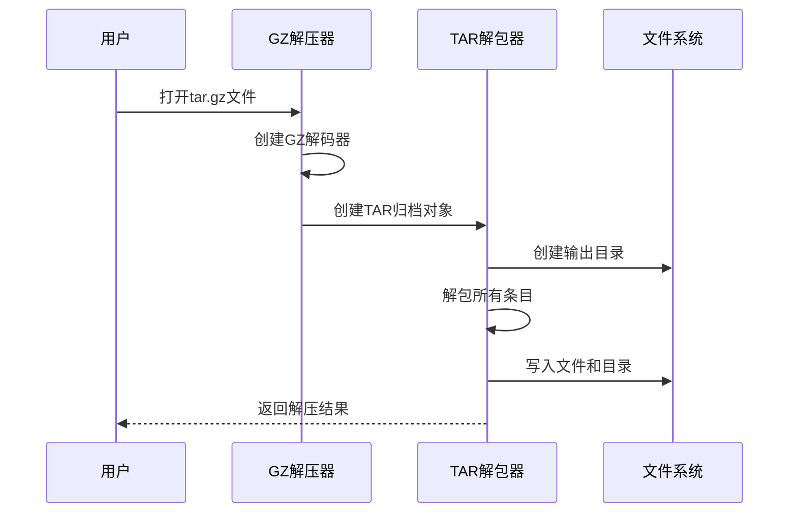
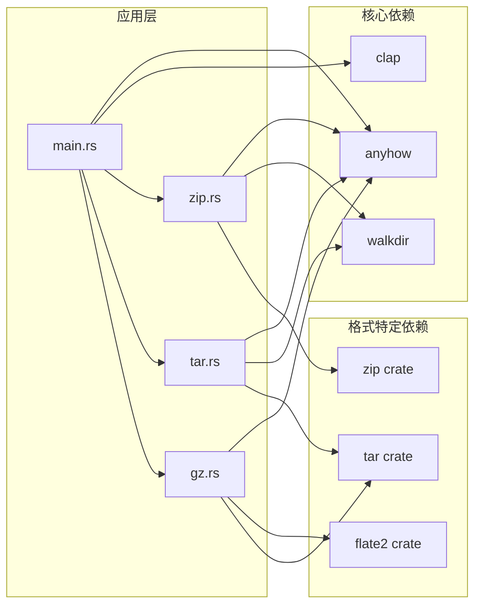

# 解压功能实现

<cite>
**本文档引用的文件**
- [main.rs](file://archive/src/main.rs)
- [zip.rs](file://archive/src/zip.rs)
- [tar.rs](file://archive/src/tar.rs)
- [gz.rs](file://archive/src/gz.rs)
- [Cargo.toml](file://archive/Cargo.toml)
</cite>

## 目录
1. [简介](#简介)
2. [项目结构](#项目结构)
3. [核心组件](#核心组件)
4. [架构概览](#架构概览)
5. [详细组件分析](#详细组件分析)
6. [依赖关系分析](#依赖关系分析)
7. [性能考虑](#性能考虑)
8. [故障排除指南](#故障排除指南)
9. [结论](#结论)

## 简介

MyArchive 是一个支持多种压缩格式的命令行工具，主要功能包括文件压缩、解压和内容列表查看。该项目采用模块化设计，分别实现了 ZIP、TAR、GZ 和 TAR.GZ 格式的处理逻辑。

## 项目结构

项目采用清晰的模块化架构，每个压缩格式都有独立的模块文件：

**图表来源**
- [main.rs:1-183](file://archive/src/main.rs#L1-L183)
- [zip.rs:1-109](file://archive/src/zip.rs#L1-L109)
- [tar.rs:1-80](file://archive/src/tar.rs#L1-L80)
- [gz.rs:1-124](file://archive/src/gz.rs#L1-L124)
- [Cargo.toml:1-13](file://archive/Cargo.toml#L1-L13)

**章节来源**
- [main.rs:1-183](file://archive/src/main.rs#L1-L183)
- [Cargo.toml:1-13](file://archive/Cargo.toml#L1-L13)

## 核心组件

### CLI命令系统

项目使用 clap 库构建命令行界面，支持三种主要操作：
- **Compress**: 压缩/打包文件或目录
- **Extract**: 解压/解包文件
- **List**: 列出压缩包内容

### 格式检测机制

系统支持自动格式检测，根据文件扩展名判断压缩格式：
- `.zip`: ZIP格式
- `.tar`: TAR格式  
- `.gz`: GZ格式
- `.tar.gz` 或 `.tgz`: TAR.GZ格式

### 默认输出命名规则

系统为不同格式提供智能的默认输出文件名生成逻辑，确保用户无需手动指定输出文件名。

**章节来源**
- [main.rs:19-133](file://archive/src/main.rs#L19-L133)

## 架构概览

整个解压功能遵循统一的处理流程：参数解析 → 格式检测 → 具体格式处理 → 结果输出。

**图表来源**
- [main.rs:135-182](file://archive/src/main.rs#L135-L182)
- [zip.rs:58-81](file://archive/src/zip.rs#L58-L81)

## 详细组件分析

### ZIP解压模块详解

ZIP解压功能位于 `zip.rs` 文件中，提供了完整的解压实现。

#### extract函数实现细节

extract函数是ZIP解压的核心实现，包含以下关键步骤：

1. **文件打开与验证**
   - 使用File::open打开ZIP文件
   - 通过ZipArchive::new创建归档对象
   - 验证文件格式的有效性

2. **条目遍历机制**
   - 使用archive.len()获取条目总数
   - 通过archive.by_index(i)按索引访问每个条目
   - 支持所有ZIP条目的顺序处理

3. **目录结构重建**
   - 使用entry.mangled_name()获取条目名称
   - 通过Path::join构建输出路径
   - 自动创建必要的父级目录

4. **文件权限保持**
   - ZIP格式本身不保存Unix权限信息
   - 当前实现保持默认文件权限设置

#### 数据流管理

**图表来源**
- [zip.rs:58-81](file://archive/src/zip.rs#L58-L81)

#### 错误恢复机制

ZIP解压实现采用了robust的错误处理策略：

1. **上下文包装**: 使用with_context为每个IO操作添加详细错误信息
2. **早期失败**: 对于不存在的源路径立即返回错误
3. **资源清理**: 使用RAII确保文件句柄正确关闭
4. **状态验证**: 在关键操作前后验证文件状态

#### 安全性考虑

当前ZIP实现存在以下安全限制：

1. **路径遍历风险**: 使用mangled_name()可能无法完全防止路径遍历攻击
2. **权限保持**: 不支持保留原始文件权限信息
3. **符号链接处理**: 未实现符号链接的安全处理

**章节来源**
- [zip.rs:58-81](file://archive/src/zip.rs#L58-L81)

### TAR解压模块分析

TAR解压功能位于 `tar.rs` 文件中，提供了简化的解包实现。

#### extract函数特点

相比ZIP实现，TAR解压更加简洁：
- 直接调用Archive::unpack方法进行解包
- 自动处理目录结构和文件权限
- 支持符号链接的原生处理

**章节来源**
- [tar.rs:43-54](file://archive/src/tar.rs#L43-L54)

### GZ/TAR.GZ解压模块分析

GZ和TAR.GZ解压功能位于 `gz.rs` 文件中，结合了GZ压缩和TAR打包的优势。

#### extract_tar函数实现

**图表来源**
- [gz.rs:85-97](file://archive/src/gz.rs#L85-L97)

**章节来源**
- [gz.rs:85-97](file://archive/src/gz.rs#L85-L97)

## 依赖关系分析

项目依赖关系清晰明确，每个模块只依赖必要的外部库：

**图表来源**
- [Cargo.toml:6-12](file://archive/Cargo.toml#L6-L12)
- [main.rs:5-7](file://archive/src/main.rs#L5-L7)

**章节来源**
- [Cargo.toml:1-13](file://archive/Cargo.toml#L1-L13)

## 性能考虑

### IO性能优化

1. **流式处理**: 所有解压操作都采用流式IO，避免一次性加载整个文件
2. **内存效率**: 使用标准库的io::copy函数进行高效的数据传输
3. **并发处理**: 当前实现为单线程，可考虑在多核环境下并行处理多个文件

### 存储空间优化

1. **零拷贝**: Rust的引用和借用机制减少了不必要的数据复制
2. **增量写入**: 解压过程中实时写入磁盘，避免额外的缓冲区占用

### 处理速度提升建议

1. **批量操作**: 对于大量小文件，可以考虑批量创建目录和文件
2. **预分配**: 对于大文件，可以预先分配磁盘空间减少碎片
3. **异步IO**: 引入async/await支持提高并发性能

## 故障排除指南

### 常见错误类型及解决方案

#### 格式检测失败
- **症状**: "无法自动检测格式，请使用 -f 指定格式"
- **原因**: 文件扩展名不在支持范围内
- **解决**: 显式使用-f参数指定格式

#### 文件打开错误
- **症状**: "无法打开 zip 文件: 路径"
- **原因**: 文件不存在或权限不足
- **解决**: 检查文件路径和访问权限

#### 目录创建失败
- **症状**: "无法创建输出目录"
- **原因**: 权限不足或磁盘空间不足
- **解决**: 检查目标目录权限和可用空间

#### 数据解压错误
- **症状**: "解压过程中发生错误"
- **原因**: 压缩文件损坏或格式不兼容
- **解决**: 验证源文件完整性

### 调试技巧

1. **启用详细日志**: 使用-v或--verbose参数获取更多信息
2. **检查文件完整性**: 验证压缩文件的CRC校验和
3. **测试最小化案例**: 使用简单的文件测试解压功能

**章节来源**
- [zip.rs:60-81](file://archive/src/zip.rs#L60-L81)
- [tar.rs:45-54](file://archive/src/tar.rs#L45-L54)
- [gz.rs:87-97](file://archive/src/gz.rs#L87-L97)

## 结论

MyArchive的解压功能实现了以下核心特性：

### 技术优势
- **模块化设计**: 清晰的格式分离便于维护和扩展
- **错误处理**: 完善的错误传播和上下文信息
- **性能优化**: 流式处理确保高效的内存使用
- **跨平台支持**: 基于标准库的跨平台兼容性

### 功能完整性
- 支持四种主流压缩格式
- 提供统一的命令行接口
- 包含格式自动检测功能
- 实现了完整的解压生命周期管理

### 改进建议
1. **增强安全性**: 添加路径遍历防护和权限验证
2. **性能优化**: 考虑异步IO和并发处理
3. **功能扩展**: 支持更多压缩格式和高级选项
4. **监控改进**: 添加进度报告和统计信息

该实现为开发者提供了一个可靠、高效的解压功能基础，可以作为更复杂压缩工具开发的良好起点。