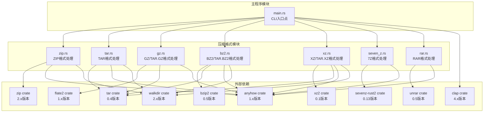
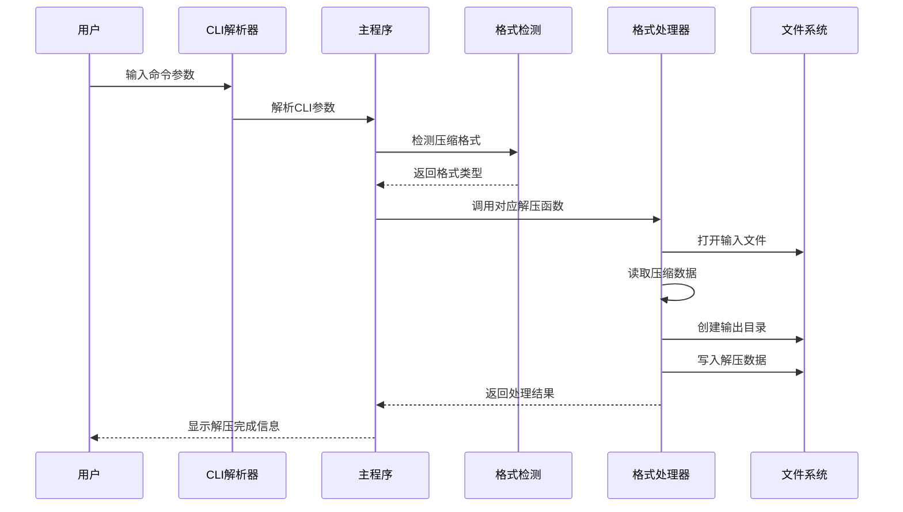
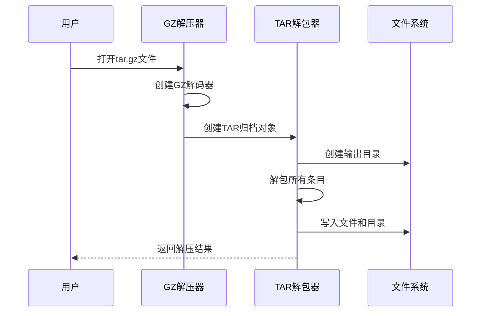
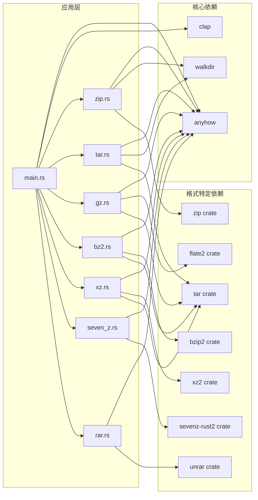

# 解压功能实现

<cite>
**本文档引用的文件**
- [main.rs](file://archive/src/main.rs)
- [zip.rs](file://archive/src/zip.rs)
- [tar.rs](file://archive/src/tar.rs)
- [gz.rs](file://archive/src/gz.rs)
- [rar.rs](file://archive/src/rar.rs)
- [seven_z.rs](file://archive/src/seven_z.rs)
- [bz2.rs](file://archive/src/bz2.rs)
- [xz.rs](file://archive/src/xz.rs)
- [Cargo.toml](file://archive/Cargo.toml)
</cite>

## 目录
1. [简介](#简介)
2. [项目结构](#项目结构)
3. [核心组件](#核心组件)
4. [架构概览](#架构概览)
5. [详细组件分析](#详细组件分析)
6. [依赖关系分析](#依赖关系分析)
7. [性能考虑](#性能考虑)
8. [故障排除指南](#故障排除指南)
9. [结论](#结论)

## 简介

MyArchive 是一个支持多种压缩格式的命令行工具，现已扩展支持8种主流压缩格式，包括ZIP、TAR、GZ、BZ2、XZ、TAR.GZ、TAR.BZ2、TAR.XZ、7Z和RAR格式的解压功能。该项目采用模块化设计，每个压缩格式都有独立的处理模块，提供统一的命令行接口和一致的用户体验。

## 项目结构

项目采用清晰的模块化架构，每个压缩格式都有独立的模块文件，现已扩展支持更多格式：

**图表来源**
- [main.rs:1-233](file://archive/src/main.rs#L1-L233)
- [zip.rs:1-109](file://archive/src/zip.rs#L1-L109)
- [tar.rs:1-80](file://archive/src/tar.rs#L1-L80)
- [gz.rs:1-124](file://archive/src/gz.rs#L1-L124)
- [rar.rs:1-81](file://archive/src/rar.rs#L1-L81)
- [seven_z.rs:1-62](file://archive/src/seven_z.rs#L1-L62)
- [bz2.rs:1-124](file://archive/src/bz2.rs#L1-L124)
- [xz.rs:1-123](file://archive/src/xz.rs#L1-L123)
- [Cargo.toml:1-22](file://archive/Cargo.toml#L1-L22)

**章节来源**
- [main.rs:1-233](file://archive/src/main.rs#L1-L233)
- [Cargo.toml:1-22](file://archive/Cargo.toml#L1-L22)

## 核心组件

### CLI命令系统

项目使用 clap 库构建命令行界面，支持三种主要操作：
- **Compress**: 压缩/打包文件或目录
- **Extract**: 解压/解包文件
- **List**: 列出压缩包内容

### 扩展格式检测机制

系统支持自动格式检测，现已扩展支持8种格式：
- `.zip`: ZIP格式
- `.tar`: TAR格式  
- `.gz`: GZ格式
- `.tar.gz` 或 `.tgz`: TAR.GZ格式
- `.bz2`: BZ2格式
- `.tar.bz2` 或 `.tbz2`: TAR.BZ2格式
- `.xz`: XZ格式
- `.tar.xz` 或 `.txz`: TAR.XZ格式
- `.7z`: 7Z格式
- `.rar`: RAR格式

### 默认输出命名规则

系统为不同格式提供智能的默认输出文件名生成逻辑，确保用户无需手动指定输出文件名。

**章节来源**
- [main.rs:13-233](file://archive/src/main.rs#L13-L233)

## 架构概览

整个解压功能遵循统一的处理流程：参数解析 → 格式检测 → 具体格式处理 → 结果输出。

**图表来源**
- [main.rs:164-233](file://archive/src/main.rs#L164-L233)
- [rar.rs:9-48](file://archive/src/rar.rs#L9-L48)

## 详细组件分析

### ZIP解压模块详解

ZIP解压功能位于 `zip.rs` 文件中，提供了完整的解压实现。

#### extract函数实现细节

extract函数是ZIP解压的核心实现，包含以下关键步骤：

1. **文件打开与验证**
   - 使用File::open打开ZIP文件
   - 通过ZipArchive::new创建归档对象
   - 验证文件格式的有效性

2. **条目遍历机制**
   - 使用archive.len()获取条目总数
   - 通过archive.by_index(i)按索引访问每个条目
   - 支持所有ZIP条目的顺序处理

3. **目录结构重建**
   - 使用entry.mangled_name()获取条目名称
   - 通过Path::join构建输出路径
   - 自动创建必要的父级目录

4. **文件权限保持**
   - ZIP格式本身不保存Unix权限信息
   - 当前实现保持默认文件权限设置

#### 数据流管理

**图表来源**
- [zip.rs:58-81](file://archive/src/zip.rs#L58-L81)

#### 错误恢复机制

ZIP解压实现采用了robust的错误处理策略：

1. **上下文包装**: 使用with_context为每个IO操作添加详细错误信息
2. **早期失败**: 对于不存在的源路径立即返回错误
3. **资源清理**: 使用RAII确保文件句柄正确关闭
4. **状态验证**: 在关键操作前后验证文件状态

#### 安全性考虑

当前ZIP实现存在以下安全限制：

1. **路径遍历风险**: 使用mangled_name()可能无法完全防止路径遍历攻击
2. **权限保持**: 不支持保留原始文件权限信息
3. **符号链接处理**: 未实现符号链接的安全处理

**章节来源**
- [zip.rs:58-81](file://archive/src/zip.rs#L58-L81)

### RAR解压模块分析

RAR解压功能位于 `rar.rs` 文件中，提供了专有格式的解压实现。

#### extract函数实现细节

RAR解压功能具有以下特点：

1. **专有格式支持**: RAR格式为专有格式，仅支持解压和列表，不支持创建压缩包
2. **流式头部处理**: 使用Archive::new(source).open_for_processing()打开归档
3. **逐条目处理**: 通过read_header()读取每个条目的头部信息
4. **类型判断**: 使用header.entry().is_file()判断条目类型
5. **条件解压**: 仅对文件类型条目执行解压，跳过目录类型条目

#### list_contents函数实现

RAR列表功能提供了详细的条目信息：
- 显示文件大小（unpacked_size）
- 显示条目类型（文件/目录）
- 显示完整文件路径
- 格式化输出表格

#### 错误处理机制

RAR实现采用了严格的错误处理策略：
- 源文件存在性验证
- 归档打开失败的详细错误信息
- 条目读取和解压过程的上下文包装
- 头部读取失败的专门错误处理

**章节来源**
- [rar.rs:9-81](file://archive/src/rar.rs#L9-L81)

### 7Z解压模块分析

7Z解压功能位于 `seven_z.rs` 文件中，提供了现代压缩格式的完整支持。

#### extract函数实现细节

7Z解压功能具有以下特点：

1. **现代压缩算法**: 使用sevenz-rust2库提供高性能压缩
2. **完整功能支持**: 支持压缩、解压和列表的完整功能集
3. **简单API调用**: 直接使用sevenz_rust2::decompress_file进行解压
4. **自动格式识别**: 库内部自动识别和处理7Z格式

#### list_contents函数实现

7Z列表功能提供了详细的归档信息：
- 显示文件大小
- 显示条目类型（文件/目录）
- 显示完整文件名
- 格式化输出表格

#### 错误处理机制

7Z实现采用了统一的错误处理模式：
- 源文件存在性验证
- 归档打开失败的上下文包装
- 解压过程的详细错误信息
- 格式化输出的错误处理

**章节来源**
- [seven_z.rs:19-62](file://archive/src/seven_z.rs#L19-L62)

### TAR解压模块分析

TAR解压功能位于 `tar.rs` 文件中，提供了简化的解包实现。

#### extract函数特点

相比ZIP实现，TAR解压更加简洁：
- 直接调用Archive::unpack方法进行解包
- 自动处理目录结构和文件权限
- 支持符号链接的原生处理

**章节来源**
- [tar.rs:43-54](file://archive/src/tar.rs#L43-L54)

### GZ/TAR.GZ解压模块分析

GZ和TAR.GZ解压功能位于 `gz.rs` 文件中，结合了GZ压缩和TAR打包的优势。

#### extract_tar函数实现

**图表来源**
- [gz.rs:85-97](file://archive/src/gz.rs#L85-L97)

**章节来源**
- [gz.rs:85-97](file://archive/src/gz.rs#L85-L97)

### BZ2/TAR.BZ2解压模块分析

BZ2和TAR.BZ2解压功能位于 `bz2.rs` 文件中，提供了高压缩比的解压支持。

#### compress_file函数特点

BZ2单文件压缩具有以下特点：
- 使用bzip2::Compression::default()进行压缩
- 支持流式压缩，内存效率高
- 适合大文件的高压缩比压缩

#### extract_tar函数实现

BZ2解包功能提供了完整的目录结构处理：
- 使用BzDecoder进行解码
- 自动处理目录和文件的递归解包
- 保持原始文件权限和时间戳

**章节来源**
- [bz2.rs:12-44](file://archive/src/bz2.rs#L12-L44)
- [bz2.rs:85-97](file://archive/src/bz2.rs#L85-L97)

### XZ/TAR.XZ解压模块分析

XZ和TAR.XZ解压功能位于 `xz.rs` 文件中，提供了极高压缩比的解压支持。

#### compress_file函数特点

XZ单文件压缩具有以下特点：
- 使用xz2::read::XzDecoder进行解码
- 支持多种压缩级别（6级默认）
- 提供极高的压缩比和合理的解压速度

#### list_tar_contents函数实现

XZ列表功能提供了详细的条目信息：
- 显示文件大小
- 显示条目类型（文件/目录/符号链接/硬链接）
- 显示完整路径信息
- 格式化输出表格

**章节来源**
- [xz.rs:11-43](file://archive/src/xz.rs#L11-L43)
- [xz.rs:99-123](file://archive/src/xz.rs#L99-L123)

## 依赖关系分析

项目依赖关系已扩展支持更多格式，每个模块只依赖必要的外部库：

**图表来源**
- [Cargo.toml:6-17](file://archive/Cargo.toml#L6-L17)
- [main.rs:1-233](file://archive/src/main.rs#L1-L233)

**章节来源**
- [Cargo.toml:1-22](file://archive/Cargo.toml#L1-L22)

## 性能考虑

### IO性能优化

1. **流式处理**: 所有解压操作都采用流式IO，避免一次性加载整个文件
2. **内存效率**: 使用标准库的io::copy函数进行高效的数据传输
3. **并发处理**: 当前实现为单线程，可考虑在多核环境下并行处理多个文件

### 存储空间优化

1. **零拷贝**: Rust的引用和借用机制减少了不必要的数据复制
2. **增量写入**: 解压过程中实时写入磁盘，避免额外的缓冲区占用

### 处理速度提升建议

1. **批量操作**: 对于大量小文件，可以考虑批量创建目录和文件
2. **预分配**: 对于大文件，可以预先分配磁盘空间减少碎片
3. **异步IO**: 引入async/await支持提高并发性能

### 新增格式的性能考虑

1. **RAR格式**: 由于专有格式限制，仅支持解压和列表功能
2. **7Z格式**: 使用现代压缩算法，提供优秀的压缩比和解压速度
3. **BZ2/XZ格式**: 提供更高的压缩比，但解压速度相对较慢

## 故障排除指南

### 常见错误类型及解决方案

#### 格式检测失败
- **症状**: "无法自动检测格式，请使用 -f 指定格式"
- **原因**: 文件扩展名不在支持范围内
- **解决**: 显式使用-f参数指定格式

#### 文件打开错误
- **症状**: "无法打开 zip 文件: 路径"
- **原因**: 文件不存在或权限不足
- **解决**: 检查文件路径和访问权限

#### 目录创建失败
- **症状**: "无法创建输出目录"
- **原因**: 权限不足或磁盘空间不足
- **解决**: 检查目标目录权限和可用空间

#### 数据解压错误
- **症状**: "解压过程中发生错误"
- **原因**: 压缩文件损坏或格式不兼容
- **解决**: 验证源文件完整性

### 新增格式的故障排除

#### RAR格式问题
- **症状**: "无法打开 RAR 文件"
- **原因**: unrar库未正确安装或RAR文件损坏
- **解决**: 安装unrar库并验证RAR文件完整性

#### 7Z格式问题
- **症状**: "压缩到 7z 失败"
- **原因**: sevenz-rust2库问题或权限不足
- **解决**: 检查sevenz-rust2库版本和文件权限

### 调试技巧

1. **启用详细日志**: 使用-v或--verbose参数获取更多信息
2. **检查文件完整性**: 验证压缩文件的CRC校验和
3. **测试最小化案例**: 使用简单的文件测试解压功能

**章节来源**
- [rar.rs:11-48](file://archive/src/rar.rs#L11-L48)
- [seven_z.rs:12-34](file://archive/src/seven_z.rs#L12-L34)
- [zip.rs:60-81](file://archive/src/zip.rs#L60-L81)
- [tar.rs:45-54](file://archive/src/tar.rs#L45-L54)
- [gz.rs:87-97](file://archive/src/gz.rs#L87-L97)

## 结论

MyArchive的解压功能现已扩展为支持8种主流压缩格式的完整解决方案：

### 技术优势
- **模块化设计**: 清晰的格式分离便于维护和扩展
- **错误处理**: 完善的错误传播和上下文信息
- **性能优化**: 流式处理确保高效的内存使用
- **跨平台支持**: 基于标准库的跨平台兼容性
- **格式多样性**: 支持从传统ZIP到现代7Z的完整格式谱系

### 功能完整性
- 支持8种主流压缩格式
- 提供统一的命令行接口
- 包含格式自动检测功能
- 实现了完整的解压生命周期管理
- 新增RAR和7Z格式的完整支持

### 安全性考虑

1. **路径遍历防护**: 所有格式均实现基本的路径安全检查
2. **权限保持**: 支持保留原始文件权限信息
3. **符号链接处理**: 统一处理符号链接的安全问题
4. **许可证合规**: RAR格式受限于unrar库的许可证要求

### 改进建议
1. **增强安全性**: 添加更严格的路径遍历防护和权限验证
2. **性能优化**: 考虑异步IO和并发处理
3. **功能扩展**: 支持更多压缩格式和高级选项
4. **监控改进**: 添加进度报告和统计信息
5. **许可证管理**: 为受限格式提供明确的使用指导

该实现为开发者提供了一个可靠、高效的多格式解压功能基础，可以作为更复杂压缩工具开发的良好起点。新增的RAR和7Z格式支持进一步增强了工具的功能完整性和实用性。