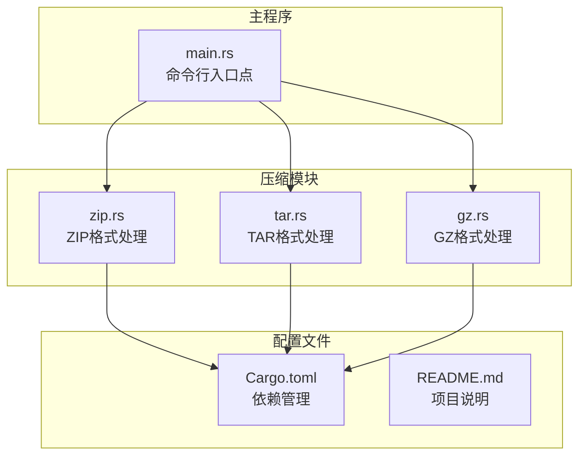
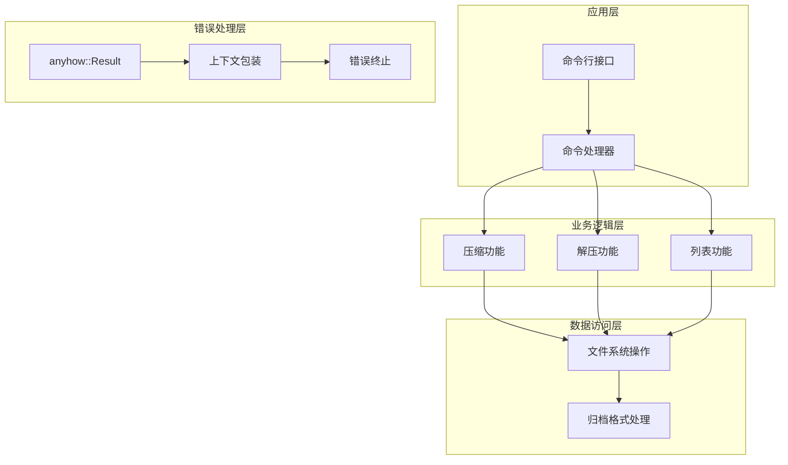
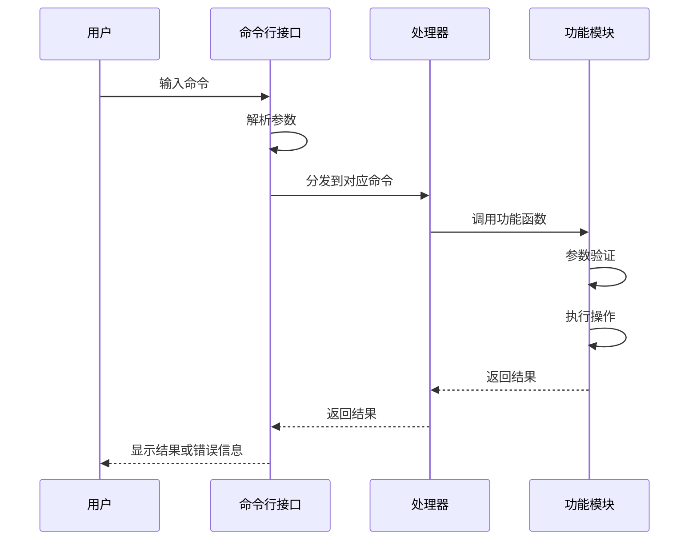
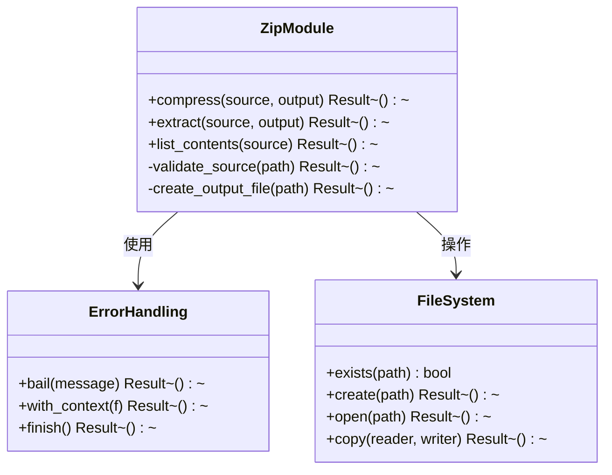
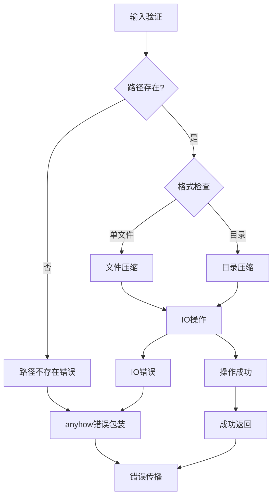
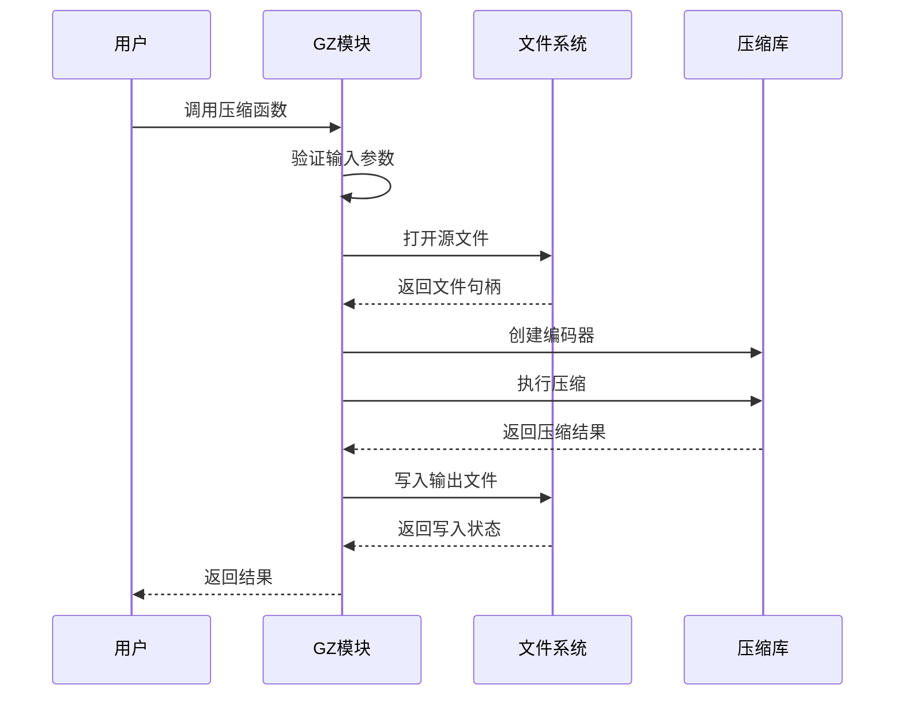
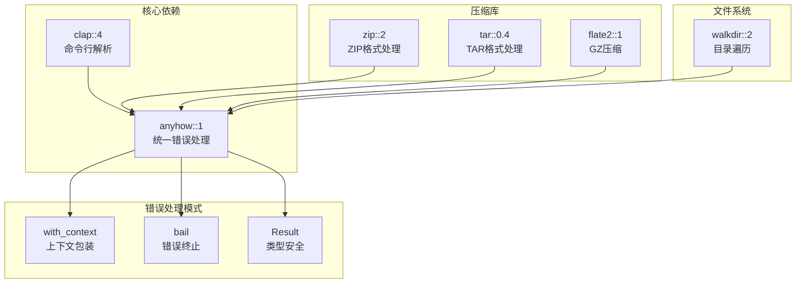

# 错误处理与调试

<cite>
**本文档引用的文件**
- [main.rs](file://archive/src/main.rs)
- [zip.rs](file://archive/src/zip.rs)
- [tar.rs](file://archive/src/tar.rs)
- [gz.rs](file://archive/src/gz.rs)
- [Cargo.toml](file://archive/Cargo.toml)
- [README.md](file://README.md)
</cite>

## 目录
1. [简介](#简介)
2. [项目结构](#项目结构)
3. [核心组件](#核心组件)
4. [架构概览](#架构概览)
5. [详细组件分析](#详细组件分析)
6. [依赖分析](#依赖分析)
7. [性能考虑](#性能考虑)
8. [故障排除指南](#故障排除指南)
9. [结论](#结论)

## 简介

MyArchive是一个基于Rust编写的文件压缩与解压工具，支持多种格式（ZIP、TAR、GZ）。本指南专注于项目的错误处理机制和调试方法，帮助用户和开发者快速定位和解决各种问题。

## 项目结构

MyArchive采用模块化设计，主要包含以下核心文件：



**图表来源**
- [main.rs:1-68](file://archive/src/main.rs#L1-L68)
- [zip.rs:1-109](file://archive/src/zip.rs#L1-L109)
- [tar.rs:1-80](file://archive/src/tar.rs#L1-L80)
- [gz.rs:1-124](file://archive/src/gz.rs#L1-L124)

**章节来源**
- [main.rs:1-68](file://archive/src/main.rs#L1-L68)
- [zip.rs:1-109](file://archive/src/zip.rs#L1-L109)
- [tar.rs:1-80](file://archive/src/tar.rs#L1-L80)
- [gz.rs:1-124](file://archive/src/gz.rs#L1-L124)
- [Cargo.toml:1-13](file://archive/Cargo.toml#L1-L13)

## 核心组件

MyArchive的错误处理系统基于Rust的`anyhow` crate，实现了统一的错误处理模式：

### 错误处理架构

```mermaid
flowchart TD
START[函数调用] --> CHECK[参数验证]
CHECK --> VALID{验证通过?}
VALID --> |否| ERROR1[返回具体错误信息]
VALID --> |是| PROCESS[执行操作]
PROCESS --> IO_CHECK{IO操作成功?}
IO_CHECK --> |否| ERROR2[包装IO错误]
IO_CHECK --> |是| SUCCESS[返回Ok(()))
ERROR1 --> ANYHOW[anyhow::Result包装]
ERROR2 --> ANYHOW
SUCCESS --> ANYHOW
ANYHOW --> PROPAGATE[错误向上传播]
PROPAGATE --> EXIT[程序退出]
```

**图表来源**
- [zip.rs:10-56](file://archive/src/zip.rs#L10-L56)
- [tar.rs:8-41](file://archive/src/tar.rs#L8-L41)
- [gz.rs:12-31](file://archive/src/gz.rs#L12-L31)

### 主要错误类型

1. **路径不存在错误**：源路径验证失败时抛出
2. **文件IO错误**：文件读写、创建等操作失败
3. **格式不匹配错误**：特定格式的约束条件不满足
4. **压缩算法错误**：压缩/解压过程中的异常

**章节来源**
- [zip.rs:12-14](file://archive/src/zip.rs#L12-L14)
- [tar.rs:10-12](file://archive/src/tar.rs#L10-L12)
- [gz.rs:14-19](file://archive/src/gz.rs#L14-L19)

## 架构概览

MyArchive采用分层架构设计，错误处理贯穿整个应用程序：



**图表来源**
- [main.rs:39-67](file://archive/src/main.rs#L39-L67)
- [zip.rs:10-56](file://archive/src/zip.rs#L10-L56)
- [tar.rs:8-41](file://archive/src/tar.rs#L8-L41)
- [gz.rs:12-31](file://archive/src/gz.rs#L12-L31)

## 详细组件分析

### 命令行接口错误处理

命令行接口负责解析用户输入并调用相应的处理函数：



**图表来源**
- [main.rs:39-67](file://archive/src/main.rs#L39-L67)

#### 错误处理策略

1. **参数验证**：在函数入口处进行严格的参数检查
2. **早期失败**：发现错误立即返回，避免无效操作
3. **上下文包装**：使用`with_context`添加详细的错误信息
4. **错误传播**：使用`?`操作符自动传播错误

**章节来源**
- [main.rs:42-64](file://archive/src/main.rs#L42-L64)

### ZIP格式处理错误机制

ZIP模块实现了完整的压缩、解压和列表功能，每个功能都有完善的错误处理：



**图表来源**
- [zip.rs:10-56](file://archive/src/zip.rs#L10-L56)
- [zip.rs:59-81](file://archive/src/zip.rs#L59-L81)
- [zip.rs:84-108](file://archive/src/zip.rs#L84-L108)

#### 压缩功能错误处理

压缩功能的关键错误点：
- 源路径存在性验证
- 输出文件创建权限检查
- 目录遍历过程中的IO错误
- 压缩算法执行异常

#### 解压功能错误处理

解压功能的关键错误点：
- ZIP文件格式验证
- 输出目录创建权限
- 文件权限设置
- 解压过程中的数据完整性检查

**章节来源**
- [zip.rs:10-56](file://archive/src/zip.rs#L10-L56)
- [zip.rs:59-81](file://archive/src/zip.rs#L59-L81)
- [zip.rs:84-108](file://archive/src/zip.rs#L84-L108)

### TAR格式处理错误机制

TAR模块提供了与ZIP类似的错误处理模式：



**图表来源**
- [tar.rs:8-41](file://archive/src/tar.rs#L8-L41)
- [tar.rs:44-54](file://archive/src/tar.rs#L44-L54)
- [tar.rs:57-79](file://archive/src/tar.rs#L57-L79)

**章节来源**
- [tar.rs:8-41](file://archive/src/tar.rs#L8-L41)
- [tar.rs:44-54](file://archive/src/tar.rs#L44-L54)
- [tar.rs:57-79](file://archive/src/tar.rs#L57-L79)

### GZ格式处理错误机制

GZ模块实现了单文件压缩和解压功能：



**图表来源**
- [gz.rs:12-31](file://archive/src/gz.rs#L12-L31)
- [gz.rs:34-44](file://archive/src/gz.rs#L34-L44)
- [gz.rs:47-83](file://archive/src/gz.rs#L47-L83)

**章节来源**
- [gz.rs:12-31](file://archive/src/gz.rs#L12-L31)
- [gz.rs:34-44](file://archive/src/gz.rs#L34-L44)
- [gz.rs:47-83](file://archive/src/gz.rs#L47-L83)

## 依赖分析

MyArchive的错误处理依赖于以下关键crate：



**图表来源**
- [Cargo.toml:6-12](file://archive/Cargo.toml#L6-L12)

**章节来源**
- [Cargo.toml:6-12](file://archive/Cargo.toml#L6-L12)

### 依赖关系分析

1. **anyhow**：提供统一的错误处理接口，支持错误链和上下文包装
2. **clap**：命令行解析，与anyhow集成提供友好的错误信息
3. **zip/tar/flate2**：底层压缩库，需要适当的错误处理包装
4. **walkdir**：目录遍历，处理文件系统异常

## 性能考虑

错误处理对性能的影响：

1. **错误检查成本**：参数验证和路径检查有轻微开销
2. **内存使用**：错误信息的字符串存储
3. **I/O操作**：文件系统操作是主要性能瓶颈
4. **压缩算法**：不同格式的压缩效率差异

优化建议：
- 在关键路径上减少不必要的错误检查
- 使用流式处理减少内存占用
- 合理的缓冲区大小设置
- 并行处理大文件时注意线程安全

## 故障排除指南

### 常见错误场景及解决方案

#### 1. 路径不存在错误

**错误特征**：
- 源路径不存在
- 权限不足访问文件
- 目录权限问题

**诊断步骤**：
1. 验证源路径是否存在
2. 检查文件权限
3. 确认磁盘空间充足

**解决方案**：
```bash
# 检查路径存在性
ls -la /path/to/source

# 检查权限
stat /path/to/source

# 检查磁盘空间
df -h
```

#### 2. 文件IO错误

**错误特征**：
- 文件无法打开
- 写入权限不足
- 磁盘空间不足

**诊断步骤**：
1. 检查文件是否被其他进程占用
2. 验证目标目录权限
3. 监控磁盘使用情况

**解决方案**：
```bash
# 检查文件占用
lsof /path/to/file

# 修改权限
chmod 644 /path/to/file
chown user:user /path/to/file

# 清理磁盘空间
sudo apt-get clean
```

#### 3. 格式不匹配错误

**错误特征**：
- ZIP文件损坏
- TAR文件格式错误
- GZ文件压缩级别不兼容

**诊断步骤**：
1. 验证文件完整性
2. 检查文件头信息
3. 测试其他工具

**解决方案**：
```bash
# 验证ZIP文件
unzip -t problematic.zip

# 验证TAR文件
tar -tvf problematic.tar

# 检查GZ文件
gzip -t problematic.gz
```

#### 4. 内存不足错误

**错误特征**：
- 处理大型文件时内存溢出
- 目录包含大量小文件
- 压缩率过高导致内存需求增加

**诊断步骤**：
1. 监控内存使用情况
2. 分析文件数量和大小分布
3. 检查系统可用内存

**解决方案**：
```bash
# 监控内存使用
htop

# 分割大文件处理
split -l 1000 large_list.txt chunk_

# 使用流式处理
./myArchive compress --stream source_dir output.zip
```

### 调试技巧和工具

#### 1. 日志分析方法

**启用详细日志**：
```bash
# 设置RUST_LOG环境变量
export RUST_LOG=debug
cargo run --bin archive

# 或者使用特定模块
export RUST_LOG=archive::zip=debug
```

**日志格式**：
- 时间戳：精确到毫秒
- 模块名称：标识错误来源
- 错误级别：区分严重程度
- 错误信息：详细描述问题

#### 2. 错误传播追踪

**错误链分析**：


**追踪方法**：
1. 使用`anyhow::Error::chain()`查看完整错误链
2. 检查每个层级的上下文信息
3. 定位具体的错误发生位置

#### 3. 性能问题诊断

**内存泄漏检测**：
```bash
# 使用valgrind检测内存问题
valgrind --leak-check=full cargo run

# 使用AddressSanitizer
cargo build --features asan
```

**CPU性能分析**：
```bash
# 使用perf分析CPU使用
perf record cargo run
perf report

# 使用flamegraph
cargo install flamegraph
flamegraph cargo run
```

### 最佳实践

#### 1. 错误处理最佳实践

**参数验证**：
- 在函数入口处进行参数验证
- 提供清晰的错误信息
- 区分不同类型的错误

**错误包装**：
- 使用`with_context`添加上下文
- 保持错误信息的可读性
- 避免泄露敏感信息

**错误传播**：
- 使用`?`操作符简化错误处理
- 避免在错误处理中引入新错误
- 在适当的地方转换错误类型

#### 2. 调试工具使用

**Rust调试工具**：
```bash
# 使用rust-gdb进行调试
rust-gdb target/debug/archive

# 使用cargo-debug
cargo install cargo-debug
cargo debug

# 使用cargo-expand查看宏展开
cargo install cargo-expand
cargo expand
```

**性能分析工具**：
```bash
# 使用cargo-instruments (macOS)
cargo instruments -t time

# 使用cargo-asm查看汇编代码
cargo install cargo-asm
cargo asm
```

#### 3. 问题诊断流程

**系统化诊断步骤**：
1. **重现问题**：确保能够稳定重现错误
2. **收集信息**：记录完整的错误信息和环境
3. **隔离问题**：确定问题的具体范围
4. **分析原因**：查找根本原因
5. **验证修复**：确认解决方案有效
6. **预防措施**：防止类似问题再次发生

**诊断检查清单**：
- 系统资源使用情况
- 文件权限和所有权
- 网络连接状态
- 外部依赖版本兼容性
- 环境变量配置

**章节来源**
- [main.rs:39-67](file://archive/src/main.rs#L39-L67)
- [zip.rs:10-56](file://archive/src/zip.rs#L10-L56)
- [tar.rs:8-41](file://archive/src/tar.rs#L8-L41)
- [gz.rs:12-31](file://archive/src/gz.rs#L12-L31)

## 结论

MyArchive的错误处理系统展现了现代Rust应用程序的最佳实践：

1. **统一的错误处理模式**：基于anyhow crate实现了类型安全的错误处理
2. **清晰的错误传播机制**：错误信息能够准确传递到用户界面
3. **完善的上下文包装**：为每个错误提供了丰富的上下文信息
4. **模块化的错误处理**：不同功能模块都有独立的错误处理逻辑

通过遵循本文档提供的故障排除指南和最佳实践，用户和开发者可以有效地诊断和解决MyArchive使用过程中遇到的各种问题。建议在实际使用中：

- 建立标准化的问题报告流程
- 定期更新依赖库以获得更好的错误处理支持
- 实施监控和日志记录机制
- 建立备份和恢复策略

这些实践将帮助确保MyArchive系统的稳定性和可靠性，为用户提供更好的使用体验。