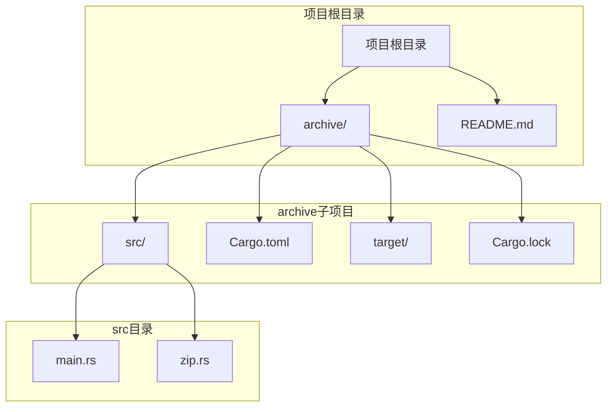
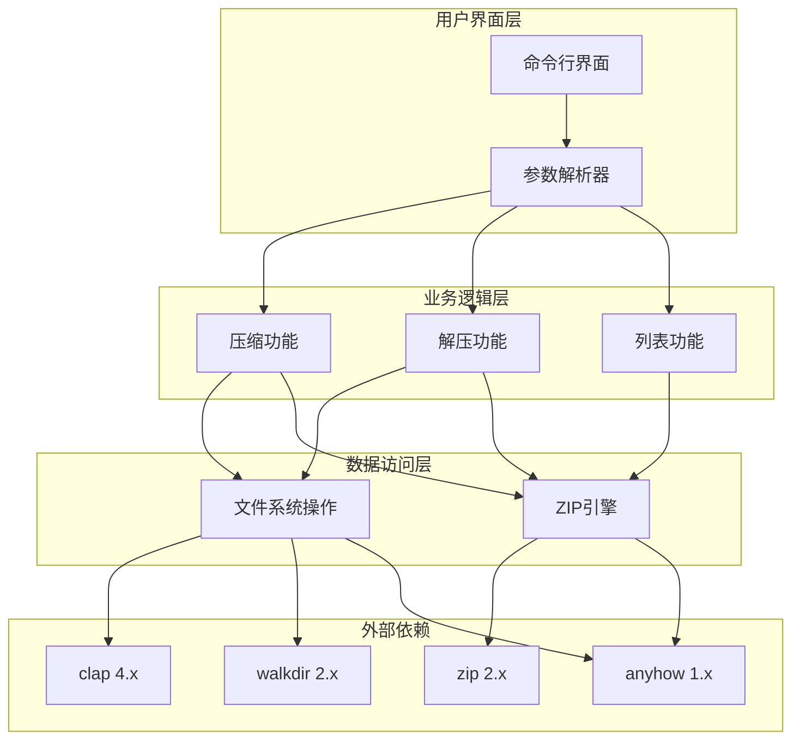
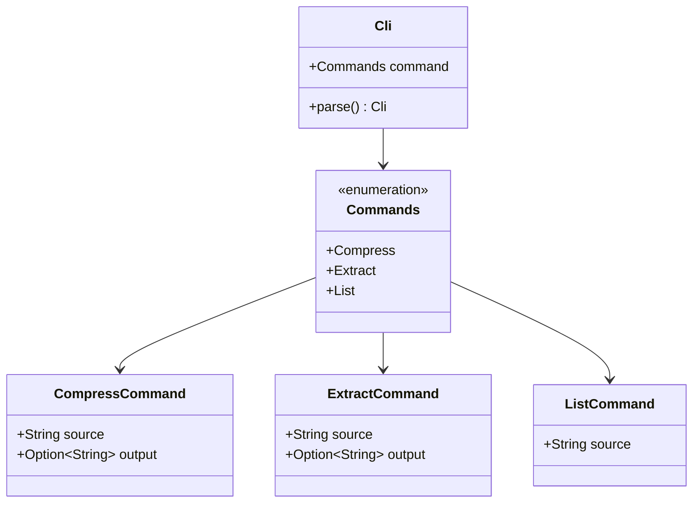
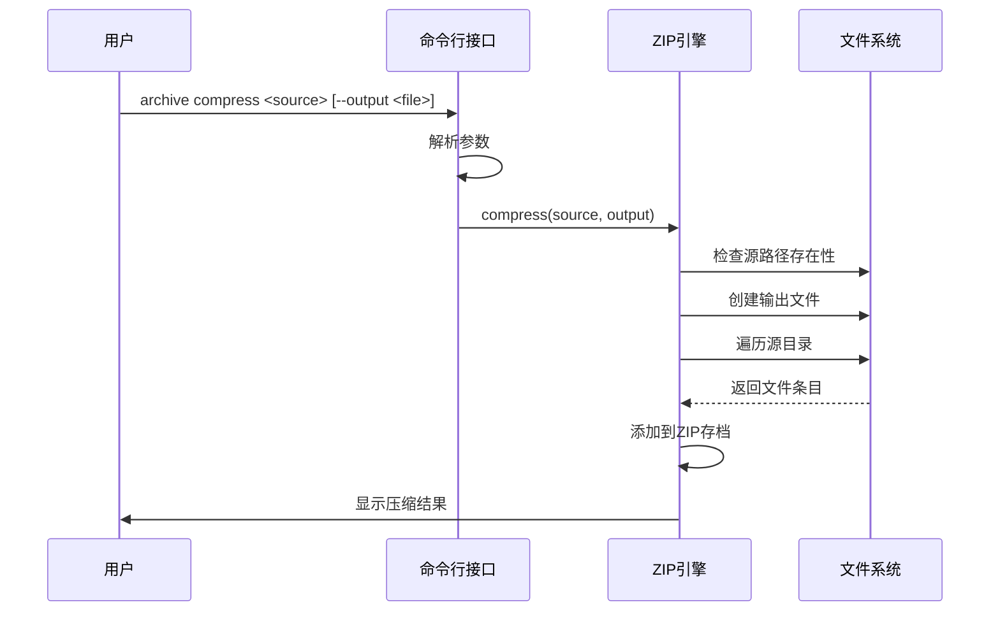
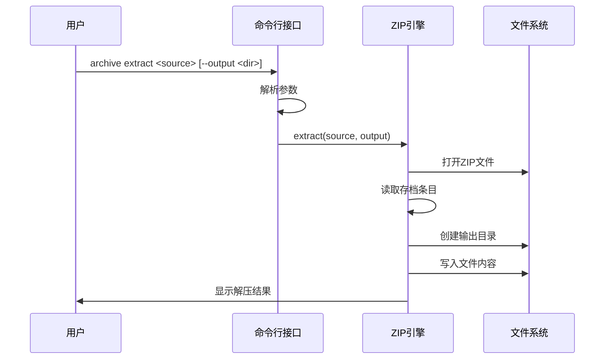
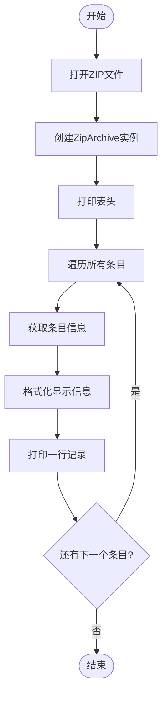
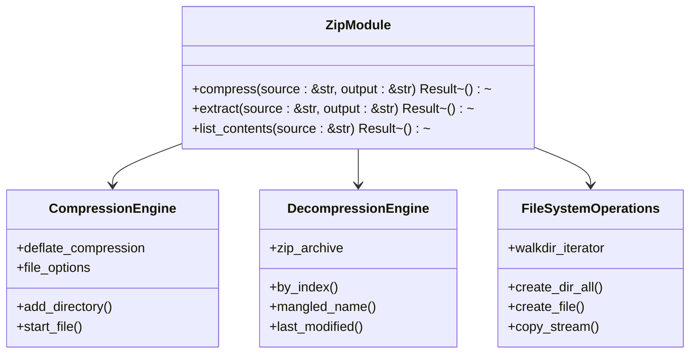
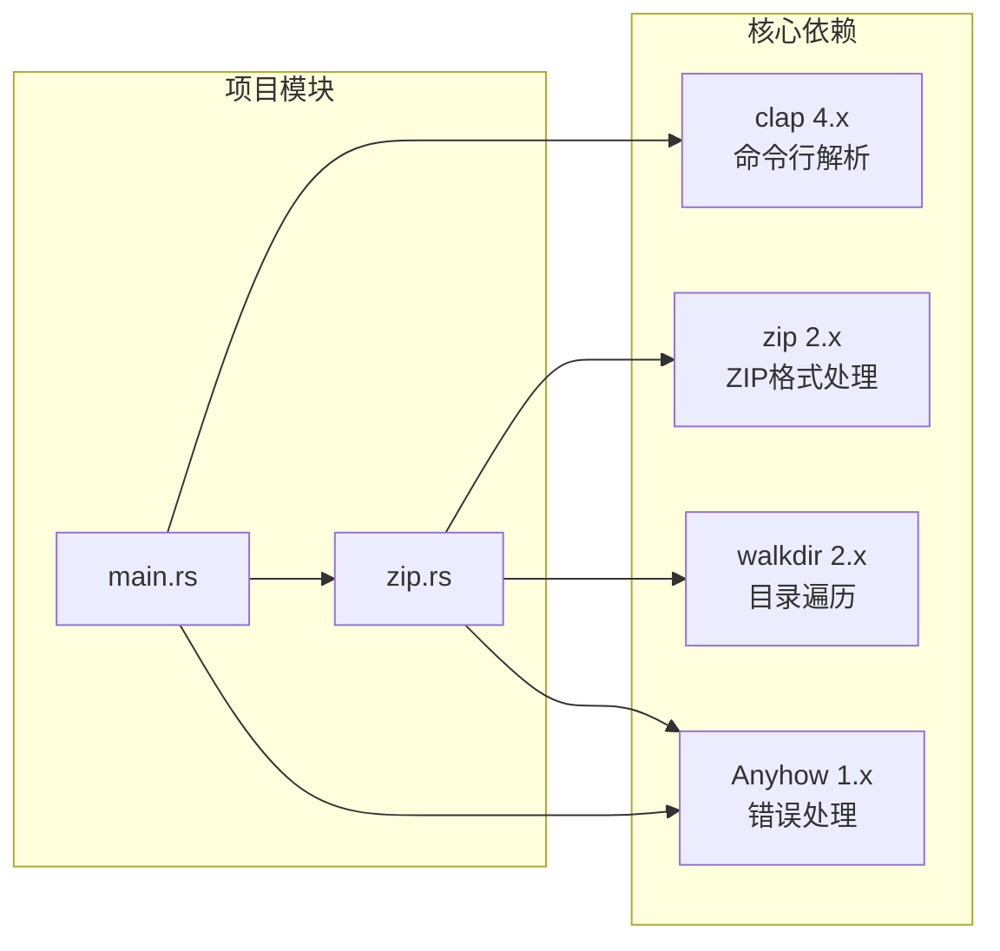

# 项目概述

<cite>
**本文档中引用的文件**
- [README.md](file://README.md)
- [Cargo.toml](file://archive/Cargo.toml)
- [main.rs](file://archive/src/main.rs)
- [zip.rs](file://archive/src/zip.rs)
</cite>

## 目录
1. [简介](#简介)
2. [项目结构](#项目结构)
3. [核心组件](#核心组件)
4. [架构概览](#架构概览)
5. [详细组件分析](#详细组件分析)
6. [依赖关系分析](#依赖关系分析)
7. [性能考虑](#性能考虑)
8. [故障排除指南](#故障排除指南)
9. [结论](#结论)

## 简介

MyArchive是一个用Rust编写的命令行文件压缩与解压工具，专注于提供简洁高效的ZIP格式处理能力。该项目旨在为用户提供一个现代化、可靠且易于使用的文件压缩解决方案，支持压缩、解压和内容列表三大核心功能。

### 项目目标与价值主张

MyArchive的核心价值在于：
- **现代化设计**：基于Rust语言构建，确保内存安全和高性能
- **简洁易用**：提供直观的命令行界面，支持常见的压缩操作
- **标准化支持**：完全兼容ZIP格式标准，确保与其他工具的互操作性
- **跨平台兼容**：支持多种操作系统环境运行

### 应用场景

该工具适用于以下场景：
- 开发者日常的文件打包和分发
- 自动化脚本中的批量文件处理
- 系统管理员的文件管理任务
- 教育和学习Rust编程的实践项目

## 项目结构

MyArchive采用简洁的单二进制文件架构，主要包含以下组件：

**图表来源**
- [Cargo.toml:1-11](file://archive/Cargo.toml#L1-L11)
- [main.rs:1-68](file://archive/src/main.rs#L1-L68)
- [zip.rs:1-109](file://archive/src/zip.rs#L1-L109)

**章节来源**
- [Cargo.toml:1-11](file://archive/Cargo.toml#L1-L11)
- [main.rs:1-68](file://archive/src/main.rs#L1-L68)

## 核心组件

MyArchive项目由两个主要组件构成：命令行接口和ZIP处理引擎。

### 命令行接口组件

命令行接口基于clap框架构建，提供了三种核心子命令：
- **compress**：将文件或目录压缩为ZIP格式
- **extract**：从ZIP文件解压到指定目录
- **list**：列出ZIP文件中的所有内容

### ZIP处理引擎

ZIP处理引擎封装了所有ZIP格式相关的操作，包括压缩、解压和内容列表功能。该引擎利用zip crate提供的高效实现，确保处理速度和可靠性。

**章节来源**
- [main.rs:7-37](file://archive/src/main.rs#L7-L37)
- [zip.rs:9-108](file://archive/src/zip.rs#L9-L108)

## 架构概览

MyArchive采用了清晰的分层架构设计，实现了关注点分离和模块化组织。

**图表来源**
- [main.rs:3-12](file://archive/src/main.rs#L3-L12)
- [zip.rs:1-7](file://archive/src/zip.rs#L1-L7)
- [Cargo.toml:6-10](file://archive/Cargo.toml#L6-L10)

### 设计理念

项目遵循以下设计理念：
- **单一职责原则**：每个模块专注于特定的功能领域
- **错误处理优先**：使用Result类型和anyhow库提供一致的错误处理体验
- **性能优化**：采用流式处理减少内存占用
- **用户体验**：提供清晰的反馈信息和默认行为

## 详细组件分析

### 主程序组件分析

主程序作为整个应用的入口点，负责解析用户输入并协调各功能模块的工作。

**图表来源**
- [main.rs:7-37](file://archive/src/main.rs#L7-L37)

#### 压缩功能实现

压缩功能支持单个文件和整个目录树的递归压缩：

**图表来源**
- [main.rs:39-50](file://archive/src/main.rs#L39-L50)
- [zip.rs:10-56](file://archive/src/zip.rs#L10-L56)

#### 解压功能实现

解压功能提供了完整的ZIP文件提取能力：

**图表来源**
- [main.rs:51-60](file://archive/src/main.rs#L51-L60)
- [zip.rs:58-81](file://archive/src/zip.rs#L58-L81)

#### 列表功能实现

列表功能提供了ZIP文件内容的详细信息展示：

**图表来源**
- [main.rs:61-63](file://archive/src/main.rs#L61-L63)
- [zip.rs:83-108](file://archive/src/zip.rs#L83-L108)

**章节来源**
- [main.rs:39-67](file://archive/src/main.rs#L39-L67)
- [zip.rs:9-108](file://archive/src/zip.rs#L9-L108)

### ZIP处理模块分析

ZIP处理模块是整个应用的核心，负责所有ZIP格式相关的操作。

**图表来源**
- [zip.rs:1-109](file://archive/src/zip.rs#L1-L109)

#### 错误处理机制

项目采用统一的错误处理策略，使用anyhow库提供详细的错误信息：

- **上下文包装**：为每个可能失败的操作添加有意义的错误上下文
- **类型安全**：使用Result类型确保错误传播的一致性
- **用户友好**：提供清晰的错误消息帮助用户诊断问题

**章节来源**
- [zip.rs:1-109](file://archive/src/zip.rs#L1-L109)

## 依赖关系分析

MyArchive项目使用了精心选择的第三方依赖，每个依赖都经过了仔细评估以确保项目的质量和性能。

**图表来源**
- [Cargo.toml:6-10](file://archive/Cargo.toml#L6-L10)
- [main.rs:3-5](file://archive/src/main.rs#L3-L5)
- [zip.rs:1-7](file://archive/src/zip.rs#L1-L7)

### 依赖选择理由

- **clap 4.x**：提供现代的命令行界面构建体验，支持丰富的特性如子命令、参数验证等
- **zip 2.x**：成熟的ZIP格式处理库，提供高性能和标准兼容性
- **walkdir 2.x**：高效的目录遍历库，支持递归文件搜索
- **anyhow 1.x**：简化错误处理的库，提供优雅的错误链和上下文信息

**章节来源**
- [Cargo.toml:6-10](file://archive/Cargo.toml#L6-L10)

## 性能考虑

MyArchive在设计时充分考虑了性能优化，特别是在处理大型文件和目录时的表现。

### 流式处理策略

项目采用流式处理模式，避免将整个文件加载到内存中：
- **压缩过程**：使用io::copy进行流式复制，减少内存占用
- **解压过程**：逐个处理存档条目，按需分配内存
- **目录遍历**：使用迭代器模式避免一次性加载所有文件信息

### 内存管理

- **零拷贝操作**：尽可能使用引用和借用避免不必要的数据复制
- **延迟计算**：只在需要时才计算文件路径和元数据
- **资源清理**：确保文件句柄和临时资源得到及时释放

### 并发处理

虽然当前版本未实现并发处理，但架构设计为未来的并发优化预留了空间：
- **异步I/O**：可扩展到async/await模式
- **多线程压缩**：未来可实现多文件并行压缩
- **缓存策略**：可添加文件内容缓存提高重复访问性能

## 故障排除指南

### 常见问题及解决方案

#### 文件权限问题
- **症状**：无法创建输出文件或读取源文件
- **原因**：文件系统权限不足
- **解决**：检查文件路径权限，使用适当的用户账户运行

#### 路径不存在
- **症状**：提示源路径不存在
- **原因**：指定的文件或目录路径不正确
- **解决**：验证路径拼写，使用绝对路径避免相对路径问题

#### ZIP文件损坏
- **症状**：解压时出现错误或部分文件缺失
- **原因**：ZIP文件在传输过程中损坏
- **解决**：重新下载或重新创建ZIP文件

#### 内存不足
- **症状**：处理大文件时出现内存不足错误
- **原因**：系统可用内存不足以处理大型文件
- **解决**：关闭其他应用程序释放内存，或分批处理大文件

**章节来源**
- [zip.rs:12-14](file://archive/src/zip.rs#L12-L14)
- [zip.rs:60-61](file://archive/src/zip.rs#L60-L61)

## 结论

MyArchive项目成功地实现了一个现代化、可靠的命令行ZIP处理工具。通过精心设计的架构和合理的依赖选择，该项目在保持简洁性的同时提供了完整的核心功能。

### 技术优势

- **Rust语言优势**：内存安全、高性能、零成本抽象
- **模块化设计**：清晰的关注点分离，便于维护和扩展
- **用户友好**：直观的命令行界面和清晰的反馈信息
- **标准兼容**：完全符合ZIP格式标准

### 发展方向

未来可以考虑的功能增强：
- **进度显示**：为长时间操作提供进度指示
- **并发处理**：实现多线程压缩和解压
- **加密支持**：添加ZIP文件密码保护功能
- **更多格式**：扩展支持其他归档格式如tar.gz等

MyArchive为学习Rust编程和构建实用工具提供了优秀的参考案例，其设计原则和实现模式值得在其他项目中借鉴。